# Admin Console Overview

The admin console is a separate, locally-authenticated web interface at `/admin` that allows DfE internal users to manage the Teacher Training Entitlement service. It is distinct from:

- The participant-facing registration app (authenticates via TRS Teacher Auth)
- The Lead Provider API (authenticates via HTTP Bearer tokens)

Admin users are **not** `User`s. They are `AdminUser`s who sign in via a separate wizard (`SessionWizardController`), not Devise or TeacherAuth.

## Who uses the admin console

Five DfE teams use the console, each with different responsibilities:

| Team                  | Primary responsibilities                                                                     |
|-----------------------|----------------------------------------------------------------------------------------------|
| **Support**           | Respond to participant queries, look up users and applications, view declarations            |
| **Contract managers** | Configure cohorts, courses, schedules, lead providers, delivery partners                     |
| **Finance**           | Manage financial statements, adjustments, payment authorizations, contracts                  |
| **Assurance**         | Generate assurance reports, verify LP work using service data                                |
| **Super admins**      | All of the above + manage admin accounts, feature flags, bulk operations, API test scenarios |

## Roles and permissions

The `AdminUser` model has a `super_admin` boolean field (default: `false`). This creates two roles:

### Regular admins
- Can access most read-only views (applications, users, providers, cohorts, courses)
- Can perform standard operations within their team's scope
- Cannot access: Admins management, Feature flags, API Test Scenarios, Bulk operations (write), Cohort create/edit/delete

### Super admins
- Have all regular admin capabilities
- Can create, delete, and elevate other admins
- Can toggle feature flags
- Can create/edit/delete cohorts
- Can run bulk operations (revert applications, reject applications, submit declarations, backfill delivery partners)
- Can seed API test scenarios (development/review/sandbox only)

**Elevation**: An existing admin can be promoted to super admin via the "Make Super Admin" link in the Admins section, or by setting `super_admin: true` in a Rails console.

**Demotion**: Super admins can only be demoted via Rails console (`super_admin: false`). The console does not provide a demote action.

See [authentication.md](./authentication.md) for full authentication flow details.

## Navigation map

The console uses a two-level navigation structure. Top-level items appear in the service navigation bar; sub-items appear in a side panel.

```mermaid
graph TD
    A[Admin Console<br/>/admin] --> B[Cohorts]
    A --> C[Courses]
    A --> D[Applications]
    A --> E[Providers]
    A --> F[Delivery partners]
    A --> G[Users]
    A --> H[Finance]
    A --> I[Workplaces]
    A --> J[Bulk changes<br/>Super admin only]
    A --> K[Registration closed]
    A --> L[Actions log]
    A --> M[Feature flags<br/>Super admin only]
    A --> N[Admins<br/>Super admin only]
    A --> O[API Test Scenarios<br/>Super admin only<br/>dev/review/sandbox]
    A --> P[Glossary]

    B --> B1[List cohorts]
    B --> B2[View cohort details]
    B --> B3[Courses within cohort]
    B --> B4[Schedules & milestones]
    B --> B5[Statements]
    B --> B6[Download contracts]

    D --> D1[Search & filter applications]
    D --> D2[View application details]
    D --> D3[View declarations]
    D --> D4[View reviews & history]
    D --> D5[API test endpoints<br/>defer, resume, withdraw, etc.]
    D --> D6[Change status, cohort, lead provider]

    H --> H1[Statements index]
    H --> H2[Statement details]
    H --> H3[Adjustments]
    H --> H4[Voided declarations]
    H --> H5[Assurance reports]
    H --> H6[Payment authorization]
    H --> H7[Change deadlines]
    H --> H8[Contracts - change per-participant fees]

    J --> J1[Revert applications to pending]
    J --> J2[Reject applications]
    J --> J3[Submit declarations]
    J --> J4[Backfill delivery partners]
```

### Top-level sections

| Section                 | Path                         | Description                                                                          |
|-------------------------|------------------------------|--------------------------------------------------------------------------------------|
| **Cohorts**             | `/admin/cohorts`             | Manage funding cohorts, registration windows, and associated courses/schedules       |
| **Courses**             | `/admin/courses`             | View course details and cohort-specific configurations                               |
| **Applications**        | `/admin/applications`        | Search, filter, and view participant applications and their lifecycle                |
| **Providers**           | `/admin/providers`           | View and edit lead provider details, applications, delivery partners, and statements |
| **Delivery partners**   | `/admin/delivery-partners`   | Manage delivery partner records and their partnerships with lead providers           |
| **Users**               | `/admin/users`               | View participant user records                                                        |
| **Finance**             | `/admin/finance/statements`  | Manage financial statements, adjustments, payment authorizations, and contracts      |
| **Workplaces**          | `/admin/schools`             | View schools and manage eligibility lists                                            |
| **Bulk changes**        | `/admin/bulk-changes`        | Run bulk operations (super admin only)                                               |
| **Registration closed** | `/admin/registration-closed` | Manage email subscriptions for users interested in future course openings            |
| **Actions log**         | `/admin/actions-log`         | View audit trail of admin actions on applications                                    |
| **Feature flags**       | `/admin/features`            | Toggle feature flags (super admin only)                                              |
| **Admins**              | `/admin/admins`              | Manage admin accounts and permissions (super admin only)                             |
| **API Test Scenarios**  | `/admin/api-test-scenarios`  | Seed test data for API testing (super admin only, non-production environments)       |
| **Glossary**            | `/admin/glossary`            | Reference documentation for service terminology                                      |

## Code locations

| Component             | Location                                                             |
|-----------------------|----------------------------------------------------------------------|
| Base controller       | `app/controllers/admin_controller.rb`                                |
| Authentication wizard | `app/controllers/session_wizard_controller.rb`                       |
| Admin user model      | `app/models/admin_user.rb`                                           |
| Routes                | `config/routes/admin.rb`                                             |
| Navigation structure  | `app/components/navigation_structures/admin_navigation_structure.rb` |
| Layout                | `app/views/layouts/admin.html.erb`                                   |
| Controllers           | `app/controllers/admin/*.rb`                                         |
| Finance controllers   | `app/controllers/admin/finance/*.rb`                                 |
| Bulk operations       | `app/controllers/admin/bulk_operations/*.rb`                         |

### Key controllers

| Controller                                                    | Purpose                                                               |
|---------------------------------------------------------------|-----------------------------------------------------------------------|
| `Admin::ApplicationsController`                               | Application search, filtering, and detail views                       |
| `Admin::CohortsController`                                    | Cohort CRUD (super admin required for write operations)               |
| `Admin::LeadProvidersController`                              | Lead provider management                                              |
| `Admin::FeaturesController`                                   | Feature flag toggling (super admin only)                              |
| `Admin::AdminsController`                                     | Admin account management (super admin only)                           |
| `Admin::SuperAdminsController`                                | Admin elevation to super admin (super admin only)                     |
| `Admin::BulkOperationsController`                             | Bulk operation index page                                             |
| `Admin::BulkOperations::*Controller`                          | Individual bulk operation handlers (revert, reject, submit, backfill) |
| `Admin::Finance::StatementsController`                        | Financial statement management                                        |
| `Admin::Finance::Statements::AssuranceReportsController`      | Assurance report generation                                           |
| `Admin::Finance::Statements::PaymentAuthorisationsController` | Payment authorization workflow                                        |
| `Admin::ActionsLogController`                                 | Audit log viewing                                                     |
| `Admin::APITestScenariosController`                           | Test data seeding (super admin only, non-production)                  |

## Related documentation

- [Authentication flow](./authentication.md) — how admins sign in and how sessions work
- [Applications management](./applications.md) — detailed application lifecycle and admin capabilities
- [Change of provider](../registration/change-of-provider.md) — participant-side provider changes (admin-side equivalent)
- [Legacy admin docs](../admins.md) — predecessor documentation (still accurate for admin account management basics)

## Environment-specific features

Some features are restricted to non-production environments:

- **API Test Scenarios** (`/admin/api-test-scenarios`): Only available in `development`, `review`, and `sandbox` environments. Allows super admins to seed test applications for API testing.

Bulk operations and feature flags are available in all environments but require super admin permissions.
