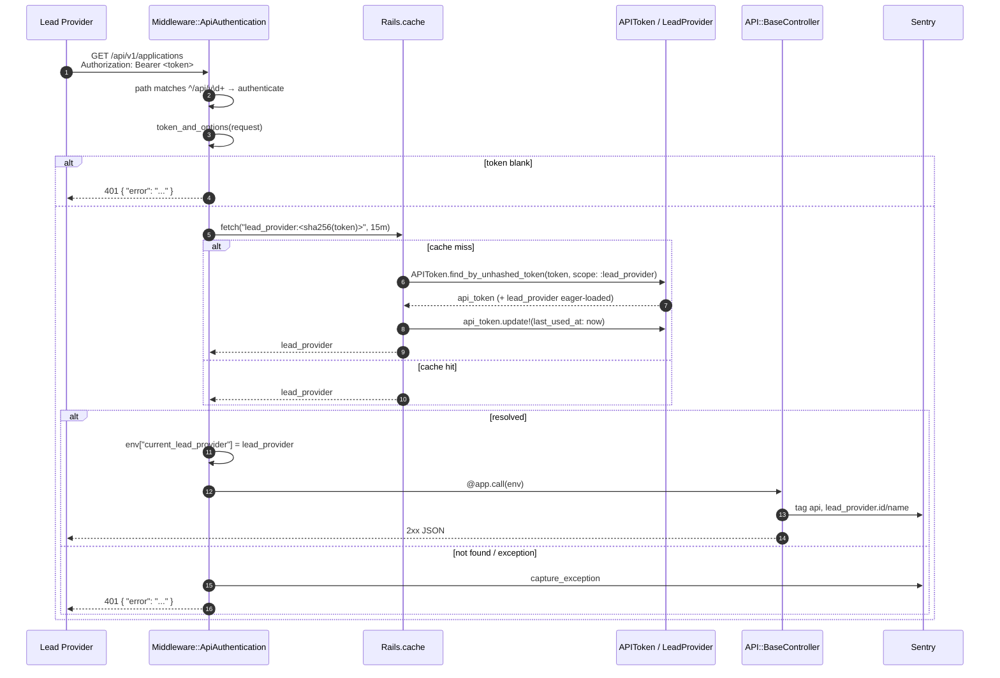

# Lead Provider API — Authentication

The Lead Provider API is a token-authenticated JSON service. Every request to
`/api/v1/*` must carry a long-lived **bearer token** that the DfE contract team
issues to a single `LeadProvider`. The token resolves to a tenant at the edge;
the rest of the stack only ever sees the resolved `LeadProvider`, never the
raw token.

## TL;DR

```http
GET /api/v1/applications
Authorization: Bearer <token>
Accept: application/json
```

- Missing or invalid token → `401` with `{ "error": "..." }`.
- Tokens are **non-expiring**. Rotate by minting a new one and deleting the old
  `APIToken` row.

## The token

| Field              | Notes                                                                                 |
|--------------------|---------------------------------------------------------------------------------------|
| `hashed_token`     | SHA-256 (via `Devise.token_generator.digest`). The plaintext is never persisted.      |
| `lead_provider_id` | Tenant the token is bound to.                                                         |
| `scope`            | Enum: `lead_provider` (this API) or `teacher_record_service` (internal integrations). |
| `last_used_at`     | Updated when the token is **resolved**, i.e. on cache miss (~every 15 min).           |

`APIToken` (`app/models/api_token.rb`):

- One token maps to exactly one `LeadProvider`.
- The plaintext is returned **once** at creation, then only the digest is
  stored. We cannot re-emit a plaintext token.
- Tokens do not expire. Revoke by deleting the row; rotate by deleting and
  minting a replacement.

## Requesting a token

| Environment                    | How tokens are minted                                                            |
|--------------------------------|----------------------------------------------------------------------------------|
| Production / Sandbox           | DfE contract team, via Rails console or Rake task. Not exposed via the admin UI. |
| Staging / Review / Development | created from seed data                                                           |

The token is delivered to the LP **once**, over secure email. If an LP loses it,
delete the row and mint a new one — there is no "re-issue" of the same string.

> Public-facing setup steps for LPs live at `/api/guidance/get-started`
> (Markdown source: `app/views/api/guidance/get-started.md`).

## Request lifecycle



### Step-by-step

1. **Path check.** `Middleware::ApiAuthentication#call` matches
   `%r{^/+api/v\d+(/.*)?$}`. Non-versioned `/api/*` paths (guidance, docs,
   catch-all) skip the middleware.
2. **Token extraction.** `ActionController::HttpAuthentication::Token#token_and_options`
   pulls the token out of the `Authorization: Bearer …` header.
3. **Resolve.** `resolve_lead_provider(token)` caches by
   `"lead_provider:" + Digest::SHA256.hexdigest(token)` for **15 minutes**.
   On a miss it calls `APIToken.find_by_unhashed_token(token, scope: :lead_provider)`,
   which digests the plaintext, eager-loads `lead_provider`, and looks up by
   `(hashed_token, scope)`.
4. **`last_used_at`.** Updated inside the miss path. Within a 15-minute window
   an active token writes the timestamp at most once.
5. **Failure handling.** Anything raised (`ActiveRecord::RecordNotFound`,
   digest errors, DB outage, …) is rescued, sent to Sentry via
   `Sentry.capture_exception`, and surfaces as `nil`. There is no in-band
   error message — only the resulting 401.
6. **`env["current_lead_provider"]`.** On success the middleware sets this and
   forwards to the app. `API::BaseController#current_lead_provider` reads it
   back; controllers pass it to every query as a tenant scope.
7. **401 envelope.** Returned directly by the middleware when the token is
   blank, the lookup misses, or an exception was swallowed:

   ```http
   HTTP/1.1 401 Unauthorized
   Content-Type: application/json

   { "error": "Unauthorized" }
   ```

## What the middleware does **not** do

| Concern                                       | Where it lives                                                                            |
|-----------------------------------------------|-------------------------------------------------------------------------------------------|
| Scope check (`lead_provider` )                | `APIToken.find_by_unhashed_token`; `API::BaseController#api_token_scope`                  |
| Per-endpoint authorisation (record ownership) | Individual controllers — they filter queries by `current_lead_provider.id`                |
| Rate limiting                                 | `Rack::Attack` in `config/initializers/rack_attack.rb` — 1,000 req / 5 min per auth token |
| Response caching                              | None — `set_cache_headers` sets `Cache-Control: no-store`                                 |
| Token rotation                                | Manual: delete + recreate `APIToken` row                                                  |

## Observability

On every authenticated request, `API::BaseController#set_sentry_context`:

- Increments `Sentry::Metrics.count("api.request")` with attributes
  `{ id, name, path, method }`.
- Sets Sentry tags `api=true`, `lead_provider.id`, `lead_provider.name`.
- Sets the Sentry user to the `LeadProvider` (id + name).
- Sets a `lead_provider` context block.

So an authenticated request shows up in error trackers and dashboards
attributable to a specific LP — even though the token itself never appears in
any log.

## Caching notes

- Cache store: whatever `Rails.cache` is configured to be in the current env
  (memory store in dev/test, memcached in prod).
- TTL: **15 minutes**, set inline in the `Rails.cache.fetch` call.
- Cache key: `lead_provider:<sha256(token)>` — never the plaintext token.
- Invalidation: implicit on `APIToken` row deletion (the next request with
  that token re-resolves and misses).
- `last_used_at` is gated by the cache miss. Heavy traffic from one LP only
  writes once per 15 minutes per token.

## Code map

| Concern                                       | Location                                                        |
|-----------------------------------------------|-----------------------------------------------------------------|
| Middleware registration                       | `config/application.rb` (`config.middleware.use …`)             |
| Middleware implementation                     | `lib/middleware/api_authentication.rb`                          |
| Token model + scopes                          | `app/models/api_token.rb`                                       |
| `current_lead_provider` / Sentry tags         | `app/controllers/api/base_controller.rb`                        |
| Token scope constant                          | `API::BaseController#api_token_scope`                           |
| Versioned routes                              | `config/routes/api/v1.rb`                                       |
| Catch-all 404 for `/api/*`                    | `config/routes/api/v1.rb` (`match "*", to: "errors#not_found"`) |
| LP-facing test-token issuance (non-prod only) | `app/controllers/admin/api_test_scenarios_controller.rb`        |
| Rate limits                                   | `config/initializers/rack_attack.rb`                            |
| Public LP setup docs                          | `app/views/api/guidance/get-started.md`                         |

## Related documentation

- [`overview.md`](./overview.md) — top-level API tour
- [`endpoints.md`](./endpoints.md) — full endpoint reference
- [`swagger.md`](./swagger.md) — OpenAPI workflow
- [`/api/guidance/get-started`](../../app/views/api/guidance/get-started.md) — what we send to LPs
- [`docs/api/overview.md#error-envelope`](./overview.md#error-envelope) — full error table
