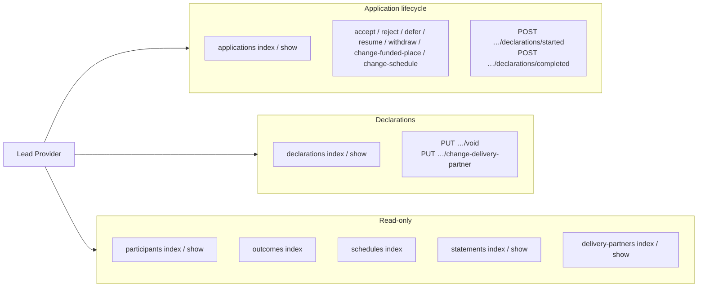

# Lead Provider API — v1 Endpoints

Method-by-method reference for every route exposed under `/api/v1/*`. Read
[`overview.md`](./overview.md) for the big picture and
[`authentication.md`](./authentication.md) for the bearer token contract.

## Conventions

- **Auth**: `Authorization: Bearer <token>` (see
  [`authentication.md`](./authentication.md)).
- **Headers**: `Content-Type: application/json` for bodies. Responses always
  carry `Cache-Control: no-store` (`API::BaseController#set_cache_headers`).
- **Envelope**: list → `{ "data": […], "links": {…}, "meta": {…} }`,
  resource → `{ "data": {…} }`. JSON:API-ish (`id`, `type`, `attributes`).
- **Errors**: `{ "errors": […] }` for app failures, `{ "error": "…" }` for
  auth/`404` (full table in [`overview.md`](./overview.md#error-envelope)).
- **Pagination**: `page[page]=N`, `page[per_page]=N`. Default 1/100, max 3000.
- **Tenant scope**: every query is filtered to `current_lead_provider`.



## Applications

| Method | Path                                | Controller#action        | Purpose                                |
|--------|-------------------------------------|--------------------------|----------------------------------------|
| GET    | `/api/v1/applications`              | `applications#index`     | List applications assigned to the LP.  |
| GET    | `/api/v1/applications/{id}`         | `applications#show`      | Show one application by `ecf_id`.      |

**Filters (`filter[…]`)**: `cohort`, `updated_since`, `participant_id` (CSV of
UUIDs), `status`, `course`. **Sort**: `sort=`.

Example:

```http
GET /api/v1/applications?filter[cohort]=2025&filter[updated_since]=2025-01-28T13:15:00Z&page[page]=1&page[per_page]=50
Authorization: Bearer <token>
```

### Applications — member actions

PUT, body `{ "data": { "attributes": { … } } }`, returns the updated application.

| Method | Path                                            | Controller#action                  | Body `attributes`     | What it does                                                |
|--------|-------------------------------------------------|------------------------------------|-----------------------|-------------------------------------------------------------|
| PUT    | `/api/v1/applications/{id}/accept`              | `applications#accept`              | `funded_place` (bool) | Accept a pending application.                               |
| PUT    | `/api/v1/applications/{id}/reject`              | `applications#reject`              | —                     | Reject a pending application.                               |
| PUT    | `/api/v1/applications/{id}/change-funded-place` | `applications#change_funded_place` | `funded_place` (bool) | Toggle the funded/unfunded flag on an accepted application. |
| PUT    | `/api/v1/applications/{id}/defer`               | `applications#defer`               | `reason` (string)     | Defer an accepted application.                              |
| PUT    | `/api/v1/applications/{id}/resume`              | `applications#resume`              | `schedule_id` (UUID)  | Resume a deferred application onto a different schedule.    |
| PUT    | `/api/v1/applications/{id}/withdraw`            | `applications#withdraw`            | `reason` (string)     | Withdraw an application.                                    |
| PUT    | `/api/v1/applications/{id}/change-schedule`     | `applications#change_schedule`     | `schedule_id` (UUID)  | Move an accepted application to another schedule.           |

Example — accept:

```http
PUT /api/v1/applications/ecf-abc-123/accept
Authorization: Bearer <token>
Content-Type: application/json

{ "data": { "attributes": { "funded_place": true } } }
```

> **403** if the LP was once assigned but is no longer the active provider
> (`updateable_application` in `ApplicationsController`).

### Applications — declarations sub-resource

| Method | Path                                               | Controller#action                    | Body `attributes`                                                                               | What it does                        |
|--------|----------------------------------------------------|--------------------------------------|-------------------------------------------------------------------------------------------------|-------------------------------------|
| POST   | `/api/v1/applications/{id}/declarations/started`   | `application_declarations#started`   | `declaration_date`, `delivery_partner_id`, `secondary_delivery_partner_id`, `has_passed` (bool) | Record a **started** declaration.   |
| POST   | `/api/v1/applications/{id}/declarations/completed` | `application_declarations#completed` | same as above                                                                                   | Record a **completed** declaration. |

Example:

```http
POST /api/v1/applications/ecf-abc-123/declarations/started
Authorization: Bearer <token>
Content-Type: application/json

{ "data": { "type": "declaration", "attributes": { "declaration_date": "2025-02-01", "delivery_partner_id": "dp-001", "has_passed": false } } }
```

## Declarations (top-level)

| Method | Path                        | Controller#action    | Purpose                           |
|--------|-----------------------------|----------------------|-----------------------------------|
| GET    | `/api/v1/declarations`      | `declarations#index` | List declarations for the LP.     |
| GET    | `/api/v1/declarations/{id}` | `declarations#show`  | Show one declaration by `ecf_id`. |

**Filters**: `cohort`, `updated_since`, `application_id`, `declaration_type`
(`started`/`completed`), `course`, `participant_id` (CSV of UUIDs).

### Declarations — member actions

| Method | Path                                                | Controller#action                      | Body `attributes`                                                      | What it does                                                                            |
|--------|-----------------------------------------------------|----------------------------------------|------------------------------------------------------------------------|-----------------------------------------------------------------------------------------|
| PUT    | `/api/v1/declarations/{id}/void`                    | `declarations#void`                    | —                                                                      | Void a submitted declaration (clawback if paid). **403** if owned by another LP.        |
| PUT    | `/api/v1/declarations/{id}/change-delivery-partner` | `declarations#change_delivery_partner` | `delivery_partner_id`, `secondary_delivery_partner_id` (both required) | Reassign a declaration to a different delivery partner. **403** if owned by another LP. |

## Participants

| Method | Path                        | Controller#action    | Purpose                                                                                                  |
|--------|-----------------------------|----------------------|----------------------------------------------------------------------------------------------------------|
| GET    | `/api/v1/participants`      | `participants#index` | List participants who have (or had) an application with the LP.                                          |
| GET    | `/api/v1/participants/{id}` | `participants#show`  | Show one participant by `ecf_id`. Returns **410** if the ID was re-assigned — see [410 Gone](#410-gone). |

**Filters**: `updated_since`, `status`, `from_participant_id`. **Sort**: `sort=`.

## Outcomes

| Method | Path               | Controller#action | Purpose                                           |
|--------|--------------------|-------------------|---------------------------------------------------|
| GET    | `/api/v1/outcomes` | `outcomes#index`  | List outcomes across all participants for the LP. |

**Filters**: `created_since` (ISO-8601), `application_id`. Pagination +
`sort=` as normal. Shape (`state`, `completion_date`, `course_identifier`,
`participant_id`, timestamps) from `API::ParticipantOutcomeSerializer`.

## Schedules

| Method | Path                | Controller#action | Purpose                                                  |
|--------|---------------------|-------------------|----------------------------------------------------------|
| GET    | `/api/v1/schedules` | `schedules#index` | List course/schedule/cohort combinations open to the LP. |

**Filters**: `cohort`, `course`. **Sort**: `sort=`.

## Statements

| Method | Path                      | Controller#action  | Purpose                             |
|--------|---------------------------|--------------------|-------------------------------------|
| GET    | `/api/v1/statements`      | `statements#index` | List monthly statements for the LP. |
| GET    | `/api/v1/statements/{id}` | `statements#show`  | Show one statement by `ecf_id`.     |

**Filters**: `cohort`, `updated_since`, `status` (payment state).

## Delivery partners

| Method | Path                             | Controller#action         | Purpose                                      |
|--------|----------------------------------|---------------------------|----------------------------------------------|
| GET    | `/api/v1/delivery-partners`      | `delivery_partners#index` | List delivery partners the LP can work with. |
| GET    | `/api/v1/delivery-partners/{id}` | `delivery_partners#show`  | Show one delivery partner by `ecf_id`.       |

**Filters**: `cohort`. **Sort**: `sort=` (`name`, etc.).

## Common filters & sorting

| Concern          | Query param                                   | Notes                                                                                            |
|------------------|-----------------------------------------------|--------------------------------------------------------------------------------------------------|
| Pagination       | `page[page]`, `page[per_page]`                | Default 1 / 100, max `per_page` 3000. Invalid → 400.                                             |
| Updated since    | `filter[updated_since]=ISO8601`               | `API::FilterByDate`. Invalid date → 400.                                                         |
| Created since    | `filter[created_since]=ISO8601`               | Outcomes only. Invalid date → 400.                                                               |
| Participant IDs  | `filter[participant_id]=uuid,uuid,…`          | Comma-separated UUIDs. `API::FilterByParticipantIds` validates format.                           |
| Cohort           | `filter[cohort]=YYYY`                         | Cohort start year as a string.                                                                   |
| Status           | `filter[status]=…`                            | Resource-specific (e.g. `pending`, `accepted`, `reassigned`).                                    |
| Course           | `filter[course]=identifier`                   | Course identifier (e.g. `tte-early-years` )                                                      |
| Declaration type | `filter[declaration_type]=started\|completed` | Declarations index only.                                                                         |
| Application      | `filter[application_id]=ecf_id`               | Declarations / outcomes index.                                                                   |
| Sort             | `sort=field`                                  | Whitelisted per resource (applications, participants, delivery-partners, schedules, statements). |


## Schemas

JSON schemas for every response/request body live in `spec/swagger_schemas/`
(`models/`, `responses/`, `attributes/`, `filters/`, `sorting/`), composed
into `public/api/docs/v1/swagger.yaml`. See [`swagger.md`](./swagger.md).

## Code map

| Concern                                   | Location                                                        |
|-------------------------------------------|-----------------------------------------------------------------|
| Routes                                    | `config/routes/api/v1.rb`                                       |
| Base controller (cache headers, 410)      | `app/controllers/api/base_controller.rb`                        |
| Pagination / date / participant-ID mixins | `app/controllers/concerns/api/`                                 |
| V1 controllers                            | `app/controllers/api/v1/`                                       |
| Application-declarations sub-controller   | `app/controllers/api/v1/application_declarations_controller.rb` |
| Blueprinter serializers                   | `app/serializers/api/`                                          |
| Request specs                             | `spec/requests/api/v1/`                                         |
| JSON schema fragments                     | `spec/swagger_schemas/`                                         |
| Generated OpenAPI                         | `public/api/docs/v1/swagger.yaml`                               |

## Related

[`overview.md`](./overview.md) · [`authentication.md`](./authentication.md) · [`swagger.md`](./swagger.md) · [`../data_model.md`](../data_model.md)
