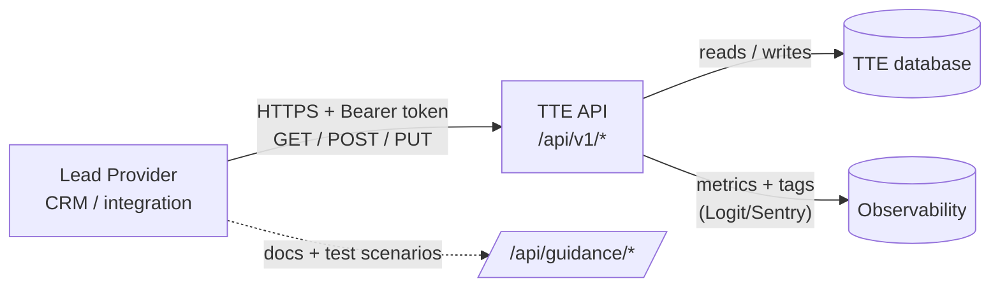

# Lead Provider API — Overview

Lets third-party training providers read and update data for their own
applications, declarations, participants, outcomes, schedules,
statements and delivery partners.

REST + JSON, scoped per Lead Provider via a bearer token, versioned by URL
prefix. One live version today: `v1`.



## Who it's for

External **Lead Providers**. Each token is bound to one `LeadProvider` record, so
the API only ever returns data belonging to that provider — no cross-tenant
access.

## Base URL and versioning

- Base path: `/api/v1/*` — routes live in `config/routes/api/v1.rb`, mounted
  from `config/routes.rb` via `draw("/api/v1")`.
- Available versions are listed in `API::Version` (`lib/api/version.rb`).
  Adding one there automatically generates a matching `/api/docs/<version>` UI.
  Today only `v1` exists.

## Authentication at a glance

- HTTP `Authorization: Bearer <token>` header on every request.
- `Middleware::ApiAuthentication` matches the path prefix `^/api/v1`, looks the
  token up in `APIToken` (`scope: "lead_provider"`), writes the resolved
  `LeadProvider` into `request.env["current_lead_provider"]`, and caches the
  lookup for 15 minutes.
- Missing/invalid token → `401` with the JSON error envelope.
- Tokens are non-expiring and issued by the DfE contract team.

Full detail, including request examples and how to request a token, lives in
[`authentication.md`](./authentication.md).

## What the API does

The Lead Provider is resolved from the token and used to scope every query —
LPs only ever see their own rows.

| Resource          | Capabilities                                                                              |
|-------------------|-------------------------------------------------------------------------------------------|
| Applications      | List, show, accept, reject, defer, resume, withdraw, change funded place, change schedule |
| Declarations      | List, show, submit started/completed (via applications), void, change delivery partner    |
| Participants      | List, show (re-assigned IDs return `410` with migration info)                             |
| Outcomes          | List per-participant outcomes                                                             |
| Schedules         | List schedules available to the provider                                                  |
| Statements        | List / show monthly financial statements                                                  |
| Delivery partners | List, show                                                                                |

Full method-by-method table (paths, verbs, params, filters) in
[`endpoints.md`](./endpoints.md).

### Example: list applications updated since a timestamp

```http
GET /api/v1/applications?filter[updated_since]=2025-01-28T13:15:00Z&page=1
Authorization: Bearer <token>
Accept: application/json
```

```json
{
  "data": [
    {
      "id": "ecf-abc-123",
      "type": "application",
      "attributes": { "status": "accepted", "funded_place": true, "...": "..." }
    }
  ],
  "links": { "next": "...", "last": "..." },
  "meta": { "page": 1, "per_page": 100 }
}
```

### Example: submit a "started" declaration against an application

```http
POST /api/v1/applications/ecf-abc-123/declarations/started
Authorization: Bearer <token>
Content-Type: application/json

{
  "data": {
    "type": "declaration",
    "attributes": {
      "declaration_date": "2025-02-01",
      "delivery_partner_id": "dp-001",
      "has_passed": false
    }
  }
}
```

## Caching and idempotency

`API::BaseController#set_cache_headers` sets `Cache-Control: no_store` on every
response — responses are **never** cached by intermediaries. State-transition
endpoints (e.g. `PUT /applications/:id/accept`) are idempotent; the rest follow
standard REST semantics.

## Error envelope

Application-layer errors are rendered through `API::Errors::Response`
(`app/services/api/errors/response.rb`):

```json
{
  "errors": [
    { "title": "Bad request", "detail": "Param `data.attributes.funded_place` is required" }
  ]
}
```

| Status | When                                                                 |
|--------|----------------------------------------------------------------------|
| `400`  | Malformed body / missing required params                             |
| `401`  | Missing or invalid bearer token                                      |
| `403`  | LP was once assigned but is no longer the active provider            |
| `404`  | Resource not visible to this LP                                      |
| `410`  | Participant ID has been changed (re-pointed to a new TRN-derived ID) |
| `422`  | Validation failure from the underlying service object                |
| `429`  | Rate limit exceeded (see `/api/guidance/get-started`)                |

A bare `{ "error": "..." }` is used by the auth middleware (`401`) and for
`RecordNotFound` (`404`).

## Pagination and filtering

List endpoints are paginated and accept a `filter[…]` query plus a top-level
`sort=…`. Shared mixins: `Pagination`, `FilterByDate` (`updated_since`),
`FilterByParticipantIds`. Per-endpoint filters (e.g. `cohort`, `status`,
`course`) are documented in [`endpoints.md`](./endpoints.md).

## Observability and correlation

`set_sentry_context` on the base controller tags every request as `api: true`
with `lead_provider.id`/`name`, sets user context to the LP, and emits an
`api.request` counter (`id`, `name`, `path`, `method`) — so per-LP traffic can
be sliced in dashboards and error trackers.

## Public guidance pages

LP-facing docs at `/api/guidance/*` are rendered by `API::GuidanceController`
from Markdown templates in `app/views/api/guidance/`:

- `/api/guidance` — landing page
- `get-started`, `api-introduction`, `data-states`,
  `process-maps-edge-cases`, `release-notes`, `roadmap`
- `how-to-guides/*`, `process-diagrams/*`, `nested/*`

## Test data and sandbox

- `config/api_test_scenarios.yml` — declarative set of applications per LP.
- The **admin → API test scenarios** page
  (`Admin::APITestScenariosController`) lets a SuperAdmin (non-prod only) seed
  scenarios for a chosen LP via
  `ValidTestDataGenerators::APITestScenariosSeeder`.
- `app/services/api_tests/` — Ruby wrappers that script full request lifecycles.

## API specification (Swagger / OpenAPI)

The machine-readable spec is generated by **rswag** from
`spec/requests/api/docs/v1/` (each spec carries
`openapi_spec: "v1/swagger.yaml"`) into `public/api/docs/v1/swagger.yaml`, then
rendered by `API::DocumentationController` under `/api/docs/v1`. Maintenance
workflow, schemas and how to add new endpoints are in
[`swagger.md`](./swagger.md) — superseding the predecessor `docs/swagger.md`.

## Code map

| Concern                     | Location                                                        |
|-----------------------------|-----------------------------------------------------------------|
| Route catalog               | `config/routes/api/v1.rb`                                       |
| Mount point                 | `config/routes.rb` (`draw("/api/v1")`)                          |
| Base controller             | `app/controllers/api/base_controller.rb`                        |
| Auth middleware             | `lib/middleware/api_authentication.rb`                          |
| API token model             | `app/models/api_token.rb`                                       |
| Error envelope              | `app/services/api/errors/response.rb`                           |
| V1 controllers              | `app/controllers/api/v1/`                                       |
| Declarations sub-controller | `app/controllers/api/v1/application_declarations_controller.rb` |
| Available versions          | `lib/api/version.rb`                                            |
| Request specs               | `spec/requests/api/v1/`                                         |
| Swagger generation specs    | `spec/requests/api/docs/v1/`                                    |
| Public guidance             | `app/views/api/guidance/`                                       |
| Test data seed              | `config/api_test_scenarios.yml`                                 |
| Admin test-scenarios UI     | `app/controllers/admin/api_test_scenarios_controller.rb`        |

## Related documentation

- [`authentication.md`](./authentication.md) — bearer token details
- [`endpoints.md`](./endpoints.md) — full endpoint reference
- [`swagger.md`](./swagger.md) — OpenAPI workflow

- [Data model](../data_model.md) — entities the API exposes
- [Public LP guidance site](/api/guidance) — rendered at runtime
