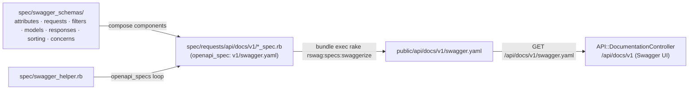

# Lead Provider API — Swagger / OpenAPI pipeline

How the TTE Lead Provider API documentation is generated, where the schemas
live, how to extend the spec when a new endpoint ships, and how the Swagger UI
is rendered at `/api/docs/v1`.

Lead Providers consume two artefacts:

- **OpenAPI 3 spec** at `/api/docs/v1/swagger.yaml` — machine-readable, drives
  client code generation and contract tests.
- **Swagger UI** at `/api/docs/v1` — browsable reference rendered by the app.

Both are generated from the same source: RSpec request specs using the rswag
DSL.

## Pipeline at a glance



## Versioning and the spec helper

Available versions live in `API::Version` (`lib/api/version.rb`) — today only
`v1`. `spec/swagger_helper.rb` loops over `API::Version.all` and registers one
OpenAPI document per version, so adding a version there:

1. emits a matching `public/api/docs/<version>/swagger.yaml`,
2. mounts `/api/docs/<version>` (route already wired: `get "docs/:version", to: "documentation#index"` in `config/routes/api/v1.rb`, and
   `API::DocumentationController#set_api_version` rejects anything not listed).

`spec/swagger_helper.rb` is the single source of truth for the document: it sets
`openapi_root = public/api/docs`, enables `openapi_strict_schema_validation`,
declares the `api_key` (Bearer) security scheme and the full `components.schemas`
map, and sets `openapi_format = :yaml`. The generated spec is **OpenAPI 3.0.1**.

Every schema file in `spec/swagger_schemas/**/*.rb` is required up front, so
any constant referenced must exist. New versions add version-keyed entries to
the per-version schema constants (e.g. `APPLICATION[version]`,
`LIST_STATEMENTS_FILTER[version]`) so each version embeds its own copy of any
model that changes.

## Schema organisation

Schemas live under `spec/swagger_schemas/`, one file per constant:

| Directory     | What it holds                                                      |
|---------------|--------------------------------------------------------------------|
| `attributes/` | Shared field definitions, e.g. `IDAttribute`                       |
| `requests/`   | Request body schemas, one per write endpoint                       |
| `models/`     | Resource shapes (mirrored by serializers under `app/serializers/`) |
| `responses/`  | Single-resource and collection envelopes                           |
| `filters/`    | `filter[…]` payloads per index endpoint, plus `PaginationFilter`   |
| `sorting/`    | `sort=` query enumerations                                         |
| `concerns/`   | Shared sub-structures composed into multiple schemas               |

Version-aware schemas are stored as `{ v1: {…} }` hashes — new versions
deep-dup the previous one and override what changed. `#components/schemas/...`
references in request specs point at the version currently being generated.

## Adding a new endpoint to the spec

Doc specs live under `spec/requests/api/docs/v1/`, deliberately separate from
the application's normal `spec/requests/api/v1/` request specs — keeping them
separate avoids polluting the main test suite with the rswag DSL.

### 1. Tag the spec file with the version

```ruby
# spec/requests/api/docs/v1/widgets_spec.rb
require "rails_helper"
require "swagger_helper"

RSpec.describe "Widgets endpoint", openapi_spec: "v1/swagger.yaml", type: :request do
  include_context "with authorization for api doc request"

  describe "list widgets" do
    it_behaves_like "an API index endpoint documentation",
                    "/api/v1/widgets", "Widgets", "widgets",
                    "#/components/schemas/ListWidgetsFilter",
                    "#/components/schemas/WidgetsResponse",
                    false
  end
end
```

### 2. Use the shared documentation examples

Reuse `spec/support/shared_examples/api_*_documentation_support.rb` — e.g.
`an API index endpoint documentation`, `an API show endpoint documentation`,
`an API update endpoint documentation`. They wrap the rswag DSL (`path`,
`parameter`, `security`, `response "200"`, `schema "$ref": …`, `run_test!`),
so a new endpoint typically takes one shared-example call plus locals for
the request body, response schema, and `resource`. Test only the happy path
here; the full request spec under `spec/requests/api/v1/` already covers
filtering, sorting, and edge cases.

### 3. Add or extend a schema

If the endpoint introduces a shape that isn't in `spec/swagger_schemas/`, add
it under the right directory and wire it into `spec/swagger_helper.rb`'s
`components.schemas` map — request bodies go in `requests/`, filters in
`filters/`.

### 4. Regenerate and verify

```bash
bundle exec rake rswag:specs:swaggerize
```

Re-runs every spec in `spec/requests/api/docs/` and writes
`public/api/docs/v1/swagger.yaml`. Commit the regenerated YAML alongside the
spec and schema changes, then open `/api/docs/v1` or the YAML to confirm the
new path appears. A CI check
(`.github/workflows/lead_provider_openapi_check.yml`) compares the generated
YAML's SHA-256 against the committed one and fails on drift, so running
`rswag:specs:swaggerize` locally before pushing is required.

## Serving the spec and rendering the UI

`API::DocumentationController` only enforces that the version is listed in
`API::Version` (via a `before_action`). The YAML itself is served straight
from `public/api/docs/<version>/swagger.yaml`. The sibling
`API::GuidanceController` renders LP-facing Markdown guides at
`/api/guidance/*` — the human companion to the spec.

The UI uses **`swagger-ui-dist`** (the standalone bundle), imported in
`app/javascript/swagger-ui.js`. `swagger-ui-dist` is used instead of
`swagger-ui` because the latter did not transpile cleanly under the older
webpacker/webpack toolchain; the dist package renders identically for our
purposes. A cache-buster query string in the JS forces the browser to reload
the YAML each visit.

## Build-time note

`rswag:specs:swaggerize` writes to `public/api/docs/**/swagger.yaml`. The
`Dockerfile` chowns that path to `appuser:appgroup` so the runtime image can
regenerate the YAML in-place without permission errors:

```dockerfile
RUN chown -R appuser:appgroup /app/tmp /app/public/api/docs/**/swagger.yaml
```

In local development the spec is regenerated against the working tree, so no
special permission handling is needed.

## Code map

| Concern                              | Location                                                                                |
|--------------------------------------|-----------------------------------------------------------------------------------------|
| Available versions                   | `lib/api/version.rb`                                                                    |
| OpenAPI helper (root, schemas, info) | `spec/swagger_helper.rb`                                                                |
| rswag DSL config                     | `config/rspec-rswag.yml`                                                                |
| Schema fragments                     | `spec/swagger_schemas/{attributes,requests,filters,models,responses,sorting,concerns}/` |
| Doc-spec source                      | `spec/requests/api/docs/v1/`                                                            |
| rswag shared examples                | `spec/support/shared_examples/api_*_documentation_support.rb`                           |
| Generated YAML                       | `public/api/docs/v1/swagger.yaml`                                                       |
| UI controller                        | `app/controllers/api/documentation_controller.rb`                                       |
| Sibling guidance controller          | `app/controllers/api/guidance_controller.rb`                                            |
| Swagger UI bootstrap                 | `app/javascript/swagger-ui.js`                                                          |
| UI package                           | `swagger-ui-dist` in `package.json`                                                     |
| CI drift check                       | `.github/workflows/lead_provider_openapi_check.yml`                                     |
| Route (`docs/:version`)              | `config/routes/api/v1.rb`                                                               |
| Dockerfile chown                     | `Dockerfile` (line 84)                                                                  |

## Related documentation

- [`overview.md`](./overview.md) — Lead Provider API surface
- [`endpoints.md`](./endpoints.md) — full endpoint reference
- [`authentication.md`](./authentication.md) — bearer token flow
- [Legacy `../swagger.md`](../swagger.md) — predecessor doc; the OpenAPI 3.0.1
  / `rswag` / one-version-at-a-time narrative has been folded into this page,
  the multi-version commentary there is stale.
