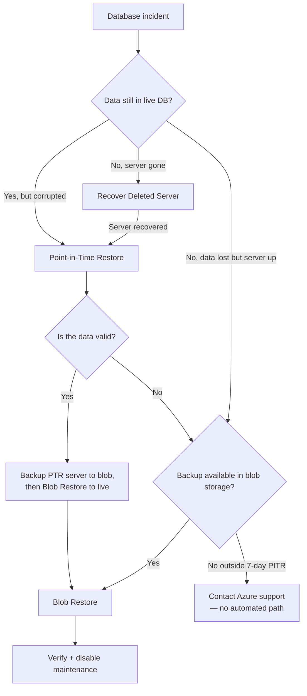
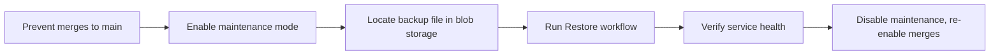

# Disaster Recovery

This document describes how the service protects its data and how to recover it
after an incident. It covers backup strategy, restore procedures, HA configuration,
and what is — and isn't — covered.

> See also: [Deployment overview](overview.md), [Environments](environments.md),
> [Maintenance mode](maintenance-mode.md), [Terraform](terraform.md).

---

## 1. Backup strategy

The service uses **two independent backup mechanisms** for PostgreSQL:

| Mechanism                          | Coverage                     | Retention                                                                | RPO                     |
|------------------------------------|------------------------------|--------------------------------------------------------------------------|-------------------------|
| Azure automated backups (built-in) | Production, sandbox, staging | 7-day PITR                                                               | Any point within 7 days |
| Daily `pg_dump` to Blob Storage    | Production, sandbox          | 7 days (blob lifecycle), 14-day immutable retention (production, locked) | ~24h                    |

### Azure automated backups (PITR)

Azure PostgreSQL Flexible Server performs automatic backups with continuous
transaction log archiving. This enables **Point-in-Time Restore** to any second
within the 7-day retention window. No geo-redundancy is configured.

| Environment | Auto-backup retention       | HA                  |
|-------------|-----------------------------|---------------------|
| Production  | 7 days, PITR enabled        | Yes (ZoneRedundant) |
| Sandbox     | 7 days, PITR enabled        | No                  |
| Staging     | 7 days, PITR enabled        | No                  |
| Review      | Container-based, no backups | No                  |

### Daily `pg_dump` to Azure Blob Storage

A scheduled workflow  [`.github/workflows/backup_production_database.yml`]
runs daily at **03:30 UTC**:

```bash
# File format in blob storage:
cpdtte_{pd|sb}_YYYY-MM-DD.sql.gz
```

**Storage accounts:**

| Environment | Storage account          | Container         | Notes                                                       |
|-------------|--------------------------|-------------------|-------------------------------------------------------------|
| Production  | `s189p01cpdttedbbkppdsa` | `database-backup` | GRS, 14-day immutable retention (locked), 7-day soft-delete |
| Sandbox     | `s189p01cpdttedbbkpsbsa` | `database-backup` | GRS, 7-day soft-delete                                      |
| Staging     | N/A                      | N/A               | Not backed up to blob storage                               |

The workflow also supports **adhoc triggers** for manual backup — useful before
a risky migration or when backing up a PTR server:

```yaml
# Manual trigger: GitHub → Actions → Backup database → Run workflow
# Optional inputs: backup-file, db-server (e.g. for PTR server)
```

### Snapshot database

A separate `*-pg-snapshot` Postgres server exists for bulk operations and testing.
It is refreshed from production on demand via
`.github/workflows/restore_snapshot_database.yml` (manual trigger only — the
cron schedule is commented out).

```bash
# After refresh, connect via konduit:
make staging konduit-snapshot
```

### What is NOT backed up

| Component            | Risk                                                                      |
|----------------------|---------------------------------------------------------------------------|
| Redis                | In-memory only, no persistence. Cache repopulates from DB.                |
| Review app databases | Container-based, no backup. Ephemeral by design.                          |
| Staging blob storage | Staging has no daily `pg_dump` to blob storage — only Azure auto-backups. |
| File uploads (blob)  | 7-day soft-delete only. No cross-region replication.                      |

---

## 2. Recovery procedures

### Decision guide: which restore to use



| Situation                      | Workflow                          | Target environments          | Impact                             |
|--------------------------------|-----------------------------------|------------------------------|------------------------------------|
| Full data loss, server running | Blob restore                      | Staging, sandbox, production | Downtime during restore            |
| Data corruption at known time  | PITR → investigate → Blob restore | All with auto-backups        | New server created; no live impact |
| Accidental server deletion     | Recover deleted server            | All with auto-backups        | New server created                 |
| Refresh snapshot for testing   | Snapshot refresh                  | Production → snapshot        | Read-only snapshot updated         |

### Prerequisites

Before any restore:

1. **Azure permissions**: the account needs Contributor access to the target
   resource group. Production requires [PIM elevation](environments.md#pim).
2. **GitHub Actions permissions**: `AZURE_CLIENT_ID`, `AZURE_TENANT_ID`,
   `AZURE_SUBSCRIPTION_ID` secrets on the target GitHub environment.
3. **Maintenance mode**: Blob restore and snapshot operations require traffic
   to be [routed away from the Rails app](maintenance-mode.md) first.
4. **Konduit**: for snapshot operations, `make install-konduit` is needed
   (installs `bin/konduit.sh`, which is gitignored).

### 2.1 Standard database restore (from blob storage)

This is the primary DR procedure — use when the server is running but data is
lost or corrupted, and a recent blob backup exists.

> ⚠️ **Blob restore drops and recreates the database.** Maintenance mode must
> be active before proceeding.



**Step 1 — Prevent merges to `main`**

Block merges to prevent workflows triggering during the restore.

1. Open the [Rulesets → main-branch](https://github.com/DFE-Digital/teacher-training-entitlement/settings/rules/10350356)
   settings page.
2. Under **Require a pull request before merging**, set **Required approvals** to `6`.

**Step 2 — Enable maintenance mode**

Run the [GitHub Actions → Set Maintenance Mode](https://github.com/DFE-Digital/teacher-training-entitlement/actions/workflows/maintenance.yml)
workflow. See [Maintenance mode](maintenance-mode.md) for alternative methods
(kubectl, Terraform toggle).

**Step 3 — Locate the backup file**

| Environment | Container name           | Portal link                                                                                                                                                                                                                                                                                                                                                                                |
|-------------|--------------------------|--------------------------------------------------------------------------------------------------------------------------------------------------------------------------------------------------------------------------------------------------------------------------------------------------------------------------------------------------------------------------------------------|
| Production  | `s189p01cpdttedbbkppdsa` | [Open in Azure Portal](https://portal.azure.com/#view/Microsoft_Azure_Storage/ContainerMenuBlade/~/overview/storageAccountId/%2Fsubscriptions%2F3c033a0c-7a1c-4653-93cb-0f2a9f57a391%2FresourceGroups%2Fs189p01-cpdtte-pd-rg%2Fproviders%2FMicrosoft.Storage%2FstorageAccounts%2Fs189p01cpdttedbbkppdsa/path/database-backup/etag/%220x8DE5FF2B3747E23%22/defaultId//publicAccessVal/None) |
| Sandbox     | `s189p01cpdttedbbkpsbsa` | [Open in Azure Portal](https://portal.azure.com/#@platform.education.gov.uk/resource/subscriptions/3c033a0c-7a1c-4653-93cb-0f2a9f57a391/resourceGroups/s189p01-cpdtte-sb-rg/providers/Microsoft.Storage/storageAccounts/s189p01cpdttedbbkpsbsa/storagebrowser)                                                                                                                             |

Files are found at: **Storage accounts → `<container-name>` → Containers → `database-backup`**.

Default naming: `cpdtte_{pd|sb}_{YYYY-MM-DD}.sql.gz`. Note the exact filename.

**Step 4 — Restore the database**

Run the [GitHub Actions → Restore Database](https://github.com/DFE-Digital/teacher-training-entitlement/actions/workflows/restore_azure_database.yml)
workflow.

| Input                | Required                 | Example                       |
|----------------------|--------------------------|-------------------------------|
| `environment`        | Yes                      | `production`                  |
| `confirm-production` | Yes (prod only)          | `true`                        |
| `backup-file`        | No (defaults to today's) | `cpdtte_pd_2024-08-09.sql.gz` |

**Step 5 — Re-enable merges and disable maintenance**

1. Reset required approvals to their original value in the Rulesets page.
2. Disable maintenance mode via the same GitHub Action workflow (set `mode` to `disable`).

### 2.2 Point-in-Time Restore (PTR)

Creates a **new** PostgreSQL server restored to a specific point in time. Does
NOT affect the live server — use to investigate data state or extract data
before performing a full restore.

**Trigger:** [GitHub Actions → Restore database from point in time](https://github.com/DFE-Digital/teacher-training-entitlement/actions/workflows/postgres-ptr.yml)

| Input                | Required                        | Example                              |
|----------------------|---------------------------------|--------------------------------------|
| `environment`        | Yes                             | `production`                         |
| `confirm-production` | Yes (prod only)                 | `true`                               |
| `restore-time`       | Yes                             | `2024-07-24T06:00:00`                |
| `new-db-server`      | No (defaults to `<server>-ptr`) | `s189p01-cpdtte-pd-pg-investigation` |

**Typical workflow:**

1. Run PTR to create a copy of the database at the point before corruption.
2. Connect via konduit (or a review app pointed at the PTR server) to inspect data.
3. If the data is valid, run the daily backup workflow targeting the PTR server:
   ```bash
   # GitHub → Actions → Backup database
   # backup-file: cpdtte_pd_adhoc_YYYY-MM-DD
   # db-server: s189p01-cpdtte-pd-pg-ptr
   ```
4. Use the resulting blob backup in the standard restore procedure.

### 2.3 Recover deleted server

Restores a deleted Azure PostgreSQL Flexible Server using Azure's recovery
capability. The restore-time must be **at least 10 minutes after deletion**.

**Trigger:** [GitHub Actions → Recover deleted postgres database server](https://github.com/DFE-Digital/teacher-training-entitlement/actions/workflows/postgres-recover-deleted-db.yml)

| Input                | Required        | Example                |
|----------------------|-----------------|------------------------|
| `environment`        | Yes             | `production`           |
| `confirm-production` | Yes (prod only) | `true`                 |
| `restore-time`       | Yes             | `2024-07-24T06:15:00`  |
| `deleted-server`     | Yes             | `s189p01-cpdtte-pd-pg` |

After recovery, a new server is provisioned with the data up to the specified
restore time. You may then run a PTR to a more precise time, or proceed directly
to a blob restore.

### 2.4 Snapshot refresh

Refreshes the `*-pg-snapshot` Postgres server from production. Used for bulk
testing and analysis without impacting the live database.

**Trigger:** [GitHub Actions → Update Snapshot DB](https://github.com/DFE-Digital/teacher-training-entitlement/actions/workflows/restore_snapshot_database.yml)

The composite action [`.github/actions/backup-and-restore-snapshot-database`]
runs `pg_dump` from production via konduit and pipes the compressed dump into
`psql` against the snapshot server:

```bash
# What the action does (simplified):
bin/konduit.sh -n cpd-production teacher-training-entitlement-production-web \
  -- pg_dump -E utf8 --compress=1 --clean --if-exists --no-privileges --no-owner \
  -f backup-production.sql.gz

bin/konduit.sh -n cpd-production -d s189p01-cpdtte-pd-pg-snapshot \
  -k s189p01-cpdtte-pd-app-kv -i backup-production.sql.gz -c -t 7200 \
  teacher-training-entitlement-production-web -- psql
```

**Prerequisites:** PIM elevation (production subscription), konduit installed.

---

## 3. HA / Failover

| Environment | HA enabled          | Postgres SKU          | Web replicas | Worker replicas | Maintenance window |
|-------------|---------------------|-----------------------|--------------|-----------------|--------------------|
| Production  | Yes (ZoneRedundant) | `GP_Standard_D4ds_v5` | 2            | 2               | Sunday 03:00 UTC   |
| Sandbox     | No                  | `B_Standard_B1ms`     | 1            | 1               | —                  |
| Staging     | No                  | `B_Standard_B1ms`     | 1            | 1               | —                  |
| Review      | No                  | Container-based       | 1            | 1               | —                  |

- Production HA provides zone-redundant failover within the same region.
- No cross-region DR is configured.
- Production safety gates: `CONFIRM_PRODUCTION=yes` on all `make` commands,
  PIM elevation for Azure subscription access.

---

## 4. Data protection overview

| Store                   | Protected? | Mechanism                                                                                | Notes                                                        |
|-------------------------|------------|------------------------------------------------------------------------------------------|--------------------------------------------------------------|
| PostgreSQL (production) | Yes        | Azure auto-backups (7-day PITR) + daily `pg_dump` to GRS blob (14-day immutable, locked) | Full recoverability                                          |
| PostgreSQL (sandbox)    | Yes        | Azure auto-backups (7-day PITR) + daily `pg_dump` to GRS blob (7-day soft-delete)        | Same mechanism, shorter immutable retention                  |
| PostgreSQL (staging)    | Partial    | Azure auto-backups only (7-day PITR)                                                     | No blob backup; synthetic data only                          |
| PostgreSQL (review)     | No         | Container-based                                                                          | Ephemeral by design                                          |
| Redis                   | No         | In-memory, no persistence                                                                | Repopulates from DB on restart                               |
| File uploads (blob)     | Partial    | 7-day soft-delete on containers/blobs                                                    | No cross-region replication                                  |
| BigQuery                | Yes        | Table deletion protection (`gcp_table_deletion_protection`)                              | Federated auth via GCP WIF                                   |
| Source code             | Yes        | Git (GitHub) + ghcr.io container registry                                                | See GitHub documentation                                     |
| Terraform state         | Yes        | Azure Storage blobs (per-environment)                                                    | See [Terraform state storage](terraform.md#state-management) |
| Key Vault (production)  | Yes        | Purge protection enabled                                                                 | See [Azure access](../development/azure-access.md)           |

> **RPO/RTO:** Not formally documented. The daily blob backup provides an
> effective RPO of ~24 hours; PITR within the 7-day window provides finer
> granularity. RTO depends on database size and network speed (estimate
> 30–90 minutes for a full blob restore). Contact the team for current targets.

---

## 5. Maintenance mode as a DR enabler

Hard maintenance (ingress fail-over) is a **prerequisite** for database restore
operations. It prevents user traffic from reaching the Rails app while the
database is being replaced.

| Method                 | How                                            | When to use                 |
|------------------------|------------------------------------------------|-----------------------------|
| GitHub Action workflow | `.github/workflows/maintenance.yml`            | Preferred; UI-driven        |
| Makefile + kubectl     | `make <env> enable-maintenance`                | When running from CLI       |
| Terraform toggle       | `TF_VAR_send_traffic_to_maintenance_page=true` | When kubectl is unavailable |

During maintenance, the real app stays reachable at a temporary canary URL for
verification. See [Maintenance mode](maintenance-mode.md) for full details.

---

## 6. Key files

| File                                                              | Purpose                                                                                  |
|-------------------------------------------------------------------|------------------------------------------------------------------------------------------|
| `.github/workflows/backup_production_database.yml`                | Daily 03:30 UTC `pg_dump` to blob storage                                                |
| `.github/workflows/restore_azure_database.yml`                    | Standard restore from blob backup                                                        |
| `.github/workflows/postgres-ptr.yml`                              | Point-in-Time Restore to new server                                                      |
| `.github/workflows/postgres-recover-deleted-db.yml`               | Recover accidentally deleted server                                                      |
| `.github/workflows/restore_snapshot_database.yml`                 | Refresh snapshot DB from production                                                      |
| `.github/actions/backup-and-restore-snapshot-database/action.yml` | Composite action: pg_dump + psql to snapshot                                             |
| `terraform/application/database.tf`                               | PostgreSQL flexible server + Redis config                                                |
| `terraform/application/config/*.tfvars.json`                      | Per-environment backup/HA/flags                                                          |
| `maintenance_page/scripts/failover.sh`                            | Enable hard maintenance                                                                  |
| `maintenance_page/scripts/failback.sh`                            | Disable hard maintenance                                                                 |
| `Makefile`                                                        | Make targets: `enable-maintenance`, `disable-maintenance`, `konduit`, `konduit-snapshot` |

---

## 7. Related docs

- [Deployment overview](overview.md) — pipeline, scaling, AKS access
- [Environments](environments.md) — environment details, PIM, namespaces
- [Maintenance mode](maintenance-mode.md) — ingress fail-over procedure
- [Terraform](terraform.md) — infrastructure-as-code
- [Azure access](../development/azure-access.md) — Azure CLI, PIM, and Konduit DB tunnels
