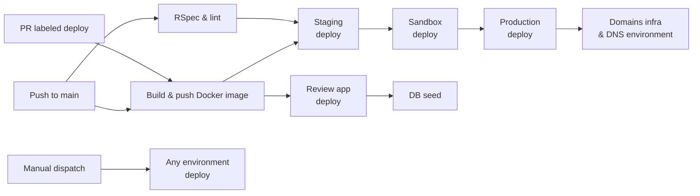

# Deployment overview

The deployment system takes code from a merged pull request, builds a container image,
pushes it to the GitHub Container Registry (ghcr.io), applies Terraform to provision or
update Azure infrastructure, and deploys the application to Azure Kubernetes Service (AKS).

## Pipeline



Each environment deployment runs `terraform apply` from `terraform/application/`. The
staging, sandbox, and production stages execute sequentially on push to `main` — a
failure in one stops the chain. Domains infrastructure (DNS zones, front-door) updates
after a successful production deploy.

## PR review apps

Every pull request labelled `deploy` on GitHub gets its own ephemeral environment:

| Property            | Value                                                                         |
|---------------------|-------------------------------------------------------------------------------|
| URL                 | `https://teacher-training-entitlement-review-<N>.test.teacherservices.cloud/` |
| Docker image tag    | `pr-<N>`                                                                      |
| Azure subscription  | `s189-teacher-services-cloud-test`                                            |
| Terraform state key | `terraform-<N>.tfstate`                                                       |
| Backing services    | Containers inside AKS (not Azure-managed PostgreSQL/Redis)                    |
| Lifetime            | Created on PR open / label add; destroyed on merge or close                   |

```bash
# To trigger a review app, push a branch, open a PR, and add the "deploy" label.
```

The database is seeded with `db:seed:replant` after deployment.

## Permanent environments

| Environment | URL                                                     | Azure space | PIM required | Access                    |
|-------------|---------------------------------------------------------|-------------|--------------|---------------------------|
| Staging     | `staging.teacher-training-entitlement.education.gov.uk` | test        | No           | Team (HTTP basic auth)    |
| Sandbox     | `sandbox.teacher-training-entitlement.education.gov.uk` | production  | Yes          | External (lead providers) |
| Production  | `teacher-training-entitlement.education.gov.uk`         | production  | Yes          | Real users                |

→ [Full environments reference](../environments.md)

## Deployment triggers

Three ways to deploy:

1. **Merge to `main`** — the standard path. Code flows staging → sandbox → production.
2. **Manual deploy** — via `.github/workflows/manual_deploy.yml`. Specify an existing
   Docker image tag on ghcr.io and a target environment. Used for rollbacks.
3. **PR label** — add the `deploy` label to an open PR to create (or update) a review app.

```yaml
# Manual deploy example (rollback production to a previous image):
# Go to GitHub → Actions → Manual deploy → Set environment=production,
# docker-image-tag=<sha>, confirm with CONFIRM_PRODUCTION=yes.
```

Production deploys require `CONFIRM_PRODUCTION=yes` (enforced in the Makefile). The
sandbox and production environments run in the `production` Azure space, which
requires Azure Privileged Identity Management (PIM) elevation.

## Container runtime

The `Dockerfile` is multi-stage, based on `ruby:3.4.9-alpine3.23`:

- **Builder**: installs system deps (build-base, postgresql-dev, yarn), gems via
  Bundler 2.5.15, Node packages, precompiles Rails assets.
- **Production**: copies compiled artifacts from builder, installs only runtime deps
  (libpq, tzdata), runs as non-root `appuser:appgroup` (UID 10001, GID 20001).

```dockerfile
CMD bundle exec rake db:migrate && exec bundle exec rails s -p ${PORT} --binding=0.0.0.0
```

The Rails server uses Puma (`config/puma.rb`) listening on port `8080`. Each worker
process runs `RAILS_MAX_THREADS` threads (default: 3).

Health probes (configured in `terraform/application/application.tf`):

| Probe                | Web            | Worker          |
|----------------------|----------------|-----------------|
| Liveness / readiness | HTTP GET `/up` | `pgrep -f rake` |

## Web and worker

Both deployments use the same Docker image with different commands:

| Deployment | Command                      | Purpose                                 |
|------------|------------------------------|-----------------------------------------|
| `*-web`    | `bundle exec rails s`        | Serves HTTP requests via Puma           |
| `*-worker` | `bundle exec rake jobs:work` | Processes Delayed::Job background queue |

The web pod runs `db:migrate` before starting the server (see CMD above). The worker
pod has a 15-second destroy delay in Terraform to let in-flight Delayed::Job tasks
finish before PostgreSQL is removed (applies to review apps that use container-backed
databases).

## Scaling

Scale imperatively with `kubectl` through Makefile targets, or declaratively by
updating `.tfvars.json` and running `terraform apply`.

```bash
# Scale web to 4 replicas in staging
make staging scale-app REPLICAS=4

# Scale worker to 3 replicas in production
CONFIRM_PRODUCTION=yes make production scale-worker REPLICAS=3
```

Baseline replicas from `.tfvars.json`:

```json
// terraform/application/config/production.tfvars.json
{ "app_replicas": 2, "worker_replicas": 2 }
```

- Staging and review apps default to 1 web / 1 worker (values not set → Terraform
  defaults).
- Increase `worker_replicas` when the Delayed::Job queue backlog grows. Monitor
  queue depth via `/healthcheck` (`database.queued_jobs`).

## AKS access

```bash
# Authenticate kubectl to the correct cluster
make staging get-cluster-credentials

# Rails console (sandboxed, via worker pod)
make staging aks-console

# Shell on worker pod
make staging aks-ssh

# Shell on web pod
make staging aks-web-ssh
```

Use `make production` or `make sandbox` for the production AKS cluster
(s189p01-tsc-production-aks). The test cluster is s189t01-tsc-test-aks. Authentication
uses Azure CLI + kubelogin.

## Database access

The `konduit` script creates a temporary tunnel to the PostgreSQL flexible server:

```bash
make staging konduit          # opens psql against the primary database
make staging konduit-snapshot # opens psql against the snapshot database
```

This writes an ephemeral `url:` entry into `config/database.yml` pointing at the
target database. The entry is removed automatically when the konduit closes.

## After-deploy verification

The `bin/smoke` script validates a live environment by querying `/healthcheck`:

```bash
bin/smoke https://staging.teacher-training-entitlement.education.gov.uk <commit-sha>
```

Checks performed:
1. `git_commit_sha` in the healthcheck response matches the deployed commit.
2. `database.migration_version` equals the latest migration file timestamp.
3. `redis` is connected.
4. `database.connected` is true.
5. `database.populated` is true.
6. HTTP GET `/` returns 200.

(The smoke test action exists in `.github/actions/smoke-test/` but is not currently
wired into CI. Run manually or re-enable per environment.)

## Key files

| File                                         | Purpose                                            |
|----------------------------------------------|----------------------------------------------------|
| `.github/workflows/deploy.yml`               | Main CI/CD: build, test, deploy on push/PR         |
| `.github/workflows/manual_deploy.yml`        | Manual deploy for rollbacks                        |
| `.github/actions/deploy-environment-to-aks/` | Composite action: terraform-apply + seed           |
| `Dockerfile`                                 | Multi-stage container build (builder → production) |
| `config/puma.rb`                             | Puma web server configuration (port, threads)      |
| `terraform/application/application.tf`       | AKS module: web, worker, config injection          |
| `terraform/application/variables.tf`         | Deployment variables (replicas, command, probes)   |
| `terraform/application/config/*.tfvars.json` | Per-environment Terraform variable sets            |
| `Makefile`                                   | Deployment, scaling, AKS access, konduit targets   |
| `bin/smoke`                                  | Post-deploy smoke test script                      |
| `Tiltfile` / `docker-compose.yml`            | Local development orchestration                    |
| `global_config/*.sh`                         | Environment-specific Azure subscription and naming |

## Related docs

- [Environments](../environments.md) — permanent environments, HTTP basic auth
- [Terraform](terraform.md) — infrastructure-as-code deep dive
- [Maintenance mode](maintenance-mode.md) — fail-over to maintenance page
- [Disaster recovery](disaster-recovery.md) — backup and restore procedures
- [Setup](../setup.md) — local development environment
