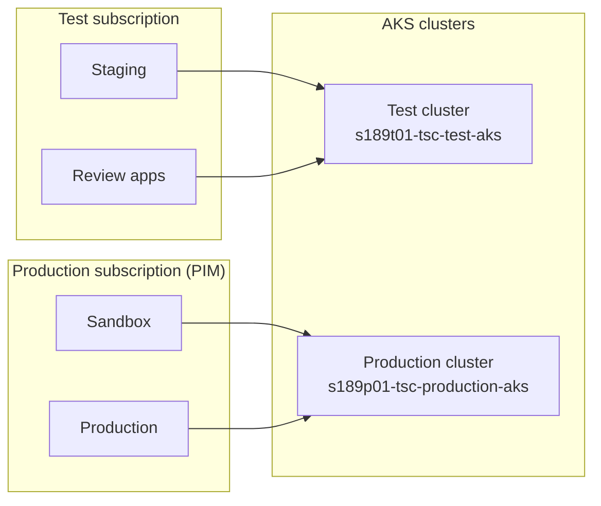

[< Back to docs](../README.md) · [Development overview](./overview.md)

# Connecting to Azure

Access TTE's Azure resources: AKS clusters (consoles, shells, rake tasks),
PostgreSQL databases (via Konduit), and Key Vaults (secrets).

> **References:** [deployment/environments.md](../deployment/environments.md) for
> environment URLs, subscriptions, and cluster names.
> [deployment/overview.md](../deployment/overview.md) for the deployment pipeline.

---

## Prerequisites

| Tool             | Required for                        | Install                                                                         |
|------------------|-------------------------------------|---------------------------------------------------------------------------------|
| Azure CLI (`az`) | Auth, Key Vault, AKS credentials    | [Microsoft docs](https://learn.microsoft.com/en-us/cli/azure/install-azure-cli) |
| kubectl          | Kubernetes interaction              | Docker Compose `ops` or `brew install kubectl`                                  |
| kubelogin        | AKS credential conversion           | `brew install Azure/kubelogin/kubelogin`                                        |
| Docker Compose   | `ops` container (bundles all tools) | [Docker Desktop](https://www.docker.com/products/docker-desktop/)               |
| Konduit          | PostgreSQL tunnel                   | `make install-konduit` ([see below](#konduit))                                  |

The Docker Compose `ops` service bundles `az`, `kubectl`, `kubelogin`,
`terraform`, and `konduit`. See [Docker Compose ops](#docker-compose-ops).

---

## 1. Azure authentication

### Sign in

```shell
az login
```

Use your `@digitalauth.education.gov.uk` account. Verify **DfE Platform Identity**
appears in the Azure portal header (switch directory via the settings cog if not).

### Select subscription

| Subscription                             | Hosts                | PIM |
|------------------------------------------|----------------------|-----|
| `s189-teacher-services-cloud-test`       | Staging, review apps | No  |
| `s189-teacher-services-cloud-production` | Sandbox, production  | Yes |

```shell
az account set -s s189-teacher-services-cloud-test
```

The Makefile handles this automatically. Manually set only when using `az`
directly (e.g. Key Vault).

---

## 2. AKS clusters

| Cluster                      | Resource group      | Environments        |
|------------------------------|---------------------|---------------------|
| `s189t01-tsc-test-aks`       | `s189t01-tsc-ts-rg` | Staging, review     |
| `s189p01-tsc-production-aks` | `s189p01-tsc-pd-rg` | Sandbox, production |

### Authenticate kubectl

```shell
make staging get-cluster-credentials   # test cluster — no PIM
make sandbox get-cluster-credentials   # production cluster — PIM required
make production get-cluster-credentials
```

This fetches kubeconfig and converts via kubelogin. Session lasts several hours.

### Verify

```shell
kubectl get pods -n cpd-development   # staging / review
kubectl get pods -n cpd-production    # sandbox / production
```

---

## 3. PIM (Privileged Identity Management)

Only the **production subscription** requires PIM. The test subscription does not.

### Request

1. Visit [PIM Activation](https://portal.azure.com/#view/Microsoft_Azure_PIMCommon/ActivationMenuBlade/~/aadgroup)
2. Activate **Member** role for `s189 CPD production PIM` group
3. Provide justification, set duration (default 8 hours)

### Approve

View and approve pending requests
[here](https://portal.azure.com/#view/Microsoft_Azure_PIMCommon/ApproveRequestMenuBlade/~/aadgroup).

### Makefile gating

| Make target           | PIM | Notes                                  |
|-----------------------|-----|----------------------------------------|
| `make staging <t>`    | No  | —                                      |
| `make review <t>`     | No  | Requires `PR_NUMBER=N`                 |
| `make sandbox <t>`    | Yes | —                                      |
| `make production <t>` | Yes | Also requires `CONFIRM_PRODUCTION=yes` |

Without PIM, `make sandbox` / `make production` fail with an authorization error.

---

## 4. Common commands

All commands follow: `make <env> <target>`.

| What                       | Target                             | Example                                                  |
|----------------------------|------------------------------------|----------------------------------------------------------|
| Rails console (sandbox)    | `aks-console`                      | `make staging aks-console`                               |
| Rails console (read-write) | `aks-rw-console`                   | `make staging aks-rw-console`                            |
| Shell on worker pod        | `aks-ssh`                          | `make staging aks-ssh`                                   |
| Shell on web pod           | `aks-web-ssh`                      | `make production aks-web-ssh`                            |
| Run a rake/runner task     | `aks-runner COMMAND="..."`         | `make staging aks-runner COMMAND="task:name"`            |
| Copy file from `tmp/`      | `aks-download-tmp-file FILENAME=x` | `FILENAME=report.csv make staging aks-download-tmp-file` |

**Review apps** require `PR_NUMBER`:

```shell
make review aks-console PR_NUMBER=123
make review aks-download-tmp-file PR_NUMBER=123 FILENAME=debug.log
```

Console sessions use `--sandbox` by default (read-only). Use `aks-rw-console`
for persisted changes.

---

## 5. Konduit

[Konduit](https://github.com/DFE-Digital/teacher-services-cloud/blob/main/scripts/konduit.sh)
creates a temporary tunnel from your machine to the PostgreSQL flexible server
inside AKS, then opens `psql`.

### Install

```shell
make install-konduit
```

Downloads to `bin/konduit.sh` (gitignored). Re-run to update.

### Usage

```shell
make staging konduit           # primary database
make staging konduit-snapshot  # read-only snapshot replica
make production konduit
```

The tunnel writes an ephemeral `url:` entry into `config/database.yml` pointing at
the target database. The entry is removed automatically when the tunnel closes
(`Ctrl+C`).

### From Docker Compose ops

The Konduit script needs two edits to work inside the `ops` container:

1. In `open_tunnels()` inside `bin/konduit.sh`:
   - Add `--address 0.0.0.0` to the `kubectl port-forward` call
   - Replace `127.0.0.1:${LOCAL_PORT}` with `konduit:${LOCAL_PORT}`
2. Run with `--name konduit`:

   ```shell
   docker compose run --rm --name konduit ops make staging konduit
   ```

---

## 6. Key Vault

Each environment has two Key Vaults: application (`*-app-kv`) and infrastructure
(`*-inf-kv`).

| Env        | Subscription | Application KV             | Infrastructure KV          |
|------------|--------------|----------------------------|----------------------------|
| Staging    | Test         | `s189t01-cpdtte-st-app-kv` | `s189t01-cpdtte-st-inf-kv` |
| Sandbox    | Production   | `s189p01-cpdtte-sb-app-kv` | `s189p01-cpdtte-sb-inf-kv` |
| Production | Production   | `s189p01-cpdtte-pd-app-kv` | `s189p01-cpdtte-pd-inf-kv` |

### Read a secret

```shell
az account set -s s189-teacher-services-cloud-test
az keyvault secret show \
  --vault-name s189t01-cpdtte-st-app-kv \
  --name MY-SECRET \
  --query value -o tsv
```

For production Key Vaults, set the production subscription and ensure PIM is
active.

---

## 7. Docker Compose ops

The `ops` service provides a container with `az`, `kubectl`, `kubelogin`,
`terraform`, and `konduit` pre-installed.

```shell
# Interactive shell
docker compose run --rm ops

# Single command
docker compose run --rm ops make staging aks-console
docker compose run --rm ops make staging konduit
```

The `ops` service is scaled to 0 by default (`docker compose up -d` does not
start it). Run explicitly when needed.

---

## 8. Environment topology



| Env        | Make target                   | Subscription                             | Cluster                      | PIM |
|------------|-------------------------------|------------------------------------------|------------------------------|-----|
| Production | `make production <t>`         | `s189-teacher-services-cloud-production` | `s189p01-tsc-production-aks` | Yes |
| Sandbox    | `make sandbox <t>`            | `s189-teacher-services-cloud-production` | `s189p01-tsc-production-aks` | Yes |
| Staging    | `make staging <t>`            | `s189-teacher-services-cloud-test`       | `s189t01-tsc-test-aks`       | No  |
| Review     | `make review <t> PR_NUMBER=N` | `s189-teacher-services-cloud-test`       | `s189t01-tsc-test-aks`       | No  |

---

## Useful links

- [Teacher Services Cloud developer docs](https://github.com/DFE-Digital/teacher-services-cloud/blob/main/documentation/developer-onboarding.md)

- [Deployment environments](../deployment/environments.md) — full environment reference
- [Deployment overview](../deployment/overview.md) — pipeline, scaling, smoke tests
- [Development overview](./overview.md) — tech stack, local setup, CI
- [Local setup](./local-setup.md) — running the app locally
- [Makefile](../../Makefile) — all available targets
