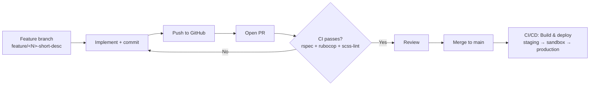

[< Back to docs](../README.md)

# Development Overview

This page surveys the TTE service from a developer's perspective: tech stack,
local setup, development and CI workflow, and authentication. Each section links
to a dedicated sub-page for deeper detail.

---

## Tech stack

| Layer               | Technology                                                                  |
|---------------------|-----------------------------------------------------------------------------|
| **Language**        | Ruby 3.4.9                                                                  |
| **Framework**       | Rails 8.1.3                                                                 |
| **Database**        | PostgreSQL 14                                                               |
| **JavaScript**      | Node.js 24.13.0, Yarn 1.22.22                                               |
| **Asset pipeline**  | Webpack 5 (via `jsbundling-rails`), SCSS (via `cssbundling-rails` + `sass`) |
| **Background jobs** | Delayed Job (5 queues, see below)                                           |
| **Feature flags**   | Flipper (`flipper-active_record`)                                           |
| **Testing**         | RSpec + FactoryBot + Faker + Capybara/Cuprite                               |
| **Linting**         | RuboCop (via `rubocop-govuk`), SCSS-Lint                                    |
| **CI parallel**     | Knapsack Pro — 6 parallel CI nodes                                          |
| **Code coverage**   | SimpleCov                                                                   |

### Delayed Job queues

Jobs are routed by priority — see `config/initializers/delayed_job.rb`:

| Queue                  | Priority | Purpose                        |
|------------------------|----------|--------------------------------|
| `high_priority`        | −10      | Time-sensitive tasks           |
| `default`              | 0        | General background work        |
| `dfe_analytics`        | 0        | Analytics event export         |
| `participant_outcomes` | 5        | Participant outcome processing |
| `low_priority`         | 10       | Batch or non-urgent work       |

---

## Quick start

Choose the method that fits your environment.

### Docker Compose (easiest)

```bash
docker compose up -d                 # start db, web, worker
docker compose run web bundle exec rails c   # console
docker compose run web bundle exec rspec     # tests
```

See [`local-setup.md`](local-setup.md) for full details.

### Local (without Docker)

```bash
bundle install && yarn && bin/rails db:setup
cp .env.template .env      # fill in secrets
./bin/dev                   # Rails server + asset watchers
```

### Tilt (advanced)

Runs Rails and worker locally while keeping the database in Docker:

```bash
tilt up -- --local-web
```

---

## Development workflow



### Branch and commit convention

```bash
git checkout -b feature/142-add-deferral-reason-field
git commit -m "Add deferral reason to application form"   # imperative mood
```

### Pull request lifecycle

| Step           | Detail                                                                                        |
|----------------|-----------------------------------------------------------------------------------------------|
| **Title**      | `[#<N>] Short imperative description` — e.g. `[#142] Add deferral reason to application form` |
| **Body**       | What, how to test, ticket link, follow-up tickets                                             |
| **Template**   | `.github/PULL_REQUEST_TEMPLATE.md` — data/integration checklist                               |
| **CI gates**   | RuboCop → SCSS-Lint → RSpec (6 parallel Knapsack nodes)                                       |
| **Review app** | Add the `deploy` label for an ephemeral environment                                           |
| **Merge**      | Via GitHub UI into `main`                                                                     |

> **Tip:** CI is the merge gate — it runs on every push. Don't merge until the
> green checkmark shows for all three jobs.

See [`ways-of-working.md`](ways-of-working.md) for full git and PR conventions.

---

## Authentication modes

The service has three distinct authentication mechanisms, one per interface:

### Participant (TRS Teacher Auth + GOV.UK One Login)

Participants authenticate via an OmniAuth OpenID Connect flow (`omniauth_openid_connect`)
against the [Teacher Record Service (TRS)](../integrations/govuk-one-login.md), which
wraps GOV.UK One Login at verified identity level and returns a Teacher Reference
Number (TRN). The strategy is configured in `config/initializers/devise.rb` using
`TEACHER_AUTH_DOMAIN`, `TEACHER_AUTH_CLIENT_ID`, and `TEACHER_AUTH_CLIENT_SECRET`.

### Admin (OTP-based)

Internal DfE users (`AdminUser`) sign in via a custom wizard at `/admin` — no
password, no Devise, no Teacher Auth. Authentication uses a time-limited OTP sent
by email (via GOV.UK Notify). See [`../admin/overview.md`](../admin/overview.md) and
[`../admin/authentication.md`](../admin/authentication.md).

### Lead Provider API (Bearer token)

Lead Providers authenticate to the REST API using HTTP Bearer tokens stored in
the database. Tokens are managed through the admin console.

---

## Environment variables

| Environment                                 | Source                                  |
|---------------------------------------------|-----------------------------------------|
| **Development**                             | `.env` file (loaded by `dotenv-rails`)  |
| **Test**                                    | Hardcoded defaults or `.env.test`       |
| **Review / Staging / Sandbox / Production** | [Azure Key Vault](../azure-keyvault.md) |

Variables required locally (see `.env.template`):

```bash
GOVUK_NOTIFY_API_KEY=        # transactional emails
ACTIVE_RECORD_ENCRYPTION_PRIMARY_KEY=  # AR encryption (ask for values)
ACTIVE_RECORD_ENCRYPTION_DETERMINISTIC_KEY=
ACTIVE_RECORD_ENCRYPTION_KEY_DERIVATION_SALT=
TEACHER_AUTH_CLIENT_SECRET=  # OIDC client secret
TRS_API_URL=                 # teacher qualifications API
```

> Copy `.env.template` to `.env` and ask a team member for the current values.

---

## Sub-pages

| Page                                           | Covers                                                               |
|------------------------------------------------|----------------------------------------------------------------------|
| [`local-setup.md`](local-setup.md)             | Docker Compose, local dev, Codespaces, Tilt, AR encryption keys      |
| [`azure-access.md`](azure-access.md)           | Azure CLI, AKS/kubectl authentication, Konduit DB tunnels, PIM       |
| [`specs-and-linting.md`](specs-and-linting.md) | RSpec (single + parallel), RuboCop, SCSS-Lint, auto-correct          |
| [`feature-flags.md`](feature-flags.md)         | Flipper admin UI, `Feature` service object, per-user flags           |
| [`data-imports.md`](data-imports.md)           | GIAS schools import, private childcare providers, pupil premium data |
| [`ways-of-working.md`](ways-of-working.md)     | Branch naming, commit style, PR template, review process             |

---

## CI pipeline

The full CI/CD pipeline is defined in `.github/workflows/`:

| Workflow            | Trigger                        | What it does                                   |
|---------------------|--------------------------------|------------------------------------------------|
| `rspec.yml`         | Every push                     | RuboCop → SCSS-Lint → RSpec (6 parallel nodes) |
| `deploy.yml`        | Push `main`, PR `deploy` label | Build → staging → sandbox → production         |
| `manual_deploy.yml` | Manual dispatch                | Deploy any image tag to any environment        |
| `maintenance.yml`   | Manual toggle                  | Maintenance mode on/off                        |

See [`../deployment/overview.md`](../deployment/overview.md) for the full deployment
pipeline and environment reference.

---

## Key configuration files

| File | Purpose |
|------|---------|
| `.ruby-version` / `.tool-versions` | Runtime versions (Ruby 3.4.9, Node 24.13, etc.) |
| `.env.template` | Required env vars for local dev |
| `config/initializers/delayed_job.rb` | Queue priorities, max run time, retry backoff |
| `config/initializers/dfe_analytics.rb` | Analytics queue and feature gate |
| `config/routes/admin.rb` | Admin console routes |
| `app/services/feature.rb` | Flipper feature flag key registry |
| `docker-compose.yml` / `Tiltfile` | Local dev orchestration |
| `webpack.config.js` | Webpack asset bundling |
