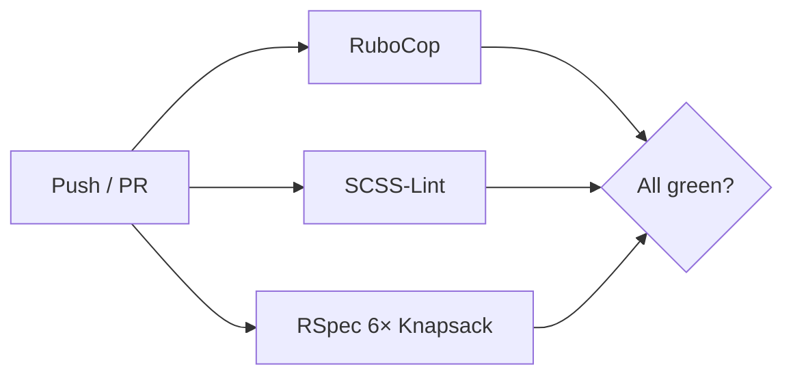

[< Back to overview](overview.md)

# Specs and Linting

A practical guide to running tests and linters.

- [Quick reference](#quick-reference)
- [Running tests](#running-tests)
- [Test config](#test-config)
- [Common patterns](#common-patterns)
- [Linting](#linting)
- [CI](#ci)
- [Coverage](#coverage)
- [Key files](#key-files)

---

## Quick reference

```bash
bundle exec rake               # rubocop → scss-lint → rspec
bundle exec rspec              # full suite
bundle exec rspec spec/models/user_spec.rb         # single file
bundle exec rspec spec/models/user_spec.rb:38      # single example
bundle exec rubocop -a         # safe auto-correct
bundle exec rubocop -A         # all auto-correct
```

---

## Running tests

### Full suite

```bash
bundle exec rspec
```

Random order. Failed examples persist to `.examples` (`--only-failures`).
RSpec uses `doc` formatter for single-file runs.

Filter by tag (`:npq` and `:revisit` excluded by default):

```bash
bundle exec rspec --tag ~npq
```

### Parallel (local)

```bash
bundle exec rake parallel:setup   # one-time
bundle exec rake parallel:spec
```

---

## Test config

**`spec/spec_helper.rb`** — Knapsack bind, SimpleCov start (`"rails"` preset),
WebMock (external HTTP blocked except localhost + edgedl), random order,
`:npq`/`:revisit` exclusion, `.examples` persistence.

**`spec/rails_helper.rb`** — transactional fixtures, FactoryBot syntax methods,
`Course::IDENTIFIERS` pre-created, `Flipper.enable(REGISTRATION_OPEN)`, Cuprite
driver (Chrome headless, `default_max_wait_time: 10`, `1400x1400`),
`capybara-screenshot` on failure, Shoulda Matchers, PaperTrail, feature specs in
`"London"` time zone, RSwag dry run disabled.

**Testing gems:** `rspec-rails`, `factory_bot_rails`, `faker`,
`shoulda-matchers`, `capybara` + `cuprite`, `capybara-screenshot`, `site_prism`,
`webmock`, `axe-core-capybara` + `axe-core-rspec`, `simplecov`, `knapsack`,
`parallel_tests`, `rspec-sonarqube-formatter`, `rswag-specs`.

---

## Common patterns

```ruby
# FactoryBot — pre-created courses, traits in spec/factories/
create(:application, :accepted, :with_school)
let(:course) { Course.find_by(identifier: "npq-headship") }

# Shoulda matchers — one-liners + negated helper
it { is_expected.to have_many(:applications).dependent(:destroy) }
expect { action }.to not_change(Application, :count)

# Request specs — shared examples, auto-included helpers
RSpec.describe "Participants", type: :request do
  it_behaves_like "an API index endpoint"
end

# Accessibility
expect(page).to be_axe_clean

# RSwag — generate OpenAPI spec
# bundle exec rspec spec/requests/api/docs/ --format RSwag::Formatters::SwaggerFormatter
```

---

## Linting

### RuboCop

Config inherits from `.rubocop_todo.yml`, `config/rspec-rswag.yml`, and
`rubocop-govuk` (default, rails, rspec presets).

```bash
bundle exec rubocop              # check only
bundle exec rubocop -a           # safe auto-correct
bundle exec rubocop -A           # all auto-correct
bundle exec rake lint:ruby       # via Rake (clang + auto-correct)
bundle exec rake lint:scss       # SCSS via scss_lint-govuk
```

---

## CI

Defined in `.github/workflows/rspec.yml`. Runs on every push and PR.



| Job            | Runs                                                 |
|----------------|------------------------------------------------------|
| `ruby_linting` | `bundle exec rubocop`                                |
| `scss_linting` | `bundle exec rake lint:scss`                         |
| `rspec`        | 6 Knapsack-balanced nodes, Postgres 14, Ubuntu 24.04 |

Coverage and test reports uploaded per node.

---

## Coverage

```bash
bundle exec rspec && open coverage/index.html
```

CI collation: `COVERAGE_DIR=./coverage bundle exec rake coverage:collate`.

No hard threshold.

---

## Key files

| File                          | Purpose                                        |
|-------------------------------|------------------------------------------------|
| `.rspec`                      | RSpec CLI flags                                |
| `spec/spec_helper.rb`         | Knapsack, SimpleCov, WebMock, RSpec config     |
| `spec/rails_helper.rb`        | Rails boot, Capybara, FactoryBot, Shoulda      |
| `.rubocop.yml`                | RuboCop chain (govuk, rswag, exclusions)       |
| `lib/tasks/govuk_lint.rake`   | `lint:ruby` / `lint:scss`                      |
| `Rakefile`                    | Default task, Knapsack load, RSwag dry-run off |
| `.github/workflows/rspec.yml` | CI pipeline                                    |

---

**See also:** [`overview.md`](overview.md) for the tech stack,
[`local-setup.md`](local-setup.md) for local dev setup.
