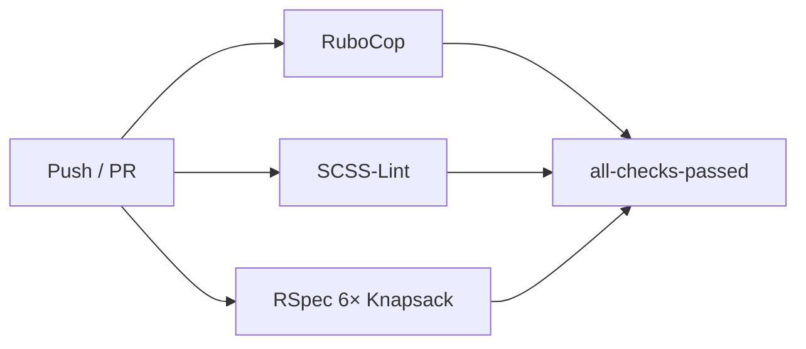
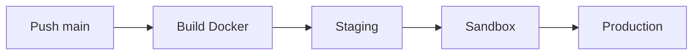

[< Back to development overview](overview.md)

# Ways of Working

Conventions, workflows, and automation rules for the TTE team. This is a reference
— see [`local-setup.md`](local-setup.md) for dev environment setup and
[`specs-and-linting.md`](specs-and-linting.md) for running tests/linters.

---

## Branching

| Prefix     | Purpose                |
|------------|------------------------|
| `feature/` | New feature (default)  |
| `fix-`     | Bug fix                |
| `enhance-` | Enhancement            |
| `spike-`   | Research / prototyping |

```bash
git checkout -b feature/142-add-deferral-reason-field
```

---

## Commits

Imperative mood, present tense: `git commit -m "Add deferral reason to application form"`.

- **Human commits** — prefix with `[#<N>] <description>` (e.g., `[#142] Add deferral reason to application form`).
- **Dependabot commits** — use `chore(deps): <scope>` (e.g., `chore(deps): bump rails`).
- **Atomic** — one logical change per commit.

---

## Pull Requests

- **Title:** `[#<N>] Short imperative description` (e.g., `[#142] Add deferral reason to application form`).
- **Body:** what the PR does, how to test, ticket link, follow-up tickets.
- **Template:** `.github/PULL_REQUEST_TEMPLATE.md` — checklists for data/schema changes, integration impact (DfE Analytics, API), and data integrity.
- **Merge:** via GitHub UI into `main`. Dependabot uses squash merge.

---

## CI Pipeline

Every push and PR triggers three parallel checks plus an OpenAPI schema check in deploy:



| Job            | Command                          | Notes                         |
|----------------|----------------------------------|-------------------------------|
| `ruby_linting` | `bundle exec rubocop`            | Inherits `rubocop-govuk`      |
| `scss_linting` | `bundle exec rake lint:scss`     | Uses `scss_lint-govuk` plugin |
| `rspec`        | Knapsack Pro on 6 parallel nodes | PostgreSQL 14, Ubuntu 24.04   |

- **OpenAPI schema check** — `rake rswag:specs:swaggerize` compares checksums of generated docs to detect schema drift. Runs via `lead_provider_openapi_check.yml` as a reusable workflow called from `deploy.yml`.
- **Gate:** `all-checks-passed` must succeed before staging deploys.

---

## Code Review

| Step              | Detail                                                |
|-------------------|-------------------------------------------------------|
| **Pre-requisite** | CI green on all three checks                          |
| **Review app**    | Add `deploy` label to PR — `deploy.yml` provisions it |
| **Review**        | Team member reviews via GitHub UI                     |
| **Merge**         | PR author merges into `main` once approved            |
| **Dependabot**    | Minor/patch auto-merged with squash                   |

Review app URL is posted as a PR comment; destroyed on PR close via `destroy_review_app.yml`.

---

## Releases

Push to `main` triggers a staged pipeline with manual gates between environments:



| Workflow            | Trigger              | Purpose                                |
|---------------------|----------------------|----------------------------------------|
| `deploy.yml`        | Push main + PR label | Build → staging → sandbox → production |
| `manual_deploy.yml` | Manual dispatch      | Deploy any image tag to any env        |
| `maintenance.yml`   | Manual dispatch      | Enable/disable maintenance mode        |

Smoke tests in review apps are currently commented out.

---

## Dependabot

Configured in [`.github/dependabot.yml`](../../.github/dependabot.yml):

| Ecosystem      | Frequency  | Open PRs | Labels                           | Prefix        |
|----------------|------------|----------|----------------------------------|---------------|
| Bundler        | Daily      | 10       | `dependencies`, `ruby`           | `chore(deps)` |
| npm            | Daily      | 10       | `dependencies`, `javascript`     | `chore(deps)` |
| Docker         | Weekly Mon | 5        | `dependencies`, `docker`         | `chore(deps)` |
| GitHub Actions | Weekly Mon | 5        | `dependencies`, `github-actions` | `chore(deps)` |

Minor/patch PRs auto-merged via `dependabot-auto-merge.yml` (squash merge).

---

## Access & Ownership

All files owned by `@DFE-Digital/tte-dev-cpd` — set in `.github/CODEOWNERS`.
Dependency files (`Gemfile`, `Gemfile.lock`, `package.json`, `yarn.lock`) are
explicitly listed to avoid auto-assigning reviewers on Dependabot PRs.

---

## Other Workflows

| Workflow                          | Trigger             | Purpose                              |
|-----------------------------------|---------------------|--------------------------------------|
| `maintenance.yml`                 | Manual              | Enable/disable maintenance mode      |
| `destroy_review_app.yml`          | PR closed / manual  | Tear down review app infra           |
| `build-nocache.yml`               | Weekly Sun + manual | Rebuild Docker image without cache   |
| `verify_external_links.yml`       | Manual              | Check external links                 |
| `refresh_knapsack_manifest.yml`   | Weekly Mon + manual | Regenerate Knapsack test manifest    |
| `validate-infrastructure.yml`     | Daily               | Validate AKS/domains Terraform plans |
| `backup_production_database.yml`  | Daily + manual      | Backup PostgreSQL to Azure Storage   |
| `postgres-ptr.yml`                | Manual              | Point-in-time restore to new server  |
| `postgres-recover-deleted-db.yml` | Manual              | Recover a deleted PostgreSQL server  |
| `restore_azure_database.yml`      | Manual              | Restore from Azure Storage backup    |
| `restore_snapshot_database.yml`   | Manual              | Refresh snapshot DB from production  |

---

## Linting

**RuboCop:** `.rubocop.yml` inherits `rubocop-govuk` (default, rails, rspec) plus
`.rubocop_todo.yml` for known offenses. Excludes `bin/*`, `db/schema.rb`,
`node_modules/**/*`, `config/application.rb`, `config/puma.rb`, `vendor/**/*`.

**SCSS-Lint:** `.scss-lint.yml` uses `scss_lint-govuk` plugin gem. Only exclusion:
`QualifyingElement` on `app/assets/stylesheets/application.scss`.

Both run in parallel on CI. See [`specs-and-linting.md`](specs-and-linting.md) for local usage.

---

## Dev Environment Quick Reference

| Task                 | Command                                             |
|----------------------|-----------------------------------------------------|
| Run tests            | `bundle exec rspec`                                 |
| Run linters          | `bundle exec rubocop && bundle exec rake lint:scss` |
| Default Rake         | `bundle exec rake` (rubocop → scss-lint → rspec)    |
| Start server         | `bundle exec rails s` or `./bin/dev`                |
| Infrastructure tasks | `make <env> <target>` (review, ci, terraform-apply) |

The `Makefile` handles AKS/terraform/deployment only — local dev uses `bundle exec`.

---

## Related Docs

| Document                                       | Covers                                                     |
|------------------------------------------------|------------------------------------------------------------|
| [`overview.md`](overview.md)                   | Tech stack, auth modes, env vars, CI pipeline overview     |
| [`local-setup.md`](local-setup.md)             | Docker Compose, local dev, Codespaces, Tilt                |
| [`specs-and-linting.md`](specs-and-linting.md) | RSpec, RuboCop, SCSS-Lint, test config, parallel execution |
| [`azure-access.md`](azure-access.md)           | Azure CLI, AKS/kubectl, Konduit DB tunnels                 |
| [`feature-flags.md`](feature-flags.md)         | Flipper admin UI, `Feature` service object, per-user flags |
