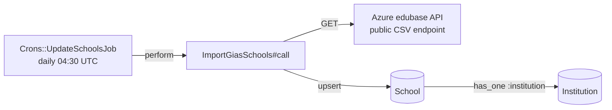

[< Back to Integrations](./README.md) · [Data Imports](../development/data-imports.md)

# GIAS (Get Information About Schools)

GIAS is the authoritative UK government dataset for school and establishment
data. The TTE service imports it daily to power eligibility checks (is a
participant's workplace a state-funded school in England?), work-setting
lookups, and funding calculations.

Imported records become `School` and `Institution` (polymorphic) rows. No API
key is required — the endpoint is a public CSV download.

---

## Architecture



**Job chain detail:**

```
Crons::UpdateSchoolsJob (daily 04:30, Sentry monitor slug: "update-schools")
  └── ImportGiasSchools.new.call
       ├── GET https://ea-edubase-api-prod.azurewebsites.net/edubase/downloads/public/edubasealldata<YYYYMMDD>.csv
       │   (ISO-8859-1 → UTF-8 chunk-by-chunk, streamed to Tempfile)
       ├── CSV.foreach(tempfile, headers: true)
       │   ├── Find Institution by URN → get School via polymorphic association
       │   ├── Create new School + Institution (URN not found)
       │   ├── Update existing if LastChangedDate is newer (or refresh_all)
       │   └── Skip otherwise
       └── ensure: tempfile.close + tempfile.unlink
```

---

## API details

| Property        | Value                                                                                                 |
|-----------------|-------------------------------------------------------------------------------------------------------|
| Endpoint        | `https://ea-edubase-api-prod.azurewebsites.net/edubase/downloads/public/edubasealldata<YYYYMMDD>.csv` |
| Auth            | None (public)                                                                                         |
| Filename format | `edubasealldata<YYYYMMDD>.csv` — date-rotated daily                                                   |
| Encoding        | `ISO-8859-1` → converted chunk-by-chunk to `UTF-8`                                                    |
| Download method | Streamed to a Ruby `Tempfile`; closed and unlinked after processing                                   |

The file is fetched via `Net::HTTP` with streaming `read_body`. Each chunk is
re-encoded before writing. A non-200 response raises
`ImportGiasSchools::FileNotAvailableError`.

---

## Data model mapping

The following GIAS CSV columns map to the service's data model:

| CSV column                            | Model field                                         |
|---------------------------------------|-----------------------------------------------------|
| `URN`                                 | `Institution#institution_reference_number` (lookup) |
| `EstablishmentName`                   | `Institution#name`                                  |
| `Street` / `Locality` / `Address3`    | `Institution#address_1` / `address_2` / `address_3` |
| `Town` / `County (name)` / `Postcode` | `Institution#town` / `county` / `postcode`          |
| `RSCRegion (name)`                    | `Institution#region`                                |
| `LA (code)` / `LA (name)`             | `School#la_code` / `School#la_name`                 |
| `EstablishmentStatus (code/name)`     | `School#establishment_status_code/name`             |
| `TypeOfEstablishment (code/name)`     | `School#establishment_type_code/name`               |
| `PhaseOfEducation (code/name)`        | `School#phase_type` / `School#phase_name`           |
| `CloseDate`                           | `School#close_date`                                 |
| `UKPRN`                               | `School#ukprn`                                      |
| `LastChangedDate`                     | `School#last_changed_date`                          |
| `NumberOfPupils`                      | `School#number_of_pupils`                           |

`Institution` is a polymorphic model (`delegated_type :institutionable`).
`School`, `PrivateChildcareProvider`, and `LocalAuthority` all use
`has_one :institution, as: :institutionable`. This means GIAS data only touches
the `School` variant, but the same `Institution` table houses data from other
import sources.

---

## Upsert logic

For each row in the CSV, the importer applies one of four paths:

1. **URN not found** — `School.create!` + `Institution.create!`
2. **`refresh_all?` is true** OR **`last_changed_date` is nil** — always
   `School.update!` + `Institution.update!`
3. **GIAS `LastChangedDate` > stored `last_changed_date`** — `update!`
4. **Otherwise** — skip the row (no change)

The `refresh_all` flag is set via `ImportGiasSchools.new(refresh_all: true)`
and is exposed through `RefreshAllGiasSchoolsJob`.

---

## Edge cases

### Same-day changes

`LastChangedDate` is a date-only column (no time component). If a school is
modified twice on the same day, the second modification is not detected and the
row is skipped. The change is picked up on the next date the
`LastChangedDate` value changes.

**Workaround:** run
`ImportGiasSchools.new(refresh_all: true).call`
or enqueue `RefreshAllGiasSchoolsJob` to ignore timestamps and re-import
everything.

### File unavailable

A non-200 HTTP response raises
`ImportGiasSchools::FileNotAvailableError` with the response body in the
message. The cron job surfaces this to Sentry via its monitor check-in.

### Malformed CSV

If the CSV has an invalid structure,
`CSV::MalformedCSVError` is caught and re-raised with the offending header
line appended to the message for debugging.

---

## Related rake tasks

| Task                                                        | Description                                                                                                              |
|-------------------------------------------------------------|--------------------------------------------------------------------------------------------------------------------------|
| `eyl_funding_eligible_schools:update[file.csv]`             | Sets `eyl_funding_eligible = true` on Schools matching URNs in the CSV.                                                  |
| `update_eyl_funding_eligible_schools_list:update[file.csv]` | Advanced version: creates new schools by postcode match for missing URNs, marks schools not in the new list as `Closed`. |

Both accept a CSV file path argument. See
[`lib/tasks/eyl_funding_eligible_schools.rake`](../../lib/tasks/eyl_funding_eligible_schools.rake)
and
[`lib/tasks/update_eyl_funding_eligible_schools_list.rake`](../../lib/tasks/update_eyl_funding_eligible_schools_list.rake).

---

## Usage in the service

School data drives several runtime decisions:

- **Eligibility checks** — `School#eligible_establishment?` checks the
  establishment type code against a whitelist of 46 eligible types.
  `School#in_england?` excludes Welsh establishments and overseas LA codes.
  `School#primary_education_phase?` matches primary or middle-deemed-primary
  phases.
- **Work-setting search** — `Institution.search_by_name` uses `pg_search` across
  name, address, and LA name fields (with saint/st synonym expansion).
- **Funding lookups** — `School#pp50?` checks PP50 eligibility via URN or UKPRN
  hash constants. `School#eyl_disadvantaged?` checks EYL Ofsted URN hashes.

---

## Testing

| Spec file                                    | Lines | Content                                                                                                                       |
|----------------------------------------------|-------|-------------------------------------------------------------------------------------------------------------------------------|
| `spec/services/import_gias_schools_spec.rb`  | 146   | Creates schools, no duplicates, applies updates, nil `last_changed_date`, `refresh_all` flag, malformed CSV, file unavailable |
| `spec/jobs/crons/update_schools_job_spec.rb` | —     | Cron job behaviour                                                                                                            |

**Fixtures:**

| File                                  | Rows | Purpose                   |
|---------------------------------------|------|---------------------------|
| `spec/fixtures/files/gias_sample.csv` | 99   | Standard import test data |
| `spec/fixtures/files/gias_update.csv` | 1    | Single-row update test    |

---

## Key files

| File                                                      | Purpose                        |
|-----------------------------------------------------------|--------------------------------|
| `app/services/import_gias_schools.rb`                     | Core import logic              |
| `app/jobs/crons/update_schools_job.rb`                    | Daily cron at 04:30 UTC        |
| `app/jobs/import_gias_schools_job.rb`                     | One-shot job wrapper           |
| `app/jobs/refresh_all_gias_schools_job.rb`                | Full-refresh job               |
| `app/models/school.rb`                                    | School model (business rules)  |
| `app/models/institution.rb`                               | Polymorphic institution model  |
| `lib/tasks/eyl_funding_eligible_schools.rake`             | EYL funding eligibility import |
| `lib/tasks/update_eyl_funding_eligible_schools_list.rake` | Advanced EYL import            |
| `spec/services/import_gias_schools_spec.rb`               | Import spec                    |
| `spec/fixtures/files/gias_sample.csv`                     | Test data                      |
