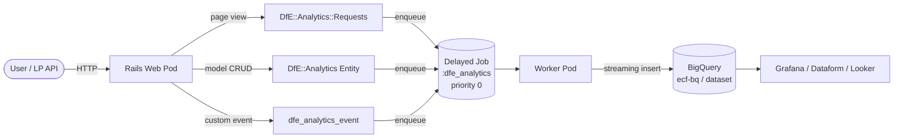

# DfE Analytics — BigQuery event tracking

[DfE Analytics](https://github.com/DFE-Digital/dfe-analytics) streams structured
events from Rails to Google BigQuery for reporting and assurance. Destination:
project `ecf-bq`, dataset per environment (from `ENV["BIGQUERY_DATASET"]`).
Data flows asynchronously via a dedicated Delayed Job queue
(`:dfe_analytics`, priority 0), gated by the Flipper flag `DfE Analytics Enabled`.

See the [Monitoring overview](./overview.md) for the full stack.

---

## 1. What is captured

| Event type       | Source                                                | Example                 |
|------------------|-------------------------------------------------------|-------------------------|
| Page view        | `DfE::Analytics::Requests` concern (auto)             | `GET /applications/:id` |
| Entity lifecycle | DfE Analytics model callbacks (create/update/destroy) | `create_application`    |
| Custom event     | `dfe_analytics_event("name", data: {})` from code     | `course_selected`       |

The `Requests` concern is mixed into `ApplicationController` (line 15) so
every action emits a request event. Entity events fire from the gem's
`ActiveRecord::Base` hook — no per-model code.

---

## 2. Data flow



Events are produced synchronously and handed to Delayed Job — the request hot
path stays fast. Insert failures surface in [Sentry](./sentry.md).

---

## 3. Configuration & feature flag

The initializer (`config/initializers/dfe_analytics.rb`) sets these knobs:

| Setting                       | Value                                        | Effect                              |
|-------------------------------|----------------------------------------------|-------------------------------------|
| `queue`                       | `:dfe_analytics`                             | Dedicated DJ queue (priority 0)     |
| `bigquery_dataset`            | `ENV["BIGQUERY_DATASET"]`                    | Per-environment dataset             |
| `enable_analytics`            | `proc { Feature.dfe_analytics_enabled? }`    | Flipper gate (see below)            |
| `user_identifier`             | `proc { \|u\| u&.id if u.respond_to?(:id) }` | User id on every row                |
| `entity_table_checks_enabled` | `true`                                       | Verifies table exists before insert |
| `excluded_paths`              | `["/healthcheck"]`                           | Filters probe traffic               |
| `azure_federated_auth`        | `ENV.include? "GOOGLE_CLOUD_CREDENTIALS"`    | GCP WIF on/off (§4)                 |
| `environment`                 | `ENV.fetch("RAILS_ENV", "development")`      | Tag on every event                  |

| Environment | Fed. auth | Flipper     | Events?    |
|-------------|-----------|-------------|------------|
| Production  | Yes       | Must enable | After gate |
| Sandbox     | Yes       | Must enable | After gate |
| Staging     | No        | N/A         | No dataset |
| Review      | No        | N/A         | No dataset |

Analytics is **off by default** everywhere. The Flipper gate checks
`Feature.dfe_analytics_enabled?` (`app/services/feature.rb`):

```ruby
def dfe_analytics_enabled?
  Flipper.enabled?(DFE_ANALYTICS_ENABLED)
end
```

When off, the gem short-circuits before enqueuing. Enable via admin console
or `Flipper.enable(Feature::DFE_ANALYTICS_ENABLED)`.

Staging/review apps provision **no BigQuery dataset**. The nightly
`Crons::CheckAnalyticsEntity` job (cron `0 2 * * *`) checks schema drift
and reports via Sentry cron monitoring.

---

## 4. Azure federated authentication (GCP WIF)

The service authenticates via
[GCP Workload Identity Federation](https://cloud.google.com/iam/docs/workload-identity-federation),
**not** a service-account JSON key. `GOOGLE_CLOUD_CREDENTIALS` is injected into
the pod; the BigQuery client exchanges it for short-lived GCP credentials.
No secrets in the repo, deploy pipeline, or Key Vault.

In Terraform (`terraform/application/dfe_analytics.tf`), the module is created
only when `enable_dfe_analytics_federated_auth = true` (`variables.tf`
lines 139-143). When `false`, no GCP resources are provisioned.

---

## 5. Custom events

Dispatch from any model or controller that mixes in DfE Analytics:

```ruby
dfe_analytics_event("course_selected", data: {
  course_id: @course.id,
  cohort: @course.cohort.start_year
})

# Models can fire from callbacks:
after_commit :track_completion

def track_completion
  dfe_analytics_event("application_completed", data: {
    application_id: id, completion_path: completion_path
  })
end
```

Custom events share the `:dfe_analytics` queue and Flipper gate. Arbitrary
`data:` keys become BigQuery columns.

---

## 6. Common BigQuery queries

```sql
-- Page views per environment, last 7 days
SELECT environment, event_name, COUNT(*) AS hits
FROM `ecf-bq.npq_events_production.events`
WHERE event_type = 'web_request'
  AND DATE(occurred_at) >= DATE_SUB(CURRENT_DATE(), INTERVAL 7 DAY)
GROUP BY environment, event_name ORDER BY hits DESC;

-- Custom event volume by name
SELECT event_name, DATE(occurred_at) AS day, COUNT(*) AS n
FROM `ecf-bq.npq_events_production.events`
WHERE event_name IN ('course_selected', 'application_completed')
GROUP BY event_name, day ORDER BY day DESC, n DESC;
```

The `request_uuid` column joins events back to their Rails request and Sentry
transaction.

## Key files

| File                                                  | Role                                          |
|-------------------------------------------------------|-----------------------------------------------|
| `config/initializers/dfe_analytics.rb`                | Queue, dataset, gate, WIF, user id            |
| `app/controllers/application_controller.rb` (line 15) | `include DfE::Analytics::Requests`            |
| `app/services/feature.rb`                             | Flipper gate (`dfe_analytics_enabled?`)       |
| `app/jobs/crons/check_analytics_entity.rb`            | Nightly entity-table check (cron `0 2 * * *`) |
| `app/jobs/stream_versions_to_big_query_job.rb`        | PaperTrail version → BigQuery                 |
| `app/jobs/stream_api_requests_to_big_query_job.rb`    | LP API request streaming                      |
| `config/initializers/delayed_job.rb`                  | Queue priority 0 definition                   |
| `terraform/application/dfe_analytics.tf`              | BigQuery module + WIF                         |
| `terraform/application/variables.tf`                  | `enable_dfe_analytics_federated_auth` var     |
| `Gemfile`                                             | `dfe-analytics` gem                           |

## Cross-links

- [Monitoring overview](./overview.md) — full observability stack
- [Sentry](./sentry.md) — event-insert failure visibility
- [Logging](./logging.md) — debugging job failures in Kibana
