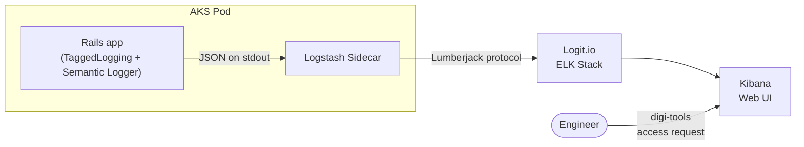

# Logging pipeline — Rails to Logit/ELK

Structured JSON logs flow from the Rails app through a Logstash sidecar into Logit.io's ELK stack for querying in Kibana. This page documents the format, the filtering applied at each layer, and how to use the resulting logs.

## Pipeline



## Rails log format

Every log line carries a `request_id` tag and is written as newline-delimited JSON when `RAILS_LOG_TO_STDOUT` is set (true in all deployed environments).

```json
{
  "timestamp": "2026-06-29T10:30:00.123Z",
  "level": "info",
  "tags": ["request_id-abc123"],
  "message": "Started GET /api/v1/participants for 192.0.2.1",
  "request_id": "abc123"
}
```

### Log levels
    
| Level   | Used for                                                    |
|---------|-------------------------------------------------------------|
| `warn`  | Rack::Attack throttled requests, Redis timeouts             |
| `info`  | Normal request lifecycle (started, completed, job enqueued) |
| `debug` | Staging only — verbose detail                               |
| `error` | Unhandled exceptions, failed job attempts                   |

### Healthcheck silence

Requests to `/up` are dropped by `config.silence_healthcheck_path = "/up"` — they produce no log output at all. This prevents Kubernetes liveness/readiness probes from drowning out real traffic.

### SQL logging disabled

`config.active_record.logger = nil` in production.rb keeps SQL queries out of the log stream. If you need to debug SQL, set `config.active_record.logger = Rails.logger` temporarily on a review app — do not enable it in production.

## Log levels per environment

| Environment | Level   | Notes                                              |
|-------------|---------|----------------------------------------------------|
| Production  | `info`  | Controlled by `RAILS_LOG_LEVEL` env var            |
| Sandbox     | `info`  | Inherits production settings                       |
| Staging     | `debug` | Explicitly set in `config/environments/staging.rb` |
| Review      | `info`  | Inherits production settings; Bullet N+1 detection |

## Log shipping infrastructure

| Component        | Role                                                  |
|------------------|-------------------------------------------------------|
| Rails app        | Writes JSON lines to stdout (not to a file)           |
| Logstash sidecar | Sidecar container in the AKS pod; reads stdout, ships |
| Logit.io         | Managed ELK stack — receives, indexes, stores logs    |
| Kibana           | Web interface for searching and visualising logs      |

The Terraform variable `enable_logit` controls whether the Logstash sidecar is deployed. It is hardcoded to `true` for the web application (line 59 of `application.tf`) and configurable per environment for the worker (`var.enable_logit`, line 88). All environments (production, sandbox, staging, review) have it enabled.

### How to access Logit

1. Request access in `#digital-tools-support` on DfE Slack (digi-tools).
2. You will receive Kibana credentials for the TTE Logit space.
3. Point your browser to the Logit.io Kibana URL to start querying.

## Mailer log redaction

Action Mailer log output is redacted by `config/initializers/mailer_log_redactor.rb`. It prepends `RailsSemanticLogger::ActionMailer::LogSubscriber::EventFormatter` with a module that runs `ActiveSupport::ParameterFilter` over every mailer event payload. The same filter parameters defined in `config/initializers/filter_parameter_logging.rb` apply:

`password`, `token`, `secret`, `otp`, `trn`, `nino`, `full_name`, `cc`, `bcc`, `to`, `key`, `code`, `national_insurance_number`, ...

Additionally, `ActionMailer::MailDeliveryJob.log_arguments = false` prevents email arguments from appearing in job logs.

## Rack::Attack throttled requests

Throttled requests produce a `warn`-level log that includes the request ID, IP, and path:

```
[warn] [rack-attack] Throttled request abc123 from 192.0.2.1 to '/session/sign-in'
```

These are subscribed via `ActiveSupport::Notifications.subscribe("throttle.rack_attack")` in `config/initializers/rack_attack.rb`. You can find them in Kibana with `message:"[rack-attack]"` or filter by `level:warn`.

## Common Kibana queries

| Scenario                          | Kibana query (Lucene syntax)                                    |
|-----------------------------------|-----------------------------------------------------------------|
| Deploy failure — app won't start  | `message:"boot" OR message:"FATAL"`                             |
| Error during participant sign-in  | `request_id:abc123 AND level:error`                             |
| All throttled requests, last hour | `level:warn AND message:"[rack-attack]"`                        |
| Requests for a specific TRN       | `message:"*trn*" OR message:"*TRN*"`                            |
| Mailer delivery failures          | `message:"mailer" AND level:error`                              |
| Redis timeout warnings            | `message:"Redis timeout" AND level:warn`                        |
| Delayed Job failures              | `message:"Job" AND message:"FAILED"`                            |
| All log levels by environment     | Filter by `kubernetes.labels.app:teacher-training-entitlement*` |

> **Tip**: Logit retains logs based on the plan. For long-term analytics, use [DfE Analytics (BigQuery)](./overview.md#6-dfe-analytics--bigquery-events) instead.

## Key files

| File                                              | Role                                                    |
|---------------------------------------------------|---------------------------------------------------------|
| `config/environments/production.rb`               | Log to stdout, JSON format, silence `/up`, SQL off      |
| `config/environments/staging.rb`                  | `log_level = :debug`                                    |
| `config/initializers/mailer_log_redactor.rb`      | PII redaction for mailer logs                           |
| `config/initializers/filter_parameter_logging.rb` | Parameter filter list (password, token, TRN, …)         |
| `config/initializers/rack_attack.rb`              | Throttle rules and warn-level notification subscription |
| `terraform/application/application.tf`            | `enable_logit = true` for web and worker                |
| `terraform/application/variables.tf`              | `var.enable_logit` definition                           |

## Cross-links

- [Monitoring overview](./overview.md) — the top-level page for all monitoring components
- [Sentry error tracking](./sentry.md) — complementary error capture with richer context
- [Rack::Attack overview](./overview.md#7-rackattack--rate-limit-monitoring) — throttle tiers summary
