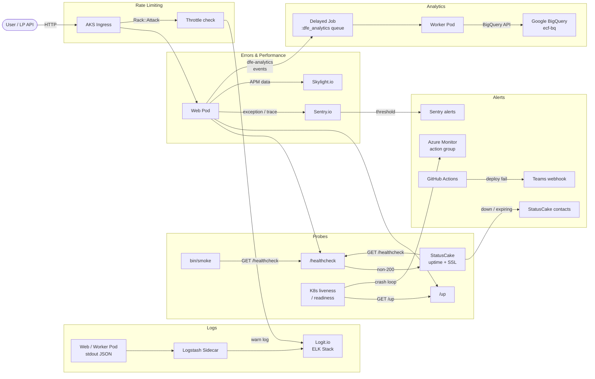

# Monitoring overview

The TTE service uses a multi-layered monitoring stack. Each layer covers a distinct concern — availability, errors, performance, logs, analytics, and rate-limiting. This page introduces each component; sub-pages cover the deeper configuration for each.

- [Sentry](./sentry.md) — error tracking & performance traces
- [Logging](./logging.md) — log aggregation with Logit/ELK
- [Uptime & SSL](./uptime-and-ssl.md) — StatusCake checks
- [Performance](./performance.md) — Skylight APM
- [Analytics](./analytics.md) — DfE Analytics / BigQuery

---

## 1. Healthcheck endpoints (in-house)

Two Rails endpoints let infrastructure and external tools verify the service is alive.

| Endpoint       | Route                              | What it checks                                            | Used by                                            |
|----------------|------------------------------------|-----------------------------------------------------------|----------------------------------------------------|
| `/healthcheck` | `MonitoringController#healthcheck` | Git SHA, DB (connected, migration, populated), Redis ping | Smoke test (`bin/smoke`), StatusCake uptime checks |
| `/up`          | `MonitoringController#up`          | DB connectivity (200 or 503)                              | Kubernetes liveness/readiness probes               |

**Example `/healthcheck` response:**

```json
{
  "git_commit_sha": "abc123",
  "database": {
    "connected": true,
    "migration_version": 20250101000000,
    "populated": true
  },
  "redis": true
}
```

Both endpoints are excluded from Sentry tracing (sampled at 0%) and omitted from Skylight and DfE Analytics to avoid noise.

---

## 2. Sentry — error tracking

[Sentry](https://sentry.io) captures exceptions, logs, and performance traces.

- **What it monitors:** unhandled exceptions, manually reported errors, log messages (`config.enable_logs = true`), and request transactions.
- **Data flow:** Rails errors are sent server-side via `sentry-ruby` / `sentry-rails` / `sentry-delayed_job`. The frontend JS SDK sends browser errors.
- **Release tracking:** release is set from `ENV["COMMIT_SHA"]` (or PR number on review apps).
- **Filtered data:** `ParameterFilter` redacts sensitive fields (passwords, tokens) before transmission. Healthcheck paths are dropped entirely.
- **Sample rates:**

  | Environment | Trace sample rate |
  |-------------|-------------------|
  | Production  | 0.2               |
  | Sandbox     | 1.0               |
  | Staging     | 1.0               |
  | Review      | 0.5               |

See [Sentry config](./sentry.md) for the initializer and per-environment setup.

---

## 3. StatusCake — uptime & SSL (production only)

[StatusCake](https://www.statuscake.com) monitors external availability. It is enabled only in production (`enable_monitoring: true`).

- **Uptime checks:** GET `/healthcheck.json` every N minutes. Alert if response is not 200.
- **SSL checks:** monitors the apex domain certificate expiry.
- **Contact groups:** alerts go to groups `282453` and `356280` (email/SMS).
- **Provisioning:** Terraform module in `terraform/application/statuscake.tf`, API token sourced from Key Vault via GitHub Actions.

See [Uptime & SSL](./uptime-and-ssl.md) for the full terraform configuration.

---

## 4. Logit / Logstash — log shipping

Container stdout is forwarded to a Logit.io ELK stack via a Logstash sidecar in the AKS pod. Logit is enabled for all environments (`enable_logit: true` by default; always on for web, configurable for workers via `var.enable_logit`).

- **What it ships:** Rails application logs (JSON-format via Semantic Logger).
- **Access:** request access via digi-tools.
- **Use cases:** debugging failed deployments, searching historical events.

| Environment | Log level |
|-------------|-----------|
| Production  | info      |
| Sandbox     | info      |
| Staging     | debug     |
| Review      | info      |

See [Logging](./logging.md) for log format details and query examples.

---

## 5. Skylight — APM

[Skylight](https://www.skylight.io) provides application performance monitoring.

- **What it monitors:** request response times, database queries, view rendering, job execution.
- **Installation:** `skylight` gem; authentication via `SKYLIGHT_AUTHENTICATION` env var.
- **Ignored endpoints:** healthcheck and up are excluded (`config/skylight.yml`).
- **Release tracking:** `git_sha` set from `ENV["COMMIT_SHA"]`.
- **Environments:** active in review, sandbox, staging, and production.

See [Performance](./performance.md) for endpoint-specific dashboards and alert thresholds.

---

## 6. DfE Analytics — BigQuery events

[DfE Analytics](https://github.com/DFE-Digital/dfe-analytics) sends structured user events to Google BigQuery.

- **What it captures:** page views, form submissions, user sign-ins, and custom `dfe_analytics` tracked events.
- **Destination:** BigQuery project `ecf-bq`.
- **Authentication:** federated auth via GCP Workload Identity Federation when `GOOGLE_CLOUD_CREDENTIALS` env var is present (`config.azure_federated_auth = true`).
- **Feature flag:** data only flows when `Feature.dfe_analytics_enabled?` returns true (Flipper toggle).
- **Queue:** events are enqueued on the `:dfe_analytics` Delayed Job queue.
- **Excluded paths:** `/healthcheck` is excluded.

| Environment | Federated auth | Feature flag required |
|-------------|----------------|-----------------------|
| Production  | Yes            | Must toggle on        |
| Sandbox     | Yes            | Must toggle on        |
| Staging     | No             | N/A (disabled)        |
| Review      | No             | N/A (disabled)        |

See [Analytics](./analytics.md) for event catalogue and BigQuery schema.

---

## 7. Rack::Attack — rate limit monitoring

[Rack::Attack](https://github.com/rack/rack-attack) throttles requests and logs violations.

- **Throttle tiers:**

  | Tier                       | Limit | Period | Scope      |
  |----------------------------|-------|--------|------------|
  | Protected routes (sign-in) | 10    | 2 min  | IP         |
  | API (authenticated)        | 1,000 | 5 min  | Auth token |
  | Public API                 | 300   | 5 min  | IP         |
  |                            |       |        |            |
  | Non-API                    | 300   | 5 min  | IP         |
  | Catch-all (backstop)       | 1,500 | 5 min  | IP         |

- **Logging:** throttled requests are logged at `warn` level with `request_id`, IP, and path — visible in Logit/Logstash.
- **Config:** `config/initializers/rack_attack.rb`.

---

## 8. Azure Monitor action groups

Infrastructure-level alerts are sent via Azure Monitor action groups.

- **Creation:** `make production action-group ACTION_GROUP_EMAIL=...`
- **Naming:** `s189p01-teacher-training-entitlement-{short}`
- **Scope:** production only (test environment has no action group).
- **What alerts:** Azure platform metrics (e.g., Postgres CPU, AKS node health).

---

## 9. Teams notifications on deploy failures

GitHub Actions workflows send failure notifications to a Microsoft Teams webhook.

- **Workflows:** `deploy.yml`, `build-nocache.yml`, `backup_production_database.yml`, `validate-infrastructure.yml` each have a `teams-webhook-url` secret.
- **Scope:** all environments (review apps notify on the PR branch).

---

## Environment matrix

| Feature                   | Production  | Sandbox     | Staging | Review |
|---------------------------|-------------|-------------|---------|--------|
| Sentry tracing            | 0.2         | 1.0         | 1.0     | 0.5    |
| Skylight                  | Yes         | Yes         | Yes     | Yes    |
| Logit                     | Yes         | Yes         | Yes     | Yes    |
| StatusCake                | Yes         | No          | No      | No     |
| DfE Analytics (fed. auth) | Yes         | Yes         | No      | No     |
| DfE Analytics (flag on)   | Must toggle | Must toggle | N/A     | N/A    |
| Azure Monitor group       | Yes         | No          | No      | No     |
| Teams deploy alerts       | Yes         | Yes         | Yes     | Yes    |

---

## Data flow diagram



---

## Key files

| File                                                  | Role                                                            |
|-------------------------------------------------------|-----------------------------------------------------------------|
| `app/controllers/monitoring_controller.rb`            | `/healthcheck` and `/up` endpoints                              |
| `config/routes.rb`                                    | Route definitions (lines 9-10)                                  |
| `config/initializers/sentry.rb`                       | Sentry DSN, sample rates, filter rules                          |
| `config/skylight.yml`                                 | Skylight ignored endpoints, release tracking                    |
| `config/initializers/dfe_analytics.rb`                | BigQuery dataset, queue, feature flag gate                      |
| `config/initializers/rack_attack.rb`                  | Throttle tiers and warn logging                                 |
| `config/environments/production.rb`                   | Log level, Semantic Logger JSON format                          |
| `config/environments/staging.rb`                      | Debug log level                                                 |
| `terraform/application/statuscake.tf`                 | Uptime/SSL module                                               |
| `terraform/application/dfe_analytics.tf`              | BigQuery federated auth                                         |
| `terraform/application/application.tf`                | Probe path, Logit enable, GCP WIF                               |
| `terraform/application/variables.tf`                  | `enable_monitoring`, `enable_logit`, etc.                       |
| `terraform/application/config/production.tfvars.json` | Production monitoring flags                                     |
| `Gemfile`                                             | `sentry-ruby`, `sentry-rails`, `sentry-delayed_job`, `skylight` |
| `bin/smoke`                                           | Smoke test script                                               |
| `Makefile`                                            | `action-group` target                                           |
| `.github/workflows/deploy.yml`                        | Teams webhook on failure                                        |
