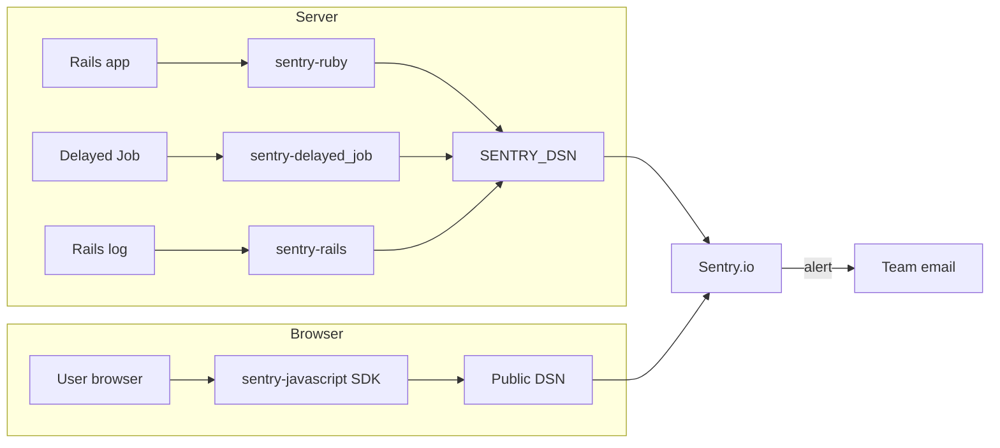

# Sentry error tracking

[Sentry](https://sentry.io) captures exceptions, log events, and performance traces from the Rails server and browser JS. This page documents `config/initializers/sentry.rb` and related wiring.



## Initializer overview

The 43-line initializer configures DSN, release, filtering, sampling, and breadcrumbs.

### DSN and enabled environments

| Setting              | Value                                                |
|----------------------|------------------------------------------------------|
| Enabled environments | `production`, `sandbox`, `staging`, `review`         |
| DSN source           | `ENV["SENTRY_DSN"]` — Key Vault, injected as env var |
| Disabled envs        | `development`, `test` — DSN set to `"disabled"`      |

```ruby
config.enabled_environments = %w[production sandbox staging review]
config.dsn = config.enabled_environments.include?(Rails.env) ? ENV["SENTRY_DSN"] : "disabled"
```

### Release tracking

In production / sandbox / staging the release is set from `ENV["COMMIT_SHA"]`. On review apps it is extracted from `ENV["HOSTNAME"]` via regex `/.*-(\d+)-/` (captures the PR number).

```ruby
config.release = Rails.env.review? ? ENV["HOSTNAME"].match(/.*-(\d+)-/)[1] : ENV["COMMIT_SHA"]
```

### Breadcrumbs

Two loggers capture request context:

```ruby
config.breadcrumbs_logger = %i[active_support_logger http_logger]
```

## Data filtering

No PII reaches Sentry. The `before_send` lambda uses `ActiveSupport::ParameterFilter` to redact `request.data`, `request.headers`, `request.query_string`, `user`, `extra`, `tags`, and `contexts`.

Healthcheck paths (`/healthcheck`, `/up`) are dropped entirely — `next nil if event.transaction.match?(/healthcheck|up/i)`.

This filtering is applied to both error events (via `before_send`) and transaction traces (via `traces_sampler`).

## Trace sampling strategy

| Environment / path   | Sample rate   |
|----------------------|---------------|
| Production (general) | 0.2 (20%)     |
| Sandbox              | 1.0 (100%)    |
| Staging              | 1.0 (100%)    |
| Review apps          | 0.5 (50%)     |
| Healthcheck paths    | 0.0 (dropped) |

The `traces_sampler` lambda enforces the path-based rules and review-app override. The fallback `traces_sample_rate` is 0.2 in production and 1.0 elsewhere.

## User context

`ApplicationController` runs `before_action :set_sentry_user` (line 12), attaching `current_user.id` to every event:

```ruby
def set_sentry_user
  Sentry.set_user(id: current_user.id) if current_user
end
```

## Frontend JS SDK

`ApplicationHelper#sentry_javascript_tag` (lines 70-75) injects the Sentry JS SDK using the public DSN. It returns nil (no-op) when no DSN is configured:

```ruby
def sentry_javascript_tag
  dsn = Sentry.configuration.dsn.public_key
  return if dsn.blank?
  javascript_include_tag "https://js.sentry-cdn.com/#{dsn}.min.js", crossorigin: "anonymous"
end
```

Call `<%= sentry_javascript_tag %>` in the layout `<head>` to enable frontend error tracking.

## Redis error handling (production only)

In `config/environments/production.rb` (lines 96-104), the Redis cache store uses a custom `error_handler`:

- **`Redis::TimeoutError`** — logged at `warn` level only (expected under load), no Sentry alert.
- **All other Redis errors** — sent to Sentry via `Sentry.capture_exception(exception, tags: { method:, returning: })`.

## Excluded exceptions

`SessionWizard::InvalidStep` is added to the default exclusion list. This exception is raised for invalid wizard steps and is already mapped to `:not_found` in `config/initializers/exceptions.rb` — it should never alert.

```ruby
config.excluded_exceptions += %w[SessionWizard::InvalidStep]
```

## Logs as events

`config.enable_logs = true` sends Rails log messages (`warn`, `error`, etc.) to Sentry as events, making them searchable alongside exceptions in the Sentry UI.

## How to verify Sentry is working

**Check the DSN** — in a Rails console: `Sentry.configuration.dsn` returns a `Sentry::DSN` object when configured, or `nil`/`"disabled"` otherwise.

**Send a test event:**

```ruby
Sentry.capture_message("Test error from rails console")
```

Check the event appears on the [Sentry project dashboard](https://sentry.io).

**Verify sampling** — `Sentry.configuration.traces_sample_rate` returns the current rate (0.2, 0.5, or 1.0).

**Frontend check** — open DevTools on a live page; look for a script request to `js.sentry-cdn.com`. Throw a JS error (`throw new Error("test")`) and confirm it appears in Sentry.

## Environment matrix

| Aspect              | Production   | Sandbox      | Staging      | Review    |
|---------------------|--------------|--------------|--------------|-----------|
| Trace sample rate   | 0.2          | 1.0          | 1.0          | 0.5       |
| Frontend JS SDK     | Yes          | Yes          | Yes          | Yes       |
| Redis error handler | Yes          | No           | No           | No        |
| Release source      | `COMMIT_SHA` | `COMMIT_SHA` | `COMMIT_SHA` | PR number |

## Key files

| File                                        | Role                                                |
|---------------------------------------------|-----------------------------------------------------|
| `config/initializers/sentry.rb`             | DSN, sample rates, filtering, excluded exceptions   |
| `app/controllers/application_controller.rb` | `set_sentry_user` before_action (line 12, 49-51)    |
| `app/helpers/application_helper.rb`         | `sentry_javascript_tag` (lines 70-75)               |
| `config/environments/production.rb`         | Redis error handler (lines 96-104)                  |
| `config/initializers/exceptions.rb`         | `SessionWizard::InvalidStep` status mapping         |
| `Gemfile` (lines 45-47)                     | `sentry-ruby`, `sentry-rails`, `sentry-delayed_job` |

## Cross-links

- [Monitoring overview](./overview.md) — top-level page introducing all monitoring components
- [Logging](./logging.md) — log aggregation with Logit/ELK (complementary to Sentry log events)
