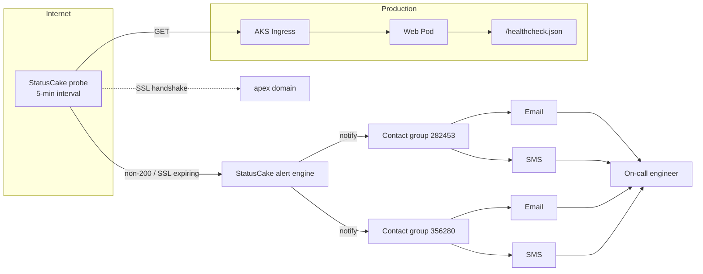

# Uptime & SSL monitoring (StatusCake)

[StatusCake](https://www.statuscake.com) is the service's **external** availability
monitor. It probes the live production endpoint from outside the cluster, so an
alert from StatusCake means real users are likely affected — not just an
in-cluster probe.

It runs **production only**. Staging, sandbox, and review apps are not
externally monitored.

See [Monitoring overview](./overview.md) for where this fits in the wider stack,
and [Logging](./logging.md) for the complementary in-cluster log layer.

---

## What is monitored

| Check  | Target                                                                       | Fires when                                                         |
|--------|------------------------------------------------------------------------------|--------------------------------------------------------------------|
| Uptime | `GET https://teacher-training-entitlement.education.gov.uk/healthcheck.json` | Response is non-200, or times out                                  |
| SSL    | `https://teacher-training-entitlement.education.gov.uk`                      | Apex certificate expires within the alert window (default 14 days) |

The uptime check hits the Rails `/healthcheck.json` endpoint. That endpoint is
served by `MonitoringController#healthcheck` (with `:json` format constraint) and
returns 200 only when the Git SHA, database connection, migrations, and Redis
ping are all healthy. A 200 from `/healthcheck.json` therefore asserts that the
full request-stack — ingress, app, database, cache — is functioning.

---

## Why production only

Non-production environments do not need external availability monitoring:

- **Cost** — every StatusCake check consumes a paid probe slot. Three extra
  environments would triple the cost for no operational benefit.
- **Risk** — monitoring `*.staging.education.gov.uk` would let synthetic
  traffic pollute analytics, and trigger pages for environments with no SLA.
- **Coverage** — non-prod is monitored by Kubernetes liveness/readiness probes
  (`GET /up`) and by `bin/smoke` after deploy. In-cluster coverage is enough.

The toggle is `enable_monitoring`. The default is `false`. It is `true` only
in `terraform/application/config/production.tfvars.json`.

---

## Terraform provisioning

`terraform/application/statuscake.tf` is the entire production config:

```hcl
module "statuscake" {
  count = var.enable_monitoring ? 1 : 0

  source = "./vendor/modules/aks//monitoring/statuscake"

  uptime_urls    = compact([var.external_url])
  ssl_urls       = compact([var.apex_url])
  contact_groups = var.statuscake_contact_groups
}
```

Three observations:

- The module is **conditionally created** via `count`. When
  `enable_monitoring` is `false`, the module is never instantiated and nothing
  is sent to StatusCake.
- `compact([...])` filters out nulls so an unset variable does not produce a
  broken URL entry.
- The actual resource definitions live in the upstream
  `./vendor/modules/aks//monitoring/statuscake` module — this file is the
  thin wrapper that passes values in.

### Variables

All four inputs live in `terraform/application/variables.tf`:

| Variable                    | Default | Purpose                                        |
|-----------------------------|---------|------------------------------------------------|
| `enable_monitoring`         | `false` | Master toggle — also enables Azure Monitor     |
| `external_url`              | `null`  | StatusCake uptime target                       |
| `apex_url`                  | `null`  | StatusCake SSL target                          |
| `statuscake_contact_groups` | `[]`    | List of StatusCake contact group IDs to notify |

### Production values

From `terraform/application/config/production.tfvars.json`:

```json
{
  "enable_monitoring": true,
  "external_url": "https://teacher-training-entitlement.education.gov.uk/healthcheck.json",
  "apex_url": "https://teacher-training-entitlement.education.gov.uk",
  "statuscake_contact_groups": [282453, 356280]
}
```

Other environments (staging, sandbox, review) omit these keys entirely, so the
module's `count` is `0` and StatusCake is a no-op.

---

## API token sourcing

StatusCake authenticates with a bearer API token. The token is **not** stored
in the repository.

1. Stored in **Azure Key Vault** under the secret name
   `STATUSCAKE-API-TOKEN` (exposed by the infrastructure module as
   `module.infrastructure_secrets.map.STATUSCAKE-API-TOKEN`).
2. Pulled into GitHub Actions as the repository secret
   `STATUSCAKE_API_TOKEN`.
3. Passed to the deploy composite action
   (`.github/actions/deploy-environment-to-aks/action.yml`) as the
   `statuscake-api-token` input.
4. Injected into `terraform apply` as the env var
   `TF_VAR_statuscake_api_token` (action.yml line 75).

Only `production.tfvars.json` references `statuscake_contact_groups`, so the
token is consumed only when production is deployed.

---

## Alert flow



StatusCake triggers the alert engine on two events: a failed uptime probe, or
an SSL certificate inside the expiry window. The engine looks up the contact
groups attached to the test (configured by Terraform) and dispatches email and
SMS to every member of each group.

---

## Setting up contact groups

Production uses two pre-existing StatusCake contact groups: **`282453`** and
**356280`**. Both are configured to send email and SMS.

To get a new engineer added to a contact group:

1. Contact the **TTE admin team** (the platform owners of the StatusCake
   account).
2. Provide the engineer's name, email, and (if SMS is required) phone number
   and carrier.
3. The admin team adds the contact to the group via the StatusCake web UI and
   confirms the engineer received a test notification.

Do **not** ask engineers to self-register — the StatusCake account is shared
across services and access is centrally controlled.

---

## What happens when an alert fires

1. StatusCake records the failure and confirms it across multiple probe
   locations (typically within 2–5 minutes of the first failure).
2. Email and SMS are dispatched to every member of contact groups `282453`
   and `356280`.
3. **Out-of-hours** — the on-call engineer acknowledges the page, opens the
   StatusCake dashboard for the failure history, and runs
   `bin/smoke <url>` against `/healthcheck` to corroborate.
4. The on-call engineer paged the wider team via the incident process if the
   outage affects participant flows, LP integrations, or finance declarations.
5. Once resolved, the StatusCake test is left as-is — it will auto-clear on
   the next successful probe.

The same on-call rotation that handles Azure Monitor action-group pages owns
StatusCake alerts.

---

## Common false positives

Two recurring patterns produce alerts that turn out to be benign.

### Planned maintenance

Deployments that touch the ingress, DNS, or SSL certificate can briefly make
the apex or `/healthcheck.json` unreachable. The service runs in maintenance
mode during planned downtime (see [Maintenance mode](../deployment/maintenance-mode.md))
to suppress participant-facing errors — but **StatusCake is not paused
automatically**.

**Before planned maintenance:**

1. Pause the relevant StatusCake tests in the StatusCake web UI (or note the
   maintenance window in the team's incident channel).
2. Carry out the work.
3. Resume the tests and confirm the next probe is green.

Skipping this step pages the on-call for a known outage.

### SSL renewal automation

The apex certificate is renewed automatically by the Azure / Let's Encrypt
automation configured for the DNS zone. During the renewal window (a few
seconds), the SSL probe can briefly flag the old certificate as expiring or
the new certificate as not yet trusted.

**Expected behaviour:** no action. StatusCake will clear the alert once the
new certificate propagates. If the alert persists for more than 30 minutes,
treat it as a real outage and investigate the renewal runbook.

---

## Key files

| File                                                   | Role                                                                |
|--------------------------------------------------------|---------------------------------------------------------------------|
| `terraform/application/statuscake.tf`                  | Wires the StatusCake module (count-gated)                           |
| `terraform/application/variables.tf`                   | `enable_monitoring`, `external_url`, `apex_url`, contact groups     |
| `terraform/application/config/production.tfvars.json`  | Production monitoring values + contact group IDs                    |
| `terraform/vendor/modules/aks/monitoring/statuscake/`  | Upstream module — defines the actual `statuscake_test` resources    |
| `.github/actions/deploy-environment-to-aks/action.yml` | Passes `TF_VAR_statuscake_api_token` to `terraform apply` (line 75) |
| `.github/workflows/deploy.yml`                         | Supplies `STATUSCAKE_API_TOKEN` secret to the deploy action         |
| `app/controllers/monitoring_controller.rb`             | Serves `/healthcheck.json` (uptime check target)                    |
| `config/routes.rb`                                     | `/healthcheck` + `/healthcheck.json` route definitions              |

---

## Cross-links

- [Monitoring overview](./overview.md) — top-level page introducing all monitoring components
- [Logging](./logging.md) — log aggregation with Logit/ELK (in-cluster, complementary to StatusCake)
- [Maintenance mode](../deployment/maintenance-mode.md) — pausing the service during planned downtime
