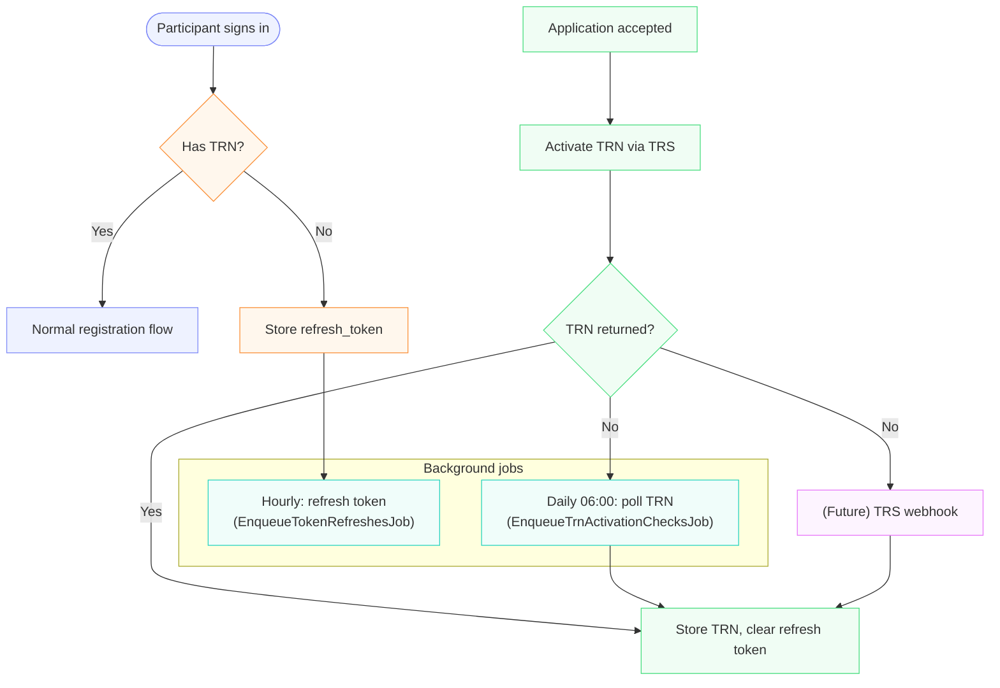

# Registration — Authentication & Sessions

Authentication is the gateway to the registration wizard. For a participant's
visit it answers three things: **who** is signing in (GOV.UK One Login via the
*Teacher Auth* wrapper), **whether they're the same person as last time** (a
`User` is matched or created and a cookie session is opened), and **whether
we already have a TRN** — if not, the service holds a refresh token and waits
for application acceptance to ask TRS for one.

This is the registration-journey view. The deep dive on the GOV.UK One Login /
TRS integration lives in
[`docs/integrations/govuk-one-login.md`](../integrations/govuk-one-login.md)
(forthcoming).

## Sign-in

The participant clicks **Sign in**, is redirected to Teacher Auth, signs in
with GOV.UK One Login, and bounces back to Devise's omniauth callback. That
callback provisions a `User` and opens a session in one step.

```ruby
# app/controllers/omniauth_controller.rb
def teacher_auth
  provider_data = request.env["omniauth.auth"]
  session[:id_token] = provider_data.credentials.id_token   # for OIDC logout
  @user = Users::FindOrCreateFromTeacherAuth
            .new(provider_data:, feature_flag_id: session["feature_flag_id"])
            .call
  session["user_id"] = @user.id
  sign_in_and_redirect @user
end
```

Where the participant lands afterward: existing applications → `/applications`;
otherwise the registration wizard (`RegistrationWizard#next_step_path`). An
`?request_email_updates=true` link routes to the email-update flow instead.

## User provisioning

Every sign-in runs `Users::FindOrCreateFromTeacherAuth` against the verified
identity Teacher Auth returns. The match order matters:

| Step | Match key           | When it wins                                             |
|------|---------------------|----------------------------------------------------------|
| 1    | `User#trn`          | TRN present in the response — strongest identity signal  |
| 2    | `User#one_login_id` | Returning participant whose One Login ID we already hold |
| 3    | (fallback)          | No match — create a new `User`                           |

A clashing `User#email` is reconciled alongside the match (see
`merge_and_archive_clashing_email_user`): if the kept user now has a TRN and
the clashing one doesn't, the duplicate is **merged** into the kept user via
`Users::MergeAndArchive` (applications and `participant_id_changes` move
across, the duplicate is archived). Otherwise the clashing user is
**archived** by `Users::Archiver#archive!` — email blurred, `one_login_id`
cleared, `archived_at` stamped. `set_one_login_id_to_nil!` exists for cases
where we must detach a One Login ID without archiving the row.

If the Teacher Auth response already includes a TRN, the stored refresh
token is cleared — `FindOrCreateFromTeacherAuth#user_attributes`.

## Sessions

The session is a standard Devise cookie session with two TTE-specific behaviours.

### Idle expiry and `/session/extend`

The wizard pings `GET /session/extend` periodically. If a `user_id` is
present, the controller refreshes `session[:last_activity_at]` and returns`200`; 
otherwise it returns `401` and the UI boots the participant back to sign-in:

```ruby
def extend_session
  if session[:user_id].present?
    session[:last_activity_at] = Time.current
    head :ok
  else
    head :unauthorized
  end
end
```

### Sign-out

`DELETE /sign-out` calls `SessionsController#destroy`, which captures the OIDC
`id_token` stored on sign-in, clears the local session via `sign_out_all_scopes`, 
then redirects to Teacher Auth's `/oauth2/logout` with `id_token_hint` and 
`post_logout_redirect_uri=https://<host>/sign-out`. Admin users are routed 
to `/admin` instead — they have their own wizard and do not participate in OIDC logout.

## TRN acquisition — participant's view

A participant may already have a TRN (UK qualified teacher) or may not (FE
or international teacher). The service handles both without blocking the user. 
The shape of the journey:

1. **Sign in** — if Teacher Auth returns a TRN, store it; otherwise store the
   `refresh_token` so we can talk to TRS later.
2. **Apply** — the wizard accepts FE/international teachers and creates an
   `Application`.
3. **Accept** — once the Lead Provider accepts, `RequestTrnJob` asks TRS to
   activate a TRN; TRS may return one immediately or later.
4. **Resolve** — when a TRN is returned, it is written to the user and the
   refresh token is cleared. Until then, two cron jobs keep the request alive.



## Background jobs

| Job                                    | Schedule    | Runs on users…                                | Purpose                                                                 |
|----------------------------------------|-------------|-----------------------------------------------|-------------------------------------------------------------------------|
| `RequestTrnJob`                        | on accept   | `can_request_trn?` (TRN blank, token present) | Refresh token, call TRS activate, persist TRN if returned, retry ×5.    |
| `RefreshUserTokenJob`                  | hourly      | `requires_token_refresh?`                     | Rotate refresh token; clear it on `invalid_grant`.                      |
| `Crons::EnqueueTokenRefreshesJob`      | hourly      | `User.requiring_token_refresh`                | Enqueues `RefreshUserTokenJob` per user.                                |
| `Crons::EnqueueTrnActivationChecksJob` | daily 06:00 | `User.needing_trn_activation_check`           | Re-polls TRS activation for previously-requested-but-not-returned TRNs. |

`RequestTrnJob` retries on `RefreshTokenError` with polynomial backoff up to five attempts — designed 
to ride out transient Teacher Auth blips without losing the token.

## Configuration

`config/initializers/teacher_auth.rb` reads these env vars on boot:

| Variable                     | Purpose                                                |
|------------------------------|--------------------------------------------------------|
| `TEACHER_AUTH_DOMAIN`        | OIDC base URL; sign-out redirect target                |
| `TEACHER_AUTH_CLIENT_ID`     | OAuth2 client id                                       |
| `TEACHER_AUTH_CLIENT_SECRET` | OAuth2 client secret                                   |
| `ONE_LOGIN_HOME_URL`         | GOV.UK One Login entry point shown to the participant  |
| `TRS_API_URL`                | Base URL for `TeacherAuth::ActivateTrn` (TRS activate) |

The full table — including local-dev fixtures and key vault mapping — is in
[`docs/integrations/govuk-one-login.md`](../integrations/govuk-one-login.md)
(forthcoming).

## Failure modes

| Symptom                                       | Handling                                                                                       |
|-----------------------------------------------|------------------------------------------------------------------------------------------------|
| Teacher Auth returns an invalid refresh token | `TeacherAuth::RefreshToken` returns `:invalid_token`; the job calls `User#clear_auth_tokens!`. |
| Token refresh fails for any other reason      | `RequestTrnJob` raises `RefreshTokenError`, retries up to 5 times with polynomial backoff.     |
| TRS activation never returns a TRN            | Daily `EnqueueTrnActivationChecksJob` keeps re-asking until TRS responds.                      |
| Future: TRS supports a webhook                | The diagram's `(Future) TRS webhook` node — out of scope today, planned as a real-time path.   |

`User#clear_auth_tokens!` nulls `refresh_token` and `refresh_token_updated_at`;
once cleared the user drops out of `without_trn` and stops being eligible for
token refresh or TRN polling.

## Related docs

- [`docs/registration/overview.md`](./overview.md) — registration domain map.
- `docs/registration/application-submission.md` *(forthcoming)* — wizard, forms,
  and how `FundingEligibility` is invoked.
- `docs/registration/change-of-provider.md` *(forthcoming)* — change-of-provider.
- [`docs/integrations/govuk-one-login.md`](../integrations/govuk-one-login.md)
  *(forthcoming)* — Teacher Auth + TRS deep dive (replaces `docs/trn.md`).

