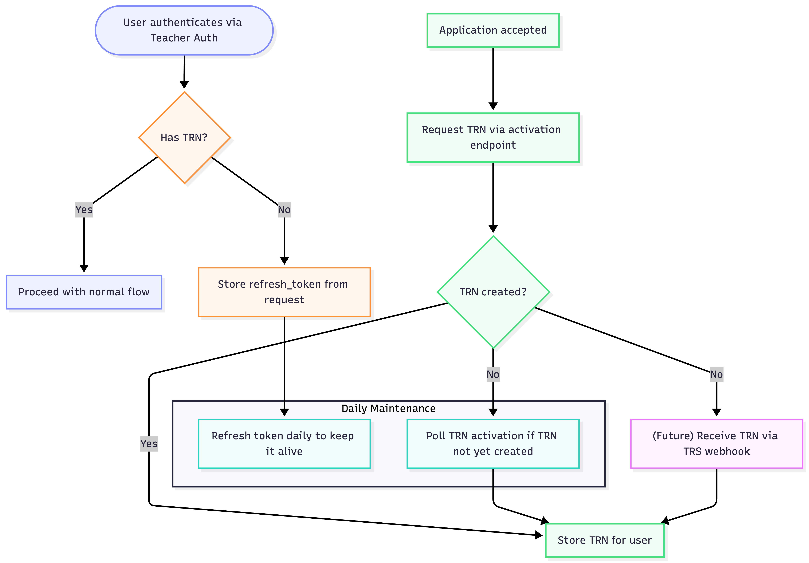

# TRN (Teacher Reference Number) Acquisition Flow

This document describes how TTE obtains and manages Teacher Reference Numbers (TRNs) for users.

## Overview

The TRN acquisition process involves two main flows:
1. **Authentication flow** - Capturing refresh tokens when users authenticate without a TRN
2. **Application acceptance flow** - Requesting TRN creation via the activation endpoint

## Flow Diagram

## Process Details

### Authentication Flow

1. When a user authenticates via Teacher Auth, we check if they already have a TRN
2. If they have a TRN, we store it
3. If they don't have a TRN, we store the `refresh_token` from the authentication request for later use

### Application Acceptance Flow

1. When an application is accepted, we request a TRN via the activation endpoint
2. If the TRN is created immediately, we store it
3. If the TRN is not created immediately, we poll the activation endpoint daily until we receive it

### Daily Maintenance

The system performs daily maintenance tasks:
- **Refresh tokens** - Tokens are refreshed daily to keep them alive and valid
- **Poll for TRN** - For users awaiting TRN creation, we poll the activation endpoint

### Future Enhancement

A future enhancement will allow receiving TRNs via a webhook, providing real-time notification when a TRN is created.
