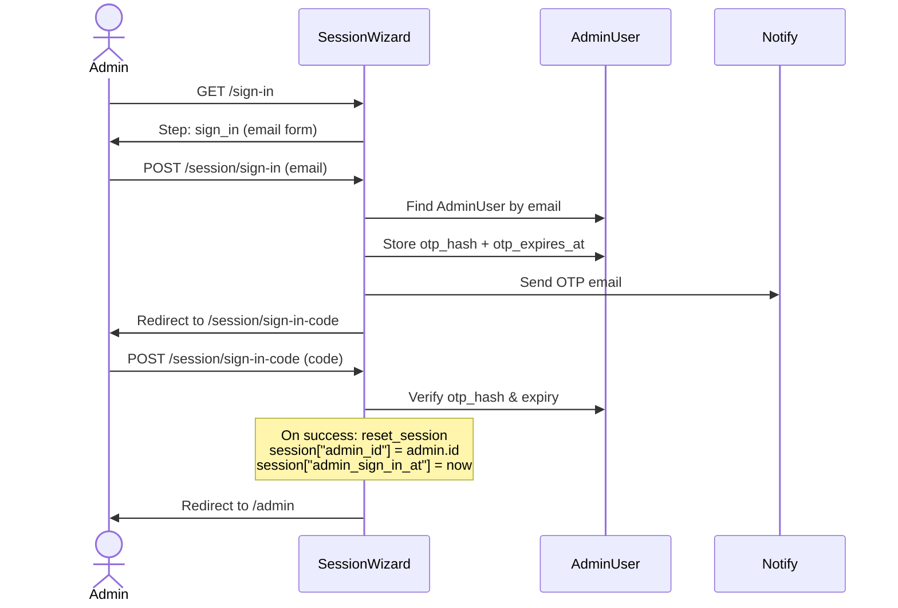

# Admin Authentication

The admin console at `/admin` has its own sign-in system, completely separate from
the participant-facing app. Admin users authenticate via a **two-step OTP wizard**
against the local `AdminUser` model. There is no Devise, no TeacherAuth, and no
password.

## AdminUser vs. User

| Aspect            | `AdminUser`                | `User`                                |
|-------------------|----------------------------|---------------------------------------|
| Purpose           | DfE internal staff         | Participants (teachers)               |
| Auth mechanism    | OTP code sent by email     | TRS / TeacherAuth (GOV.UK One Login)  |
| Sign-in page      | `/sign-in`                 | `/` (registration wizard)             |
| Model location    | `app/models/admin_user.rb` | `app/models/user.rb`                  |
| Trackable columns | None (session-bound)       | Devise trackable (sign-in count, IPs) |
| Session key       | `session["admin_id"]`      | `session["user_id"]`                  |
| Password          | No password field          | No password field (omniauth-based)    |

### AdminUser schema

| Column           | Type      | Purpose                                       |
|------------------|-----------|-----------------------------------------------|
| `email`          | string    | Identifies the admin; OTP is sent here        |
| `full_name`      | string    | Display name in the console                   |
| `super_admin`    | boolean   | Grants elevated permissions (default `false`) |
| `otp_hash`       | text      | One-time code (set on each sign-in attempt)   |
| `otp_expires_at` | timestamp | 10-minute expiry on the OTP code              |

## Sign-in wizard

The sign-in wizard (`SessionWizardController`) collects an email address, sends a
6-digit OTP, then validates the code. The wizard does **not** use a password.



### Step 1 — Sign in (`/sign-in`)

The admin enters their email address.

- The `SessionWizardSteps::SignIn` form validates the email format.
- `after_save` looks up the `AdminUser`, generates a random 6-digit OTP,
  stores `otp_hash` and `otp_expires_at` (10 minutes from now) on the record,
  and sends the code via `GenericMailer`.
- If the email has no matching `AdminUser`, **no error is shown** — the code is
  simply not sent. This prevents email enumeration.

```
# Typical flow:
GET  /sign-in                              → show email form
PATCH /session/sign-in  (email=admin@...)  → validate, send OTP, redirect
```

### Step 2 — Check your email (`/session/sign-in-code`)

The admin enters the 6-digit code they received.

- The `SessionWizardSteps::SignInCode` form validates the code against the
  `otp_hash` stored on the `AdminUser` record (looked up via the email saved in
  the wizard store during step 1).
- The code must match **and** be within the 10-minute window (`otp_expires_at`).
- On success, the controller calls `reset_session` (clears any remnants of a
  previous session), then sets `session["admin_id"]` and
  `session["admin_sign_in_at"]`.

```
# Typical flow:
GET  /session/sign-in-code                 → show code form
PATCH /session/sign-in-code  (code=123456) → verify, create session, redirect to /admin
```

## Session management

The `AdminController` base controller enforces authentication:

```ruby
class AdminController < ApplicationController
  before_action :require_admin
  skip_before_action :authenticate_user!
  # ...
end
```

### Guard methods

| Method                | Behaviour                                                   |
|-----------------------|-------------------------------------------------------------|
| `require_admin`       | Redirects to `/sign-in` with flash unless `current_admin`   |
| `require_super_admin` | Redirects to `/sign-in` unless `current_admin.super_admin?` |

Neither method calls `authenticate_user!` (Devise), so an admin who is not a
participant `User` can still access the console without triggering an omniauth
redirect.

### current_admin

Defined in `ApplicationController`. Reads `session["admin_id"]` and enforces a
**daily session expiry**: if `session["admin_sign_in_at"]` is older than the
start of the current day (UTC), the session is reset and the admin must sign in
again.

```ruby
def current_admin
  return unless session[:admin_id]

  if session[:admin_sign_in_at]&.<(Time.zone.now.utc.beginning_of_day)
    reset_session
    nil
  else
    AdminUser.find_by(id: session[:admin_id])
  end
end
```

### Sign-out

The `SessionsController#destroy` action handles both public users and admins.
If `current_admin` is present at sign-out time, it redirects to `/admin`
(instead of sending the user through the TeacherAuth logout flow).

```
GET /sign-out   → clears session → redirects to /admin (if admin)
```

## Role elevation

Elevation to super admin is a one-way operation from the UI. Demotion requires
a developer in the Rails console.

### Promote to super admin

`Admin::SuperAdminsController#update` sets `super_admin: true`:

```
POST /admin/super_admins/:id
```

This action is itself guarded by `require_super_admin`, so only existing super
admins can promote others.

### Demote from super admin

The console does **not** expose a demote action. A developer must run:

```ruby
AdminUser.find_by(email: "admin@example.com").update!(super_admin: false)
```

Neither can an admin delete themselves or another super admin via the console
(`Admin::AdminsController#destroy` guards against this).

## Code locations

| Component             | File                                               |
|-----------------------|----------------------------------------------------|
| Wizard controller     | `app/controllers/session_wizard_controller.rb`     |
| Wizard service object | `app/models/session_wizard.rb`                     |
| Step: sign_in         | `app/forms/session_wizard_steps/sign_in.rb`        |
| Step: sign_in_code    | `app/forms/session_wizard_steps/sign_in_code.rb`   |
| Admin base controller | `app/controllers/admin_controller.rb`              |
| Admin user model      | `app/models/admin_user.rb`                         |
| Super admin elevation | `app/controllers/admin/super_admins_controller.rb` |
| Admin CRUD            | `app/controllers/admin/admins_controller.rb`       |
| Sign-in views         | `app/views/session_wizard/sign_in.html.erb`        |
| Code-entry view       | `app/views/session_wizard/sign_in_code.html.erb`   |
| Sign-out              | `app/controllers/sessions_controller.rb`           |
| Routes (public)       | `config/routes.rb` (lines 41–46)                   |
| Routes (admin)        | `config/routes/admin.rb`                           |

## Related documentation

- [Admin console overview](./overview.md) — who uses the console, permissions, navigation
- [Applications management](./applications.md) — detailed application lifecycle

