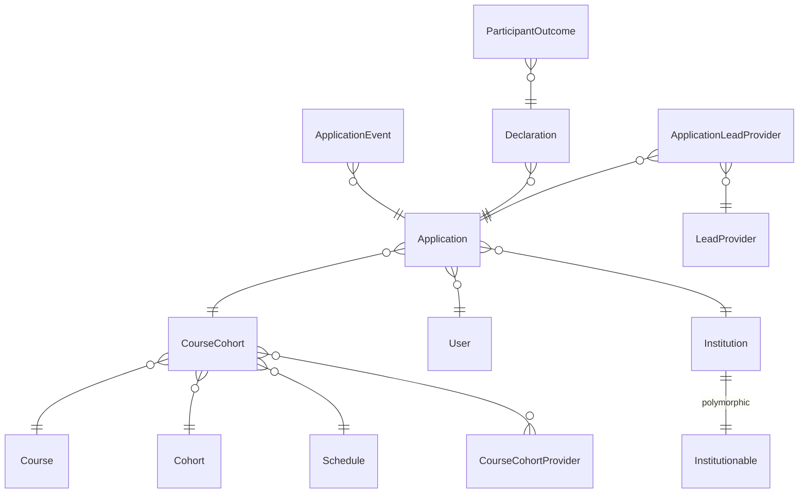

# Data Model

This document covers the TTE service's data model, which grew out of the NPQ
application and is still evolving. An auto-generated entity-relationship diagram
is available at [`domain-model.md`](domain-model.md) — regenerate it with
`bundle exec mermaid_erd` whenever schema changes are made.

---

## Data dictionary

Tables are grouped by domain. Column types are abbreviated: `PK` (primary key),
`FK` (foreign key), `uuid`, `text`, `enum`, `jsonb`, `decimal`, `boolean`,
`date`, `datetime`.

---

### 1. Registration core

| Table                       | Role                                                                                                                                                  | Key columns                                                                                                                                                                                                                  |
|-----------------------------|-------------------------------------------------------------------------------------------------------------------------------------------------------|------------------------------------------------------------------------------------------------------------------------------------------------------------------------------------------------------------------------------|
| **User**                    | A participant (teacher, FE teacher, international teacher). Identity comes from GOV.UK One Login via TeacherAuth; TRN is stored after TRS activation. | `trn`, `one_login_id`, `email`, `full_name`, `date_of_birth`, `refresh_token` (encrypted), `feature_flag_id`                                                                                                                 |
| **Application**             | The central entity. Links a User to a CourseCohort (course + cohort + schedule). Tracks funding, employment, and training status.                     | `user_id` (FK), `course_cohort_id` (FK), `institution_id` (FK), `status` (enum: pending→accepted→started→completed, or rejected/deferred/withdrawn), `funding_eligiblity_status_code`, `works_in_school`, `works_in_nursery` |
| **Course**                  | A training course (e.g. "Excellence in reception teaching"). Belongs to a `course_group` enum (reception / send).                                     | `identifier` (e.g. `tte-early-years`), `course_group` (enum), `name`, `short_code`                                                                                                                                           |
| **Cohort**                  | A programme year.                                                                                                                                     | `start_year`, `registration_starts_at`, `registration_ends_at`, `funding_cap`                                                                                                                                                |
| **Schedule**                | Defines when training starts/ends and when declaration types are valid. Belongs to a course_cohort.                                                   | `identifier`, `course_group` (enum), `training_starts_at`, `training_ends_at`, `allowed_declaration_types` (array), `policy_descriptor`                                                                                      |
| **CourseCohort**            | Join between Course, Cohort and Schedule. The cornerstone of the registration domain — each offering of a course in a year.                           | `course_id` (FK), `cohort_id` (FK), `schedule_id` (FK), `ecf_id`                                                                                                                                                             |
| **CourseCohortProvider**    | Links a LeadProvider to a CourseCohort — determines which providers can accept applications for which course+cohort.                                  | `course_cohort_id` (FK), `lead_provider_id` (FK)                                                                                                                                                                             |
| **ApplicationLeadProvider** | Tracks provider assignment history for an Application (including transfers). The `current` flag indicates the active provider.                        | `application_id` (FK), `lead_provider_id` (FK), `current` (boolean), `assigned_at`, `unassigned_at`                                                                                                                          |
| **ApplicationEvent**        | Audit log of state changes and notifications on an Application. Uses single-table inheritance (`Notification` subclass).                              | `application_id` (FK), `event` (string), `type`, `metadata` (jsonb), `lead_provider_id` (FK)                                                                                                                                 |
| **RegistrationInterest**    | Captures email sign-ups from non-registered users who want to be notified when registration opens.                                                    | `email`, `full_name`                                                                                                                                                                                                         |

---

### 2. Provider management

| Table                   | Role                                                                                                            | Key columns                                                                                                     |
|-------------------------|-----------------------------------------------------------------------------------------------------------------|-----------------------------------------------------------------------------------------------------------------|
| **LeadProvider**        | A third-party training provider. Authenticates via Bearer token.                                                | `name`, `email`, `url`, `hint`, `ecf_id`                                                                        |
| **DeliveryPartner**     | A sub-organisation working under a LeadProvider to deliver training.                                            | `name`, `ecf_id`                                                                                                |
| **DeliveryPartnership** | Join between LeadProvider, DeliveryPartner, and Cohort. A provider works with certain partners in a given year. | `lead_provider_id` (FK), `delivery_partner_id` (FK), `cohort_id` (FK)                                           |
| **ApiToken**            | Bearer token for provider API access. Hashed for storage; tracks last usage.                                    | `lead_provider_id` (FK), `hashed_token`, `last_used_at`, `scope` (enum: lead_provider / teacher_record_service) |

---

### 3. Finance [TODO]

| Table                            | Role                                                                                                                         | Key columns                                                                                                                                                                                                                |
|----------------------------------|------------------------------------------------------------------------------------------------------------------------------|----------------------------------------------------------------------------------------------------------------------------------------------------------------------------------------------------------------------------|
| **Declaration**                  | A milestone claim submitted by the Lead Provider (started, retained-1, retained-2, completed). Goes through a state machine. | `application_id` (FK), `cohort_id` (FK), `lead_provider_id` (FK), `delivery_partner_id` (FK), `declaration_type` (enum), `state` (enum: submitted→eligible→payable→paid, or voided/ineligible/clawed_back), `state_reason` |
| **Statement**                    | A monthly financial statement for a LeadProvider+Cohort. Aggregates declarations into billing periods.                       | `lead_provider_id` (FK), `cohort_id` (FK), `month` (enum), `year`, `deadline_date`, `state` (enum: open→payable→paid), `reconcile_amount`, `marked_as_paid_at`                                                             |
| **StatementItem**                | Links a Declaration to a Statement with its own state (tracks clawbacks).                                                    | `statement_id` (FK), `declaration_id` (FK), `state` (enum matching declaration states)                                                                                                                                     |
| **Contract**                     | Links a Statement to a Course and ContractTemplate — defines what was agreed.                                                | `statement_id` (FK), `course_id` (FK), `contract_template_id` (FK)                                                                                                                                                         |
| **ContractTemplate**             | Payment terms: recruitment targets, per-participant fees, service fees, payment schedules.                                   | `recruitment_target`, `per_participant`, `output_payment_percentage`, `service_fee_percentage`, `number_of_payment_periods`                                                                                                |
| **ParticipantOutcome**           | Tracks whether a participant passed/failed/voided their course. Linked to a Declaration.                                     | `declaration_id` (FK), `state` (enum: passed/failed/voided), `completion_date`                                                                                                                                             |
| **ParticipantOutcomeApiRequest** | Logs API requests for participant outcomes (for audit/traceability).                                                         | `participant_outcome_id` (FK), `request_body`, `response_body`, `response_code`                                                                                                                                            |
| **Milestone**                    | A training milestone tied to a Schedule. Each milestone corresponds to a declaration type.                                   | `schedule_id` (FK), `declaration_type`, `milestone_date`                                                                                                                                                                   |
| **MilestoneStatement**           | Join between Milestone and Statement for financial reconciliation.                                                           | `milestone_id` (FK), `statement_id` (FK)                                                                                                                                                                                   |
| **Adjustment**                   | Manual financial adjustments to a Statement.                                                                                 | `statement_id` (FK), `amount`, `description`                                                                                                                                                                               |
| **FinancialChangeLog**           | An audit trail for financial data changes.                                                                                   | `statement_item_id` (FK), `changed_data`, `change_type`                                                                                                                                                                    |

---

### 4. Institutions

| Table                              | Role                                                                                                              | Key columns                                                                                                                                       |
|------------------------------------|-------------------------------------------------------------------------------------------------------------------|---------------------------------------------------------------------------------------------------------------------------------------------------|
| **Institution**                    | Polymorphic model for workplaces. `institutionable` can be a School, PrivateChildcareProvider, or LocalAuthority. | `name`, `address_1`–`address_3`, `town`, `county`, `postcode`, `institution_reference_number` (URN), `institutionable_type`, `institutionable_id` |
| **School**                         | A GIAS-imported school. One `Institution` per school via the polymorphic association.                             | `ukprn`, `establishment_status_code`, `establishment_type_code`, `phase_type`, `last_changed_date`, `close_date`, `high_pupil_premium`            |
| **PrivateChildcareProvider**       | An Ofsted-registered childcare provider. Imported bi-annually via rake task.                                      | `local_authority`, `provider_compulsory_childcare_register_flag`, `early_years_individual_registers`, `disabled_at`                               |
| **LocalAuthority**                 | A local authority in England. Also uses the Institution polymorphic association.                                  | (uses Institution for name/address)                                                                                                               |

---

### 5. Admin & system

| Table                                | Role                                                                                                              | Key columns                                                                         |
|--------------------------------------|-------------------------------------------------------------------------------------------------------------------|-------------------------------------------------------------------------------------|
| **AdminUser**                        | DfE internal users (support, contract managers, finance, assurance). OTP-based auth.                              | `email`, `otp_hash`, `otp_expires_at`, `super_admin` (boolean)                      |
| **ClosedRegistrationUser**           | Users who have been removed from registration (opted out or flagged).                                             | `user_id` (FK)                                                                      |
| **Session**                          | Active Record session store (sessions table, not cookie-only).                                                    | `session_id`, `data`                                                                |
| **BulkOperation**                    | Tracks batch operations (e.g. bulk declaration submission).                                                       | `action`, `state`, `data` (jsonb)                                                   |
| **Report**                           | Generated report records (e.g. assurance sampling exports).                                                       | `type`, `data` (jsonb)                                                              |
| **FlipperFeature** / **FlipperGate** | Flipper feature flag storage.                                                                                     | feature name, target actors/groups                                                  |
| **Version**                          | PaperTrail versioning for audited models.                                                                         | `item_type`, `item_id`, `event`, `whodunnit`, `object`, `object_changes`            |
| **DelayedJob**                       | Delayed Job background job queue.                                                                                 | `priority`, `attempts`, `handler`, `run_at`, `locked_at`, `failed_at`, `last_error` |
| **ActiveStorage** tables             | File attachment storage (`active_storage_attachments`, `active_storage_blobs`, `active_storage_variant_records`). | blob metadata, attachment links                                                     |

---

## Key relationships

Institutionable is one of these entities:
- School
- PrivateChildcareProvider
- LocalAuthority

---

## Related docs

- [`domain-model.md`](domain-model.md) — auto-generated Mermaid ERD (run `bundle exec mermaid_erd` to refresh)
- [`db/schema.rb`](../db/schema.rb) — canonical schema definition
