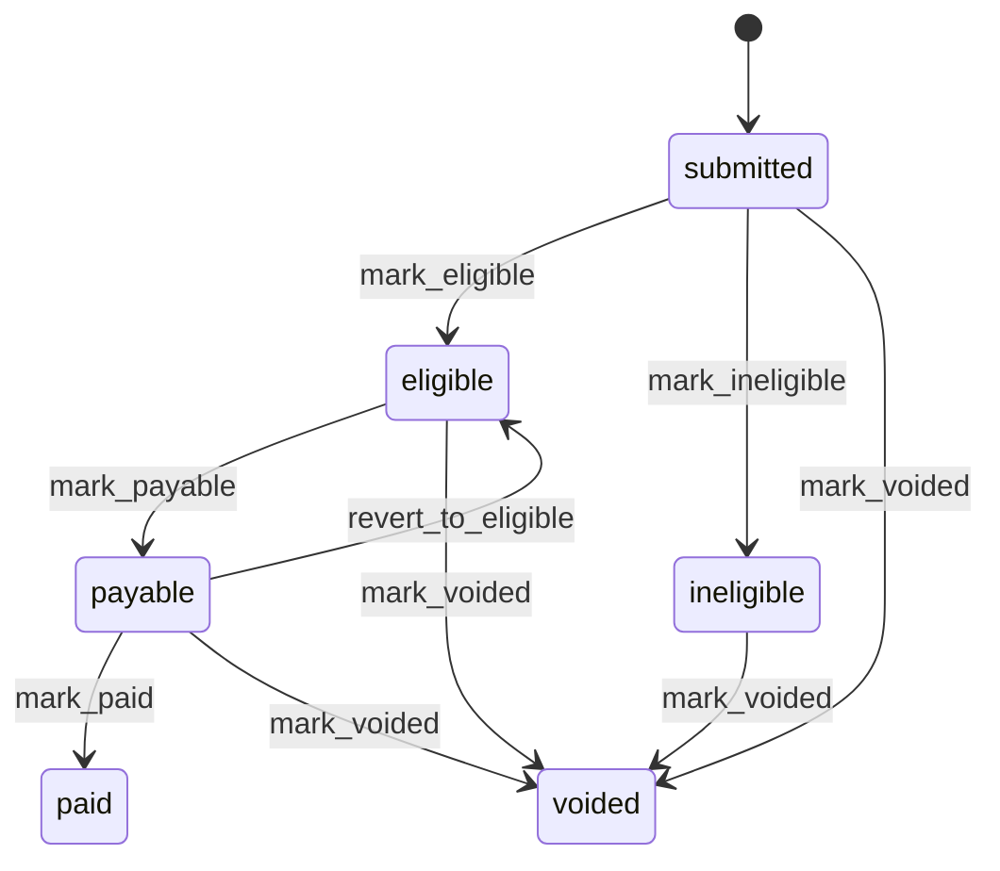
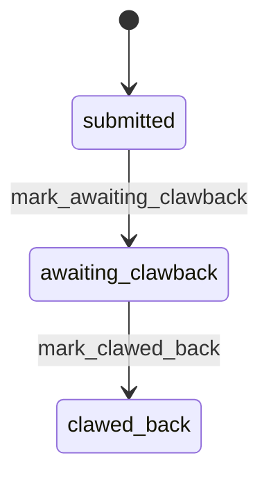
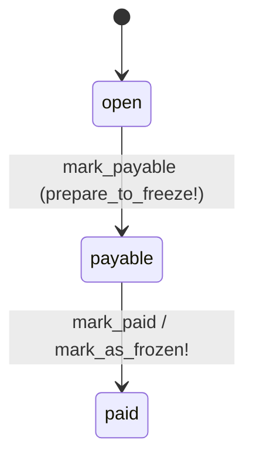

# Finance — Overview

The finance domain is set to give some flexibility to create contract that suits DfE needs for a course. This domain allows values to be set as contract of overall while keeping the ability to
set some changes per academic year along with some control at the course cohort level.

To determine the value of a contractual field you merge:
- Default contract
- Academic year contract
- CourseCohortProvider contract

The four building blocks, in the order money flows through them:

| Concept       | Model                                 | Answers                                       |
|---------------|---------------------------------------|-----------------------------------------------|
| Contract      | `ContractYear`, `CourseCohortProvider`, `ComputedContract` | how much is a participant worth?             |
| Milestone     | `Milestone`                           | what can be claimed, when, and for what share? |
| Declaration   | `Declaration`, `ClawbackDeclaration`  | what was actually claimed?                    |
| Statement     | `Statement`, `Adjustment`             | what does DfE pay this month?                 |

> Note: `Contract`, `ContractTemplate`, `StatementItem` and `MilestoneStatement` no longer
> exist. They were removed by `e8572b67a`, `670806a25` and `3e7622ba7`. A statement is now
> composed directly of `Declaration`s and `Adjustment`s.


## Contract

A contract is computed set of values defined at 3 levels:
- default level
- academic year level
- course cohort level

The computation is a merge operation:
`default values merged with academic_year values merged with course_cohort values`

`ComputedContract` is a plain `ActiveModel` object (not a table) holding
`recruitment_target`, `teacher_funding` and `service_fee`
(`app/models/computed_contract.rb:5-7`). `ComputedContract.draw` performs the merge
(`app/models/computed_contract.rb:32-37`) and `nil` values never override an
already-set value (`app/models/computed_contract.rb:40-52`).

Read a contract through the lead provider:

```ruby
lead_provider.contract(course_cohort:) # => ComputedContract
```
`app/models/lead_provider.rb:25-27`

### Default contract

The contract is set up with a `ContractYear` with the `academic_year` field left null.
Whatever value are set at this level will apply to the statement calculation unless a field is amended at lower level (ie Academic year level and or course cohort level)

Example:
we can set a Lead provider a set recruitment_target 100 year on year for all their course cohorts
```
ContractYear.create(
  lead_provider:,
  course:,
  recruitment_target: 100,
  academic_year: nil,
)
```

### Academic year specifics

The Lead provider contract can be amended per academic year.
With the earlier example the Lead provider can have recruitment_target of 200 for the academic year 2026. For the years prior and after the recruitment_target is 100.

```
ContractYear.create(
  lead_provider:,
  course:,
  recruitment_target: 200,
  academic_year: 2026,
)
```

A `ContractYear` is unique per `lead_provider` + `course` + `academic_year`
(`app/models/contract_year.rb:9`) and carries `recruitment_target`, `service_fee` and
`teacher_funding` (`db/schema.rb:197-212`).

### CourseCohort specifics

The Lead provider contract can also be amended to have specific value for each course cohort in an academic year.
The model `CourseCohortProvider` allows to setup amendments at course cohort level
```
CourseCohortProvider.create(
  course_cohort: first_course_cohort,
  lead_provider:,
  recruitment_target: 150,
)

CourseCohortProvider.create(
  course_cohort: second_course_cohort,
  lead_provider:,
  recruitment_target: 50,
)
```

Only `recruitment_target` and `teacher_funding` exist at this level
(`db/schema.rb:214-224`), so `service_fee` cannot be amended per course cohort.
A `CourseCohortProvider` row is also what links a lead provider to a course cohort, and
`ComputedContract` looks it up with `find_by!` — drawing a contract for a lead provider
that is not attached to the course cohort raises `RecordNotFound`
(`app/models/computed_contract.rb:29`).


## Milestone

A milestone defines what declaration is expected, when it is expected (acceptance window), in what order relative to other declarations and how much the declaration is worth.

A milestone belongs to a `course_cohort`, and there is at most one milestone per
declaration type per course cohort (`app/models/milestone.rb:12,17`, `db/schema.rb:416`).
The declaration types are `started`, `retained-1`, `retained-2`, `completed`
(`app/models/milestone.rb:2-7`).

`milestone.payment_amount` is a **percentage**, not a cash amount
(`db/schema.rb:414`; see the rename TODO at `app/services/declarations/create.rb:115`).

### Acceptance window

The window is stored as two absolute dates on the milestone:
`acceptance_window_start_date` (required — `app/models/milestone.rb:15`) and
`acceptance_window_end_date` (optional; an open-ended window). Milestones are ordered by
`acceptance_window_start_date` by default (`app/models/milestone.rb:23`), and that ordering
is what defines declaration ordering (see below).

A milestone stays editable while its window has not closed
(`app/models/milestone.rb:29-31`).


## Declaration

A declaration records on event in the life-cycle of a teacher's training journey; started, retained, completed training events.
A declaration may also have a financial implication as it represents a financial statement entry which has a value. That value may be:
- positive (100),  DfE will pay that value to Lead provider
- null     (nil),  no payment attached to this declaration
- negative (-100), only for clawback declaration (details below)

The column is `declarations.value` (`db/schema.rb:275`). There is no `amount` column on
declarations — `amount` only exists on `adjustments`.

### Value

The value is defined as a percentage of `contract.teacher_funding` by the associated milestone percentage. Here contract is the computed set of values described in the contract section.

```
declaration.value = contract.teacher_funding * (milestone.payment_amount / 100)
```
`app/services/declarations/create.rb:111-123`

A declaration is only valued when the application holds a funded place — if
`application.funded_place` is falsey the value stays `nil`
(`app/services/declarations/create.rb:112`).

### Lifecycle


`app/models/declaration.rb:52-85`

`Declarations::Create` creates the declaration and immediately calls `mark_eligible!`, so
API-submitted declarations land in `eligible` (`app/services/declarations/create.rb:43-44`).
The same transaction transitions the application to `started` or `completed`
(`app/services/declarations/create.rb:46-51`).

Useful state groupings (`app/models/declaration.rb:2-7`):

| Constant                  | States                                | Used for                                     |
|---------------------------|---------------------------------------|----------------------------------------------|
| `BILLABLE_STATES`         | `eligible`, `payable`, `paid`         | anything that counts towards money           |
| `VOIDABLE_STATES`         | `submitted`, `eligible`, `payable`, `ineligible` | can be voided outright            |
| `CHANGEABLE_STATES`       | `eligible`, `submitted`               | still amendable by the provider              |
| `UNIQUE_MILESTONE_STATES` | billable + `submitted`                | one declaration per milestone per application |

### `Declaration.billable`

```ruby
scope :billable, -> { where(state: BILLABLE_STATES, clawback_declaration: nil) }
```
`app/models/declaration.rb:31`

Two conditions, both required:
1. the state is `eligible`, `payable` or `paid`; and
2. the declaration has **not** been clawed back (`clawback_declaration_id` is null).

Consequences worth knowing:
- `ClawbackDeclaration` rows are never billable — their states (`submitted`,
  `awaiting_clawback`, `clawed_back`) are outside `BILLABLE_STATES`. This matters because
  `statement.declarations` spans the whole STI table, clawbacks included.
- Once a paid declaration is clawed back it silently drops out of `billable`, so the
  original payment stops being counted and the negative clawback value is counted
  separately.

### Milestone-driven validation

Since #681 [614] the milestones of the application's course cohort — not a schedule — decide
what a provider may claim:

- **Allowed types** are `course_cohort.milestones.pluck(:declaration_type)`
  (`app/services/declarations/create.rb:105-109`); the milestone itself is then resolved
  with `find_by!(declaration_type:)` (`app/services/declarations/create.rb:93-99`).
- **Ordering**: every milestone whose `acceptance_window_start_date` is earlier than the
  target milestone must already have a billable-or-changeable declaration, and a non-started
  type is rejected outright if the application has no `started` declaration
  (`app/services/declarations/create.rb:244-261`).
- **Acceptance window**: `declaration_date` must be on or after
  `milestone.acceptance_window_start_date`, and on or before
  `acceptance_window_end_date` when that is set
  (`app/models/declaration.rb:192-207`). Errors are
  `declaration_before_schedule_start` / `declaration_after_schedule_end`.
- **No future dates** (`app/models/declaration.rb:209-211`).
- **One per milestone**: `milestone_id` is unique per `application_id` + `type` while in
  `UNIQUE_MILESTONE_STATES` (`app/models/declaration.rb:118-120`, `db/schema.rb:276`). The
  `type` in the scope is the STI column, which is what lets a clawback coexist with the paid
  declaration it mirrors.

A new declaration is attached to the provider's current open statement, creating it if
needed (`app/services/declarations/create.rb:153-155`).

### Delivery partner

A declaration records who delivered the training: `delivery_partner` and an optional
`secondary_delivery_partner` (`app/models/declaration.rb:18-19`).

- Required for cohorts from 2024 onwards, for applications inside catchment
  (`app/models/declaration.rb:8,219-225`).
- Must be absent for out-of-catchment (overseas) applications
  (`app/models/declaration.rb:101-110`).
- Must be one of the partners the lead provider works with **on that course cohort**
  (`app/models/declaration.rb:103-104,170-174`).
- The two partners cannot be the same (`app/models/declaration.rb:213-217`).

Since #698–#701 [647] the partnership is scoped to a course cohort rather than a cohort:
`DeliveryPartnership` joins `lead_provider` + `delivery_partner` + `course_cohort` and is
unique on that triple (`app/models/delivery_partnership.rb:1-10`, `db/schema.rb:315-327`).
Resolution goes through `LeadProvider#delivery_partners_for_course_cohort`
(`app/models/lead_provider.rb:21-23`).

Partners on an existing declaration are changed with `Declarations::ChangeDeliveryPartner`,
which takes `ecf_id`s and re-runs the declaration's own validations before saving
(`app/services/declarations/change_delivery_partner.rb:16-32`).

### Voiding

`Declarations::VoidStrategy.for(declaration:)` picks the right behaviour
(`app/services/declarations/void_strategy.rb:3-9`):

- **not paid** → `Declarations::Void`, which calls `mark_voided!`
  (`app/services/declarations/void.rb:22`)
- **paid** → `Declarations::Clawback`, which calls `declaration.clawback!`
  (`app/services/declarations/clawback.rb:23`)

Both void the participant outcome and walk the application back one status — a voided
`started` declaration returns the application to `accepted`, a voided `completed`
declaration returns it to `started` (`app/services/declarations/void.rb:24-30`,
`app/services/declarations/clawback.rb:24-30`). A paid declaration can only be clawed back
once (`app/services/declarations/clawback.rb:43-47`).

### ClawbackDeclaration

A clawback declaration is a specific type of declaration that gets created internally as a knock on effect to voiding a paid declaration.
Both paid declaration and clawback declaration links to each other and a clawback declaration is an exact replica of its paid declaration with negative value.

`ClawbackDeclaration` is an STI subclass of `Declaration`
(`app/models/clawback_declaration.rb:3`). It requires a `paid_declaration` and its `value`
must not be positive (`app/models/clawback_declaration.rb:4-5`).

Since #693 [649] it shares the `submitted` initial state with `Declaration`, and has its own
two-step machine (`app/models/clawback_declaration.rb:7-21`):



`Declaration#clawback!` builds the replica — same application, milestone, lead provider,
delivery partners, declaration type and date — with `value` negated, and points the paid
declaration at it (`app/models/declaration.rb:133-149`). The clawback is filed on the lead
provider's **next month** clawback statement, created on demand
(`app/models/declaration.rb:129-131`).

> `Declaration#clawback!` currently writes `state: :awaiting_clawback` explicitly
> (`app/models/declaration.rb:146`), bypassing `submitted`.


## [TODO] Uplift Incentives


## Statement

A statement is a monthly list of declarations and adjustments for one lead provider.

Associations (`app/models/statement.rb:9-15`):
- `declarations` — the whole STI table, so clawbacks are included
- `clawback_declarations` — `type = "ClawbackDeclaration"` only
- `milestones` and `course_cohorts` — distinct, derived through the declarations
  (`course_cohorts` comes from the *application's* course cohort)
- `adjustments`

### Scheduling

`frequency` is an enum whose only value today is `monthly` (`app/models/statement.rb:2-4`,
`db/schema.rb:35`). From `start_date`, two dates are derived on save
(`app/models/statement.rb:45,134-138`):

```
deadline_date = start_date + 1 month - 1 day   # end of the claim window
payment_date  = start_date + 2 months - 1 day  # payment is made within a month of the deadline
```

`payment_date` must not fall before `deadline_date` (`app/models/statement.rb:22,140-145`).
Either date can be moved by hand with `Statements::ChangeDeadlineDate` /
`Statements::ChangePaymentDate`, which enforce the same ordering rule
(`app/services/statements/change_deadline_date.rb:25-31`,
`app/services/statements/change_payment_date.rb:25-31`).

`academic_year` is derived from `start_date` on a September boundary — months before
September belong to the previous academic year (`app/models/statement.rb:46,130-132`):

```ruby
academic_year = start_date.year - (start_date.month < 9 ? 1 : 0)
# 2026-08-01 => 2025
# 2026-09-01 => 2026
```

A statement is unique per lead provider + `start_date` + `frequency`
(`app/models/statement.rb:18`, `db/schema.rb:549`).

#### `current` vs `clawback`

Two scopes select the open statement a new declaration should land on
(`app/models/statement.rb:32-41`):

| Scope      | `start_date`                 | Used by                                              |
|------------|------------------------------|------------------------------------------------------|
| `current`  | beginning of this month      | new declarations (`app/services/declarations/create.rb:154`) |
| `clawback` | beginning of next month      | clawbacks (`app/models/declaration.rb:130`)          |

Both are `state: :open`. The matching constructors `Statement.create_current!` and
`Statement.create_clawback!` create the statement with a fresh `ecf_id`
(`app/models/statement.rb:48-66`). Clawbacks are pushed to next month so they do not
disturb a statement that is already being settled.

### Lifecycle


`app/models/statement.rb:68-80`

Two orchestrating methods cascade to the declarations:

**`prepare_to_freeze!`** (`app/models/statement.rb:90-96`) — closing the claim window:
- `eligible` declarations → `payable`
- `submitted` clawback declarations → `awaiting_clawback`
- the statement → `payable`

Run daily by `Crons::MarkStatementsAsPayableJob` for open statements whose
`deadline_date` was yesterday (`app/jobs/crons/mark_statements_as_payable_job.rb:9-13`).

**`mark_as_frozen!`** (`app/models/statement.rb:82-88`) — authorising payment:
- `payable` declarations → `paid`
- `awaiting_clawback` clawback declarations → `clawed_back`
- the statement → `paid` and stamps `marked_as_paid_at`

Triggered from the admin console via `Statements::PaymentAuthorisationForm`, which requires
an explicit confirmation that checks were done
(`app/forms/statements/payment_authorisation_form.rb:12,22`).

Note `mark_as_frozen!` sets `state` directly rather than firing `mark_paid`.

#### `output_fee`

`output_fee` is a boolean defaulting to `true` (`db/schema.rb:542`) and must not be null
(`app/models/statement.rb:21`). Only output-fee statements can be paid, and the provider API
filters on it by default (`app/services/statements/query.rb:8,48-52`).

#### `allow_marking_as_paid?`

The admin "mark as paid" action is offered only when all of these hold
(`app/models/statement.rb:102-108`, used at `app/views/admin/finance/statements/show.html.erb:51`):

- `output_fee` is true
- state is `payable`
- `deadline_date` is today or in the past
- `marked_as_paid_at` is still blank
- the statement has at least one declaration

`marked_as_paid_at` is the audit stamp of authorisation. Between authorisation and the state
flip a statement is `authorising_for_payment?`; once both are set it is
`marked_as_paid_with_date?` (`app/models/statement.rb:98-112`).

#### Immutability guards

Once a statement leaves `open` it is frozen by two `on: :update` validations:

| Guard                             | State was  | Allowed to change                          |
|-----------------------------------|------------|--------------------------------------------|
| `changing_attributes_when_payable` | `payable` | `marked_as_paid_at`, `output_fee`, `state` |
| `changing_attributes_when_paid`    | `paid`    | nothing                                    |

`app/models/statement.rb:23-24,147-158`. Violations add `:statement_payable` /
`:statement_paid` on `:base`.

### Core formula

`Statements::Calculate#total_payment` is the number DfE pays
(`app/services/statements/calculate.rb:58-60`):

> `statement.total_payment = Σ billable declarations.value + Σ clawback_declarations.value + Σ adjustments.amount + statement.reconcile_amount`

Term by term:

| Term                | Source                                             | Sign     |
|---------------------|----------------------------------------------------|----------|
| `total_output_payment` | `statement.declarations.billable.sum(:value)` (`:42-44,70-72`) | positive |
| `total_clawbacks`   | `statement.clawback_declarations.sum(:value)` (`:50-52`) | negative |
| `total_adjustments` | `statement.adjustments.sum(:amount)` (`:54-56`)    | either   |
| `reconcile_amount`  | manual column on the statement (`db/schema.rb:544`) | either   |

`total_voided` is reported alongside but is a **count**, not money — voided declarations
carry no value into the total (`app/services/statements/calculate.rb:46-48`).

### Funding summary

Since #697 [620] the calculation is grouped by course cohort.
`Statements::Calculate` builds one `Statements::CourseCohortCalculator` per course cohort on
the statement and sums across them (`app/services/statements/calculate.rb:9-13`).

Each `CourseCohortCalculator` resolves the contract for its own course cohort
(`app/services/statements/course_cohort_calculator.rb:7`) and produces one row per milestone
of that course cohort (`:14-19`), split into two sets:

- `funded` — applications with `funded_place: true`
- `self_funded` — applications with `funded_place` `nil` or `false`; these rows report
  `received` only, with `expected` and the value columns forced to `0` (`:61-69`)

A funded row holds (`app/services/statements/course_cohort_calculator.rb:47-60`):

| Key              | Meaning                                                             |
|------------------|---------------------------------------------------------------------|
| `received`       | count of billable declarations on this statement for this milestone (`:84-91`) |
| `expected`       | forecast count still to come (`:99-111`)                            |
| `outstanding`    | `expected - received`                                               |
| `value`          | `contract.teacher_funding * (milestone.payment_amount / 100)` (`:93-97`) |
| `expected_value` | `expected * value`                                                  |
| `received_value` | `received * value`                                                  |

`expected` is `0` while the statement's `deadline_date` is on or before the milestone's
`acceptance_window_start_date` (`:100`). Otherwise it is the count of the lead provider's
applications on that course cohort, minus the billable declarations already counted for the
same milestone on the provider's *other* statements, floored at zero (`:99-118,120-131`).

> The application-status narrowing at `:103-107` (`accepted`/`started`/`completed` for a
> `started` milestone, `started`/`completed` otherwise) builds a relation whose result is
> discarded — `:109` counts the unnarrowed `scope`. As written, `expected` therefore ignores
> application status.

`funded_rows` / `self_funded_rows` are the same rows with a `"Total"` row appended
(`:27-41`). At statement level, `summary_rows` sums `expected` / `received` / `outstanding`
per declaration type across all course cohorts and appends its own `"Total"` row
(`app/services/statements/calculate.rb:15-29`), and `expected_output_payment` is the sum of
every funded `expected_value` (`:36-40`).

Both calculators are consumed by the admin finance screens
(`app/components/admin/statement_details_component.rb:8`,
`app/controllers/admin/finance/statements_controller.rb:40`).

### Adjustments

An `Adjustment` is a manual, signed correction on a single statement. It requires a
`description` and a non-zero `amount`, and the amount must be written in decimal form
(`app/models/adjustment.rb:1-8`, `db/schema.rb:66-73`).

### Audit trail

Finance records are versioned with PaperTrail — `Statement` with a `version_note`
(`app/models/statement.rb:6-7`), `Declaration` ignoring `updated_at`
(`app/models/declaration.rb:10`), plus `Milestone` and `ContractYear`.
`Declaration#state_history` reconstructs the state timeline from those versions
(`app/models/declaration.rb:180-188`).

`FinancialChangeLog` is a separate, coarser ledger for bulk or out-of-band financial data
changes — CSV imports, one-off data fixes — where per-model versions are hard to search. It
stores an `operation_description` and a `data_changes` JSON blob, survives deletion of the
records it describes, and is written with `FinancialChangeLog.log!`
(`app/models/financial_change_log.rb:13-23`, `db/schema.rb:338-343`).
