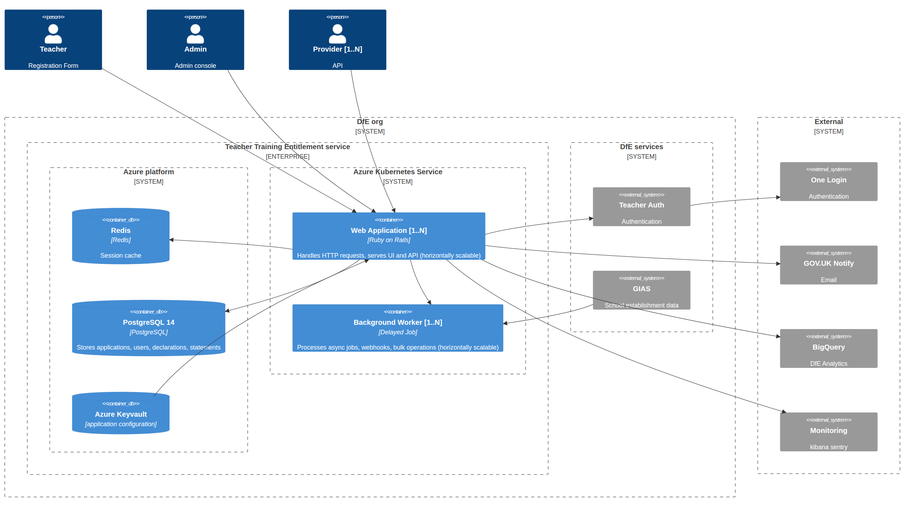

[< Back to docs](../README.md)

[View live diagram](https://mermaid.live/view#pako:eNqNVm1P2zAQ_iuWPwWpQnQUCv1WaDcQb2Vlm7R1Qm5yTb06dmY7hYL633e2Q5O2vCwfytmX596euyPPNFYJ0A49bZ0qaeHRjiTBx3IrgFwzy5Vkggy0moAx4dCDOQiVZyAtia4HvR1iQM95DCThLNUsCybqv8OFsZDdn6hCJkwvomQCDTKivUmfKJ2O6A55Di-6p49x6FxzAxXAWg8YxlOlhCE9nnKLoeSC2YnS2YaF11yyp0LDfcIs84as0iyFV3DucaVgXILujSMNCTcO8tUJI7ohDkNZSMziqTP3vrFk7DADZWyqYXh7SZqtYKa6Ks1ifGAIy3PBY88CxlBgnfFPArFg-uXSWIZ5IhfmQ--zuTPddYUgF7CYs0LY4K7mh8RKTnhaBAdbNpfrx_drjqzdl73hvJyqLC8skKh7Mdz5qPTRA_hi_YAx6dbC-9Xc3b3-HcLuqXgG2kUcMOH2jMlEYPHO7u4GRMPfAox1hcJA8PbbOUE96Q7OSTRVmj85sBALYmIm2FjAzvt1jB6URqfO0QmLZ6l2yZIf_vI_gsNJirFlHLdmIWPyR40xNswVG3uG0rgQM6JyKPn97xhrvNTEStqkRtlpSMLNYMmReXuM-o82soA9zgo7dbA7d8D0ungOmTkJ27DkaSvAmqGUMz9RX867w7Ld_VwTJAqz42bqd4ub1TUzmFg4rITNrHB_gcYd5Wz2S3kjqVocSuIeS7l0b99IIJfu8GEyNQNSWT5Z-FRuvu9-uyDX_iKY6GeMi7eQY55iX2qPPeHprZPLtkE-uhj2Ap2bt-AGYwvgoZfIlZIcVwaX6QqyrC_gAW4OJSO3QWrsvWyzlBsbGo58Dtt0DcWSLBSp64SyQE50zW2UgE1ArtWcJ8HVoJTXZgOnz2NeeAy_X0GUEZazv7LrNJXR17RljJuq6gWvWWvhNbxXV3xu6-qMbWtX_yW2Vcn49fuKwzWdW9IfZFFtoDVkGKsNZaWu5V5vfP8WbdBU84R2rC6gQTPQ2Lx4pH5wRhSHIUOWOyjinM0QJZeIyZn8qVT2AsNVmE5pZ8KEwVOR4wBDL3wSrF4BiRSe4rxa2jn0FmjnmT7Szv7Rp92jvf3jdqt9eNRqHTT3G3RBO-623To-aO_vHR602-3mskGfvM89VBw0KBYeG_8qfMX4j5nlP_7GuLk)

The service runs as two deployment groups of the same docker container:​
- one dedicated to serving our three user groups,​
- and a second handling background processing tasks​

this is to ensure reliable performance across both workloads.​

The infrastructure is provisioned and maintained through Terraform scripts​
and they define our data and compute resource requirements.​

# Integrations

The Teacher Training Entitlement service connects to three external services.
Each integration is covered by its own detail page (linked below), which
documents the contract, the data flows, and any operational notes.

---

## [GOV.UK One Login](./govuk-one-login.md)

Provides participant authentication and identity verification.

The participant signs in via GOV.UK One Login at the verified-identity level.
The service then calls the **Teacher Record Service (TRS)** to match the
verified identity to a Teacher Reference Number (TRN). Participants without a
TRN — such as Further Education (FE) teachers or those trained outside the UK —
follow an assisted-verification path.

**What the detail page covers:** OIDC flow, TRN acquisition via the TRS API,
TeacherAuth middleware, and assisted-verification handling.

---

## [GOV.UK Notify](./govuk-notify.md)

Sends all service-generated email notifications.

The service uses a single GOV.UK Notify template and populates it with dynamic
personalisation fields at send time. Emails are triggered by application state
transitions (submission, deferral, withdrawal, declaration receipt) and are
tracked via the Notify API for delivery status.

**What the detail page covers:** template ID, personalisation fields,
send-email lifecycle, idempotency guarantees, and troubleshooting failed sends.

---

## [GIAS (Get Information About Schools)](./govuk-gias.md)

Imports establishment data used in eligibility checks.

A daily scheduled job fetches school and local-authority data from the Azure-
hosted edubase API (the GIAS dataset). The imported data powers school-type
lookups and eligibility decisions during registration — for example, checking
that a participant works at an eligible state-funded institution.

**What the detail page covers:** import schedule, data model of imported
fields, error-handling strategy, idempotent re-import, and manual re-run
procedure.

---

## Related

- [Service data model](../data_model.md) — how imported GIAS records relate to
  applications and participants.
