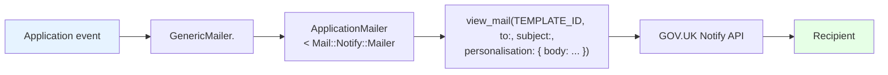

# GOV.UK Notify Email Integration

## 1. Introduction

The service uses [GOV.UK Notify](https://www.notifications.service.gov.uk/) to send all transactional emails. Integration is via the [`mail-notify`](https://github.com/alphagov/mail-notify) gem (v2.1.0).

- The Notify API key is supplied through the `GOVUK_NOTIFY_API_KEY` environment variable.
- Delivery is configured in `config/application.rb` as `config.action_mailer.delivery_method = :notify`.
- Developers must have a Notify account created during onboarding to send real emails locally (see [`ways-of-working.md`](../development/ways-of-working.md)).
- For other service integrations, see [`README.md`](./README.md).

## 2. Architecture



## 3. Single template pattern

All email types use a single Notify template identified by:

```
a586a2a2-f53a-4201-a489-e7aaf09ec1d9
```

This ID is hardcoded as `GenericMailer::TEMPLATE_ID`. Content is customised by passing different `subject` and `personalisation[:body]` values. The `subject` is looked up from Rails I18n locale files and may include the course name (e.g. `mailers.deferral_notification`).

This approach differs from a multi-template architecture where each email type would have its own Notify template.

## 4. Mailer methods

`GenericMailer` defines one method per email type. All use the single template ID.

| Method                           | Purpose                                              | Triggered by                                                   |
|----------------------------------|------------------------------------------------------|----------------------------------------------------------------|
| `eligible_for_funding`           | Participant notified of funding eligibility change   | `Applications::ChangeFundingEligibility`                       |
| `application_submitted`          | Confirmation after application submission            | `Emails::SendApplicationSubmissionEmailJob`                    |
| `confirmation_code`              | Magic-link / OTP confirmation code for admin sign-in | `SessionWizardSteps::SignIn` form                              |
| `email_updates_confirmation`     | Confirmation of email subscription preferences       | `EmailUpdatesController`                                       |
| `change_provider`                | Participant notified of provider change              | `Applications::ChangeLeadProvider`                             |
| `deferral_notification`          | Application has been deferred                        | `Applications::Defer`                                          |
| `registration_open_notification` | Registration re-opened for deferred participants     | `Crons::SendRegistrationOpenNotificationEmailsJob`             |
| `deferral_expiring_notification` | Deferral period is about to expire                   | `Crons::SendDeferralExpiringNotificationEmailsJob`             |
| `provider_rejected`              | Provider has rejected the application                | `Applications::Reject` (when reason is `rejected-by-provider`) |
| `previous_provider`              | Previous provider notified of application transfer   | `Applications::ChangeLeadProvider`                             |

Every method calls the private `generic_mail` helper which:

- Suppresses all email types **except** `confirmation_code` when `Rails.env.sandbox?`.
- Passes `params[:to]` as the recipient.
- Builds the subject from I18n via `I18n.t(subject, course_name:)`.
- After delivering, logs an `ApplicationEvent` / `Notification` record against the application (if `ecf_id` is present in `params`).

## 5. Background jobs

| Job                                                | Schedule       | Delivery        | Purpose                                      |
|----------------------------------------------------|----------------|-----------------|----------------------------------------------|
| `Emails::SendApplicationSubmissionEmailJob`        | On-demand      | `deliver_now`   | Sends `application_submitted` synchronously  |
| `Crons::SendDeferralExpiringNotificationEmailsJob` | Daily at 06:15 | `deliver_later` | Sends `deferral_expiring_notification` async |
| `Crons::SendRegistrationOpenNotificationEmailsJob` | Daily at 06:00 | `deliver_later` | Sends `registration_open_notification` async |

The cron jobs query for eligible applications, iterate them, and queue individual emails via `GenericMailer.with(...).<method>.deliver_later`.

## 6. Email architecture

```
ApplicationMailer < Mail::Notify::Mailer   # base class
    └── GenericMailer < ApplicationMailer  # single class for all emails
```

The `after_action :log_application_event` callback in `GenericMailer` creates a `Notification` record (an `ApplicationEvent` subclass) after each successful send, provided `params[:ecf_id]` matches an existing application.

## 7. Adding a new email type

Add a method to `app/mailers/generic_mailer.rb`:

```ruby
# app/mailers/generic_mailer.rb
def my_new_email
  generic_mail(subject: "mailers.my_new_email")
end
```

Then add an I18n key in the locale files (e.g. `config/locales/mailers/en.yml`):

```yaml
en:
  mailers:
    my_new_email: "Your subject line"
```

Call it from a service or job:

```ruby
GenericMailer.with(
  to: user.email,
  full_name: user.full_name,
  course_name: course.name,
  ecf_id: application.ecf_id,
).my_new_email.deliver_later
```

The value of `personalisation[:body]` is rendered from the `app/views/mailers/generic_mailer/my_new_email.text.erb` template. If you need a custom subject (e.g. including the course name), use the `course_name:` interpolation in the I18n string.

## 8. Testing

- `config/environments/test.rb` sets `config.action_mailer.delivery_method = :test` — emails are accumulated in `ActionMailer::Base.deliveries` instead of being sent to Notify.
- CI workflow (`.github/workflows/rspec.yml`) sets `GOVUK_NOTIFY_API_KEY: Test` — a fake value that satisfies the configuration but is never used to call the Notify API.
- Custom RSpec matchers in `spec/support/matchers/notify_matcher.rb`:
  - `use_template(template_id)` — asserts the mail uses a specific Notify template ID.
  - `have_personalisation(hash)` — asserts personalisation values.
- `MailHelper#expect_mail_to_have_been_sent` (`spec/support/helpers/mail_helper.rb`) is a convenience helper that checks a delivery was queued for a given recipient and template.
- A shared example exists for asserting that mailer logs are redacted (email addresses not written to logs).

## 9. PII redaction

- `config/initializers/mailer_log_redactor.rb` prepends a module onto `RailsSemanticLogger::ActionMailer::LogSubscriber::EventFormatter` to filter email addresses and other sensitive payload fields from log output.
- Redaction uses `ActiveSupport::ParameterFilter` with the application's `config.filter_parameters`.
- `ActionMailer::MailDeliveryJob.log_arguments = false` prevents email arguments from appearing in job logs.
- See [`logging.md`](../monitoring/logging.md) for broader logging practices.

## 10. Email validation

The `NotifyEmailValidator` (`app/validators/notify_email_validator.rb`) replicates GOV.UK Notify's own email validation rules. It validates:

- Presence (not blank).
- Format matches `/\A[a-zA-Z0-9.!#$%&'*+\/=?^_`{|}~\\-]+@([^.@][^@\s]+)\z/`.
- Total length ≤ 320 characters.
- No consecutive dots (`..`) in the local part.
- Hostname parts each ≤ 63 characters, total hostname ≤ 253 characters.
- At least two hostname parts (a TLD is required).
- TLD matches `/\A([a-z]{2,63}|xn--([a-z0-9]+-)*[a-z0-9]+)\z/i`.
- Internationalised domain names are normalised via `SimpleIDN.to_ascii` before validation.

Used via `validates :email, notify_email: true` on `User` and `RegistrationInterest` models.

## 11. Key files

| File                                         | Purpose                                                        |
|----------------------------------------------|----------------------------------------------------------------|
| `app/mailers/generic_mailer.rb`              | All email methods; single template ID                          |
| `app/mailers/application_mailer.rb`          | Base class inheriting `Mail::Notify::Mailer`                   |
| `config/application.rb`                      | Delivery method and API key configuration                      |
| `config/initializers/mailer_log_redactor.rb` | PII redaction from logs                                        |
| `app/validators/notify_email_validator.rb`   | Email format validation matching Notify rules                  |
| `spec/support/matchers/notify_matcher.rb`    | Custom RSpec matchers (`use_template`, `have_personalisation`) |
| `spec/support/helpers/mail_helper.rb`        | Test helper `expect_mail_to_have_been_sent`                    |
| `.github/workflows/rspec.yml`                | CI environment sets `GOVUK_NOTIFY_API_KEY: Test`               |
