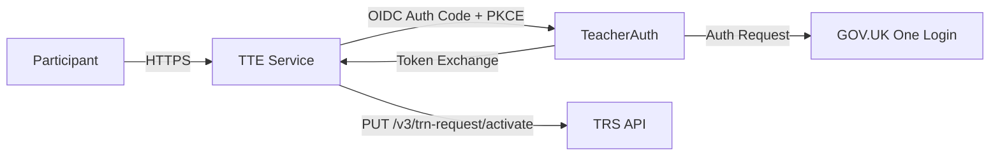

# GOV.UK One Login Integration

## 1. Introduction

The Teacher Training Entitlement (TTE) service uses **GOV.UK One Login** at the
identity verification level for participant authentication. One Login is not
called directly — TTE talks to **Teacher Auth**, DfE's OIDC proxy service, which
in turn proxies authentication to One Login. The same integration also provides
TRN lookup and activation via the **Teacher Record Service (TRS) API**.

This document is the deep dive on the OIDC protocol, token lifecycle, TRN
activation, and sign-out. For the registration-journey view of authentication
(user provisioning, session expiry, the sign-in button in the wizard) see
[`registration/authentication.md`](../registration/authentication.md).

For a listing of all external integrations see
[`integrations/README.md`](./README.md).

## 2. Architecture overview

## 3. OIDC configuration

- **OmniAuth strategy**: `Omniauth::Strategies::TeacherAuth` at
  `lib/omniauth/strategies/teacher_auth.rb`. It extends
  `OmniAuth::Strategies::OpenIDConnect`.
- **Discovery**: enabled — the strategy fetches the provider's
  `/.well-known/openid-configuration` to locate endpoints automatically.
- **PKCE**: enabled (`option :pkce, true`).
- **Scopes**: `email openid profile teaching_record offline_access`.
  - `offline_access` is critical: it causes Teacher Auth to return a
    `refresh_token` for users who do **not** have a TRN, allowing the service
    to re-authenticate later when activating a TRN via TRS.
- **Devise integration**: `devise_for :users, controllers: { omniauth_callbacks: "omniauth" }`
  (in `config/routes.rb`).
- **Callback route**: `GET /users/auth/teacher_auth/callback`.
- **Config initializer**: `config/initializers/teacher_auth.rb` reads env vars
  into `Rails.configuration.x`.
- **Devise initializer**: `config/initializers/devise.rb` configures the OmniAuth
  strategy with `client_options` (host, identifier, redirect_uri, secret),
  `issuer`, `post_logout_redirect_uri`, and `strategy_class`.

## 4. Environment variables

| Variable                     | Purpose                                                                     |
|------------------------------|-----------------------------------------------------------------------------|
| `TEACHER_AUTH_DOMAIN`        | OIDC issuer URL used as the base for discovery and all OIDC endpoints       |
| `TEACHER_AUTH_CLIENT_ID`     | OAuth2 client ID issued by Teacher Auth                                     |
| `TEACHER_AUTH_CLIENT_SECRET` | OAuth2 client secret                                                        |
| `ONE_LOGIN_HOME_URL`         | GOV.UK One Login landing page shown to users in UI links                    |
| `TRS_API_URL`                | Base URL for the TRS API (used by `TeacherAuth::ActivateTrn`)               |
| `HOSTING_DOMAIN`             | Service URL, used to build callback `redirect_uri` and post-logout redirect |

In the test environment the Teacher Auth initializer is skipped; equivalent
values are hardcoded in `config/environments/test.rb`.

## 5. Sign-in flow

1. Participant clicks **Sign in** in the registration wizard.
2. TTE redirects the user to Teacher Auth's OIDC authorization endpoint (Auth
   Code + PKCE flow).
3. Teacher Auth proxies the request to GOV.UK One Login.
4. User authenticates at One Login at the identity verification level (proves
   who they are).
5. One Login returns an authorization code to Teacher Auth, which exchanges it
   for tokens and forwards the code back to TTE's callback.
6. `OmniauthController#teacher_auth` receives the callback, extracts the
   `omniauth.auth` hash from `request.env`, stores the `id_token` in the
   session (for later OIDC logout), and calls `Users::FindOrCreateFromTeacherAuth`.
7. User provisioning runs (see §6). The user is signed in via Devise
   (`sign_in_and_redirect`).
8. After sign-in, the user is redirected to:
   - `/applications` if they have existing applications, or
   - the next step in the registration wizard.

## 6. User provisioning

`Users::FindOrCreateFromTeacherAuth` (`app/services/users/find_or_create_from_teacher_auth.rb`)
runs on every sign-in and matches or creates a `User` record:

| Step | Match key           | What happens                                                                                                                                                            |
|------|---------------------|-------------------------------------------------------------------------------------------------------------------------------------------------------------------------|
| 1    | `User#trn`          | Strongest identity signal. If a non-archived user with this TRN exists, merge/archive clashing email records and update `one_login_id`, `email`, `full_name`, provider. |
| 2    | `User#one_login_id` | Returning user. Match by `one_login_id` and provider name, update profile fields.                                                                                       |
| 3    | (fallback)          | No match — create a new `User` with the One Login ID, email, full name, TRN (if present), and date of birth.                                                            |

**On match**: any existing user with a clashing email is either merged (if the
clashing user has no TRN) or archived (email blurred, `archived_at` set).

**If TRN is present** in the Teacher Auth response: the stored `refresh_token`
is cleared — it is no longer needed. If TRN is absent: the `refresh_token` is
stored for later use (§7, §8).

## 7. Token refresh (users without TRN)

Users who sign in without a TRN receive a `refresh_token`. The service keeps
this token alive so it can later call TRS on their behalf.

- **`TeacherAuth::RefreshToken`** (`app/services/teacher_auth/refresh_token.rb`):
  POSTs to `{TEACHER_AUTH_DOMAIN}/oauth2/token` with `grant_type=refresh_token`.
  Returns `{ access_token:, refresh_token: }` on success, `:invalid_token` if
  the grant has expired/been revoked, or `nil` on other errors.
- **`RefreshUserTokenJob`** (`app/jobs/refresh_user_token_job.rb`): calls
  `RefreshToken` for a single user. On `:invalid_token` it calls
  `User#clear_auth_tokens!` (nulls `refresh_token` and `refresh_token_updated_at`).
- **`Crons::EnqueueTokenRefreshesJob`** (`app/jobs/crons/enqueue_token_refreshes_job.rb`):
  runs **hourly** (`0 * * * *`). Enqueues `RefreshUserTokenJob` for every user
  matching `User.requiring_token_refresh`:
  `trn IS NULL AND refresh_token IS NOT NULL AND refresh_token_updated_at < 1 day ago AND trn_requested_at IS NULL`.
- **Storage**: `refresh_token` is encrypted at rest via Active Record encryption
  (`encrypts :refresh_token` in the User model).

## 8. TRN activation

When a Lead Provider accepts an application for a user without a TRN, the
service activates a TRN via TRS.

- **`TeacherAuth::ActivateTrn`** (`app/services/teacher_auth/activate_trn.rb`):
  `PUT /v3/trn-request/activate` on `{TRS_API_URL}` with headers:
  - `Authorization: Bearer <access_token>`
  - `X-Api-Version: 20260416`
  - `Content-Type: application/json`

  Returns `{ trn: }` on success or `nil` on failure.

- **`RequestTrnJob`** (`app/jobs/request_trn_job.rb`): the orchestrator.
  1. Calls `TeacherAuth::RefreshToken` to get a fresh `access_token`.
  2. Calls `TeacherAuth::ActivateTrn` with it.
  3. If TRN returned: stores it on `User`, clears `refresh_token`.
  4. If TRN not returned (TRS may activate asynchronously): updates
     `refresh_token` (rotated), sets `trn_requested_at`.
  5. On `RefreshTokenError`: retries up to 5× with polynomial backoff.

- **`Crons::EnqueueTrnActivationChecksJob`** (`app/jobs/crons/enqueue_trn_activation_checks_job.rb`):
  runs **daily at 06:00** (`0 6 * * *`). Re-polls TRS for users who have
  `trn_requested_at` set but TRN still blank (`User.needing_trn_activation_check`).

## 9. Sign-out flow

`SessionsController#destroy` (`app/controllers/sessions_controller.rb`) handles
`DELETE /sign-out`:

1. Reads `id_token` from session (stored on sign-in).
2. Calls `sign_out_all_scopes` to clear the local Devise session.
3. Redirects to `{TEACHER_AUTH_DOMAIN}/oauth2/logout` with query parameters:
   - `id_token_hint=...` (the stored `id_token`)
   - `post_logout_redirect_uri={HOSTING_DOMAIN}/sign-out`

Admin users are redirected to `/admin` instead (they have their own wizard and
do not participate in OIDC logout).

## 10. Key files

| File                                                     | Purpose                                               |
|----------------------------------------------------------|-------------------------------------------------------|
| `lib/omniauth/strategies/teacher_auth.rb`                | OIDC strategy class (extends `OpenIDConnect`)         |
| `app/controllers/omniauth_controller.rb`                 | OIDC callback handler                                 |
| `app/services/users/find_or_create_from_teacher_auth.rb` | User provisioning on sign-in                          |
| `app/services/teacher_auth/refresh_token.rb`             | OIDC token refresh via `POST /oauth2/token`           |
| `app/services/teacher_auth/activate_trn.rb`              | TRS TRN activation via `PUT /v3/trn-request/activate` |
| `app/jobs/request_trn_job.rb`                            | TRN activation job (refresh → activate → persist)     |
| `app/jobs/refresh_user_token_job.rb`                     | Single-user token refresh job                         |
| `app/jobs/crons/enqueue_token_refreshes_job.rb`          | Hourly cron to queue token refreshes                  |
| `app/jobs/crons/enqueue_trn_activation_checks_job.rb`    | Daily 06:00 cron to re-poll TRS                       |
| `app/controllers/sessions_controller.rb`                 | Sign-out with OIDC `id_token_hint` logout             |
| `config/initializers/teacher_auth.rb`                    | Reads env vars into `Rails.configuration.x`           |
| `config/initializers/devise.rb`                          | OmniAuth strategy configuration                       |

## 11. Testing

- The Teacher Auth initializer (`config/initializers/teacher_auth.rb`) is
  skipped in test via `unless Rails.env.test?`. Test-specific values are
  hardcoded in `config/environments/test.rb`.
- Devise's `secret_key` is hardcoded in `config/initializers/devise.rb` for
  the test environment.
- **OmniAuth test mode** is enabled in specs via
  `OmniAuth.config.test_mode = true`. Mock responses are registered with
  `OmniAuth.config.add_mock(:teacher_auth, ...)`.
- **Shared context**: `spec/support/shared_contexts/stub_teacher_auth.rb`
  provides a `Stub Teacher Auth Responses` context with configurable fields
  (`user_trn`, `user_uid`, `user_email`, etc.) and sets up the mock in a
  `before` block.
- **Factory**: `spec/factories/users.rb` defines a `:with_one_login_id` trait
  that sets `one_login_id` and `provider` for FactoryBot User records used in
  integration tests.

## 12. Related docs

- [`registration/authentication.md`](../registration/authentication.md) —
  registration-journey view (user provisioning, session expiry, TRN acquisition
  from the participant's perspective).
- [`integrations/README.md`](./README.md) — full integration index.

