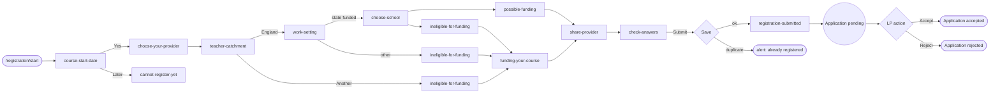
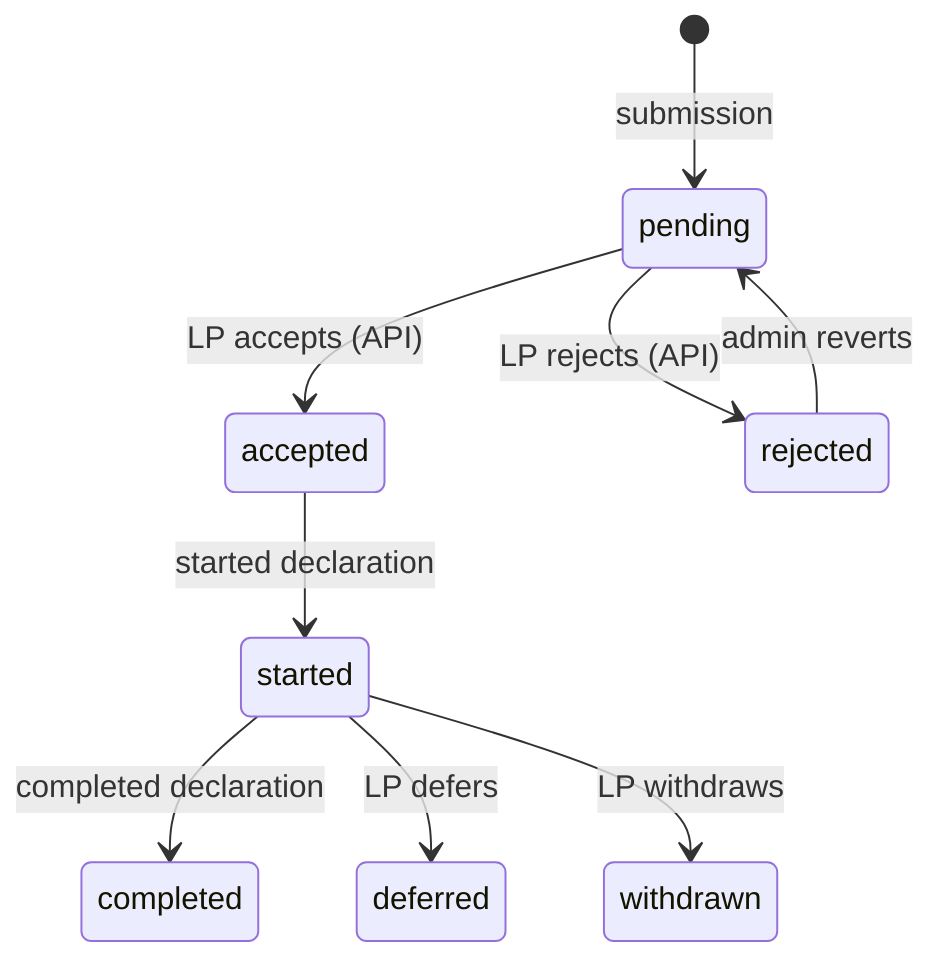

# Registration — Application Submission

The wizard turns a signed-in participant into a pending `Application`: the
participant answers step pages, sees a summary, and submits. On submit the
service re-checks funding eligibility against the full answer set, then
creates an `Application` tied to the current `CourseCohort` and the user's
chosen `LeadProvider`.

## End-to-end



Above the LP-action branch is registration. Everything below is application
management.

## The show/update loop

`RegistrationWizardController` is the loop. Every step is
`GET /registration/:step` (show) and `PATCH /registration/:step` (update);
`/registration/:step/change` flips a `changing_answer: "1"` flag so the form
routes the participant back to `check-answers` after editing.

```ruby
def update
  return redirect_to registration_wizard_show_path(@wizard.next_step_path) if @wizard.skip_step?
  return redirect_to root_path unless @form.requirements_met?
  if @form.valid?
    redirect_to registration_wizard_show_path(@wizard.next_step_path)
    @wizard.save!
  else
    render @wizard.current_step
  end
end
```

The route map (`config/routes.rb`) is `get`/`patch` on
`/registration/:step` and `/registration/:step/change`, plus the
`applications` resource and the `applications/change_provider` namespace.
The controller also gates the closure banner (`before_action
:registration_closed`) and, on `course-start-date`, redirects away if the
user already has an active application for the same course in the current
cohort.

## Step form objects

Each step is a `Questionnaires::*` form object under
`app/forms/questionnaires/`, sharing a contract via `Questionnaires::Base`:

| Method              | Returns                                                                 |
|---------------------|-------------------------------------------------------------------------|
| `permitted_params`  | Attribute names accepted from strong params                             |
| `next_step`         | Next step (symbol); falls back to `:closed` when registration is closed |
| `previous_step`     | Previous step (symbol); same `:closed` fallback                         |
| `skip_step?`        | Auto-redirect away (e.g. `auth_callback` after sign-in)                 |
| `requirements_met?` | Gate to render this step at all                                         |
| `after_save`        | Mutations applied to `wizard.store` on successful save                  |

Step symbols and their mapping to `Questionnaires::Camelcased` classes live
in `RegistrationWizard::VALID_REGISTRATION_STEPS` /
`RegistrationWizard.fetch_step` (`app/models/registration_wizard.rb`).

## Session-backed store

Until submission, the registration lives entirely in the session — abandonable, discardable.

| Concern        | Code                                                                                                        |
|----------------|-------------------------------------------------------------------------------------------------------------|
| Hash location  | `session["registration_store"]` (Devise cookie session)                                                     |
| Read access    | `wizard.store` (raw hash)                                                                                   |
| Typed access   | `RegistrationQueryStore.new(store:)` — booleans like `inside_catchment?`, `works_in_school?`                |
| Save on submit | `Questionnaires::CheckAnswers#after_save` triggers `HandleSubmissionForStore.new(store: wizard.store).call` |

New step logic should go through `RegistrationQueryStore`
(`app/services/registration_query_store.rb`) rather than poking the hash.

## On submit — session becomes an Application

`HandleSubmissionForStore` (`app/services/handle_submission_for_store.rb`)
reads the session once and writes the durable record inside a transaction:

```ruby
ActiveRecord::Base.transaction do
  @application = user.applications.create!(
    course_cohort: CourseCohort.find_by!(course:, cohort: Cohort.current),
    application_lead_providers: [ApplicationLeadProvider.new(current: true, lead_provider_id: store["lead_provider_id"])],
    institution: (institution_from_store if inside_catchment?),
    eligible_for_funding: funding_eligibility_service.funded?,
    funding_eligiblity_status_code: funding_eligibility_service.funding_eligiblity_status_code,
    status: Application::PENDING,
    raw_application_data: raw_application_data.except("current_user", "current_user_id"),
    # …teacher_catchment, work_setting, kind_of_nursery, …
  )
  enqueue_send_application_submission_email_job(application)
end
```

What matters from outside:

- The course is anchored via `CourseCohort.find_by!(course:, cohort: Cohort.current)`
   — never directly to `Course`. See [`data_model.md`](../data_model.md).
- The chosen `LeadProvider` is recorded as a current `ApplicationLeadProvider`.
  The list of available providers is `LeadProvider.for(course:)`
  (`app/models/lead_provider.rb`) — driven by which LPs are joined to the
  current `CourseCohort` for the course.
- Funding is recomputed against the full answer set — the wizard consulted
  `FundingEligibility` earlier to render decision pages, but the value
  written to the `Application` comes from this final pass.
- `status: "pending"`. The LP moves it to `"accepted"` or `"rejected"` via
  the LP API.
- The submission email is enqueued in the same transaction. On
  `registration-submitted` the wizard also flips a `clear_tra_login` flag
  in the session (`Questionnaires::RegistrationSubmitted#after_save`).

## FundingEligibility — at a glance

`FundingEligibility` is invoked at the `choose-school` /
`ineligible-for-funding` branches to choose the next step, and again inside
`HandleSubmissionForStore`. Interface:

```ruby
funding = FundingEligibility.new(course:, institution:, inside_catchment:, query_store:)
funding.funded?                              # => true / false
funding.funding_eligiblity_status_code       # => :funded | :not_in_england
                                             #    | :previously_funded | :ineligible_setting
funding.previously_funded?                   # prior accepted, eligible-for-funding app?
```

Full rules and downstream effects (accept, declarations) live in
[`funding.md`](../funding.md).

## Status lifecycle (pending → acceptance)



This doc stops at `accepted` / `rejected`. The full transition map is
`Application::STATUS_TRANSITIONS` in `app/models/application.rb`. The
submitted application becomes visible at `/applications/<ecf_id>`.

## Where the code lives

| Concern                                | Path                                                                                             |
|----------------------------------------|--------------------------------------------------------------------------------------------------|
| Wizard controller (show/update loop)   | `app/controllers/registration_wizard_controller.rb`                                              |
| Wizard service object (steps, store)   | `app/models/registration_wizard.rb`                                                              |
| Step form objects                      | `app/forms/questionnaires/`                                                                      |
| Typed store wrapper                    | `app/services/registration_query_store.rb`                                                       |
| Funding rules                          | `app/services/funding_eligibility.rb`                                                            |
| Submission persistence                 | `app/services/handle_submission_for_store.rb`                                                    |
| Application model & status transitions | `app/models/application.rb` (`STATUSES`, `STATUS_TRANSITIONS`, `can_change_provider?`)           |
| Lead provider lookup for a course      | `app/models/lead_provider.rb#for`                                                                |
| Routing                                | `config/routes.rb` (`/registration/:step`, `applications` resource, `change_provider` namespace) |
| Submitted application view             | `app/views/registration_wizard/check_answers.html.erb`, `…/registration_submitted.html.erb`      |

## Related docs

- [`overview.md`](./overview.md) — registration domain map.
- [`authentication.md`](./authentication.md) — sign-in and how a `User` is provisioned before the wizard.
- `change-of-provider.md` *(forthcoming)* — change-of-provider flow (participant action after submission; guarded by `Application#can_change_provider?`).
- [`funding.md`](../funding.md) — `FundingEligibility` status codes and downstream effect on declarations.

  - [`data_model.md`](../data_model.md) — `Application`, `CourseCohort`, `LeadProvider` relationships.
