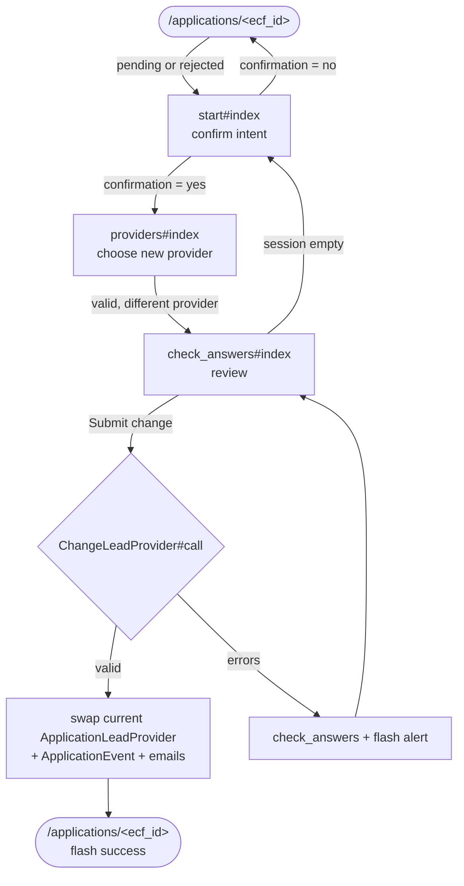

# Registration — Change of Provider

A signed-in participant can move an existing `Application` to a different Lead
Provider without re-registering. The flow keeps the same `Application`, course
and cohort — it only swaps which `LeadProvider` is `current`, preserving the
previous provider as history and notifying both sides by email.

It is a **post-submission** action: it starts from the participant's
application page (`/applications/<ecf_id>`), not from the registration wizard.

## When it is allowed

Change of provider is gated by `Application#can_change_provider?`:

```ruby
def can_change_provider?
  pending_status? || rejected_status?
end
```

The self-service flow is open only while no provider has accepted the
participant onto the course:

| Application status | Self-service change? | What the participant sees                         |
|--------------------|----------------------|---------------------------------------------------|
| `pending`          | Yes                  | "Register with a different provider" → start flow |
| `rejected`         | Yes                  | "Register with a different provider" → start flow |
| `accepted`         | No                   | link shown but gate redirects to application page |
| `started`          | No                   | no action shown                                   |
| `completed`        | No                   | no action shown                                   |
| `deferred`         | No                   | no action shown                                   |
| `withdrawn`        | No                   | no action shown                                   |

The cut-off is the **accepted status**: once a Lead Provider has accepted the
participant (`pending → accepted` in `Application::STATUS_TRANSITIONS`), the
participant can no longer self-serve a switch.

> **Note:** The `_course_details.html.erb` partial renders a contact-us link
> for `accepted` applications, but the `ensure_can_change_provider`
> `before_action` on `ChangeProviderController` redirects them back to the
> application page. The contact-us route is effectively unreachable for
> `accepted` applications under the current gate.

## Entry points

Both links live on the application page's course-details card
(`app/views/applications/applications/_course_details.html.erb`):

- `can_change_provider?` (pending/rejected) → link to `start` flow.
- `accepted_status?` → link to `contact_us` (currently blocked by controller gate; see note above).

## Routes

Mounted under the `applications` resource as the `change_provider` namespace
with a dashed URL path (`config/routes.rb` lines 60–67):

| Verb   | Path                                                   | Controller#action      | Purpose                          |
|--------|--------------------------------------------------------|------------------------|----------------------------------|
| `GET`  | `/applications/<ecf_id>/change-provider/contact-us`    | `contact_us#index`     | Manual route guidance (accepted) |
| `GET`  | `/applications/<ecf_id>/change-provider/start`         | `start#index`          | Confirm intent to switch         |
| `POST` | `/applications/<ecf_id>/change-provider/start`         | `start#create`         | Record confirmation              |
| `GET`  | `/applications/<ecf_id>/change-provider/providers`     | `providers#index`      | Choose the new provider          |
| `POST` | `/applications/<ecf_id>/change-provider/providers`     | `providers#create`     | Record the chosen provider       |
| `GET`  | `/applications/<ecf_id>/change-provider/check-answers` | `check_answers#index`  | Review the new provider          |
| `POST` | `/applications/<ecf_id>/change-provider/check-answers` | `check_answers#create` | Perform the swap                 |

Every controller inherits `ChangeProviderController`, whose `before_action`
re-runs the gate on each request:

```ruby
def ensure_can_change_provider
  redirect_to applications_path and return unless application
  redirect_to application_path(application.ecf_id) unless application.can_change_provider?
end
```

## The self-service flow

`start` and `providers` persist their answers in a multi-step form session
(`storing_form_session_as :change_provider`); `check_answers#create` reads that
session, performs the swap, then clears it.



**Step 1 — start.** A yes/no confirmation. `yes` redirects to `providers`;
`no` returns to the application page. The `StartForm` also validates
`can_change_provider?` at form level, so a stale page submission after the LP
accepts is caught before any redirect.

**Step 2 — providers.** Lists the Lead Providers offering this course,
alphabetically, with the current provider removed:

```ruby
LeadProvider.for(course: application.course).alphabetical
            .reject { |p| p.id == application.lead_provider.id }
```

**Step 3 — check-answers.** Shows the chosen provider and a "Submit change"
button. If the session has no provider (e.g. revisited cold), it redirects back
to `start`.

## What persists

`check_answers#create` calls the `Applications::ChangeLeadProvider` service,
which does everything inside one transaction:

```ruby
Application.transaction do
  application.update!(lead_provider: new_provider)
  application.application_events.create!(
    event: :changed_provider,
    metadata: { reason: }.compact,
  )
  # GenericMailer → participant (change_provider) + previous provider (previous_provider)
end
```

The swap is implemented by `Application#lead_provider=`, which never deletes a
row — it retires the old `ApplicationLeadProvider` and creates a new one:

```ruby
def lead_provider=(new_provider)
  return if new_provider == lead_provider          # no-op if unchanged
  timestamp = Time.zone.now
  application_lead_providers.current.update_all(   # retire the old one
    current: false, updated_at: timestamp, unassigned_at: timestamp,
  )
  application_lead_providers.create!(              # mark the new one current
    lead_provider: new_provider, current: true, assigned_at: timestamp,
  )
end
```

After a switch an application has many `application_lead_providers`: exactly one
`current: true` and one or more `current: false`. The model exposes both ends:

| Association                        | Returns                                          |
|------------------------------------|--------------------------------------------------|
| `lead_provider`                    | the `current: true` provider                     |
| `current_application_lead_provider`| the live join row (`assigned_at`)                |
| `previous_provider`                | the most recent retired provider                 |
| `previous_application_lead_provider`| the most recent `current: false` join row (`unassigned_at`) |

**Audit.** Each switch writes an `ApplicationEvent` with `event: :changed_provider`
and a human-readable reason, e.g. `"Changed lead provider from Ambition
Institute to UCL"`. `ApplicationEvent#set_lead_provider` stamps the event with
the *new* current provider on create.

**Notifications.** The participant is emailed (`change_provider` template); the
previous provider is emailed (`previous_provider` template) only if it has an
email on record.

## What is NOT allowed

- **`accepted` applications.** A place exists but the course has not started.
  The controller gate blocks self-service; an admin must revert the application
  to `pending` via the admin console before the participant can switch.
- **`started`, `completed`, `deferred`, `withdrawn` applications.** A started
  declaration or terminal state has been reached. No self-service change is
  possible.

## Edge cases

- **Same provider chosen.** Blocked three times: `ProvidersForm#different_provider`
  rejects it at step 2, `ChangeLeadProvider#new_provider_is_different`
  re-checks at submit, and `lead_provider=` is a no-op if unchanged.
- **Status changes mid-flow (race with LP acceptance).** The gate runs on every
  request via `ensure_can_change_provider`, `StartForm` re-validates
  `can_change_provider?`, and `ChangeLeadProvider` re-validates it before
  writing. If the provider accepted the participant mid-flow, the swap is
  rejected with `application_cannot_change_provider` and the participant is
  bounced to the application page.
- **Double submission / cold revisit.** `check_answers` redirects to `start`
  when the session has no chosen provider, so a resubmitted or stale request
  cannot re-run the swap; `check_answers#create` clears the session on success.
- **Service error.** Any validation failure surfaces as a `flash[:alert]` and
  redirects back to `check-answers` — no partial write, because the swap, event
  and emails share one transaction.

## Where the code lives

| Concern                    | Path                                                                                                    |
|----------------------------|---------------------------------------------------------------------------------------------------------|
| Eligibility gate           | `app/models/application.rb` (`can_change_provider?`, `STATUS_TRANSITIONS`)                              |
| Base controller + gate     | `app/controllers/applications/change_provider/change_provider_controller.rb`                            |
| Sub-flow controllers       | `app/controllers/applications/change_provider/{contact_us,start,providers,check_answers}_controller.rb` |
| Step forms                 | `app/forms/applications/change_provider/{start,providers}_form.rb`                                      |
| Swap service (transaction) | `app/services/applications/change_lead_provider.rb`                                                     |
| Provider swap setter       | `app/models/application.rb#lead_provider=`                                                              |
| Current/historic join rows | `app/models/application_lead_provider.rb`                                                               |
| Audit record               | `app/models/application_event.rb` (`event: :changed_provider`)                                          |
| Views                      | `app/views/applications/change_provider/`                                                               |
| Entry point partial        | `app/views/applications/applications/_course_details.html.erb`                                          |
| Copy / error strings       | `config/locales/en.yml` (`applications.change_provider.*`)                                              |
| Routing                    | `config/routes.rb` (`change_provider` namespace, dashed path)                                           |

## Related docs

- [`overview.md`](./overview.md) — registration domain map.
- [`authentication.md`](./authentication.md) — sign-in and `User` provisioning.
- [`application-submission.md`](./application-submission.md) — how the `Application` and its first `LeadProvider` are created.
- [`data_model.md`](../data_model.md) — `Application`, `ApplicationLeadProvider`, `LeadProvider`, `ApplicationEvent` relationships.