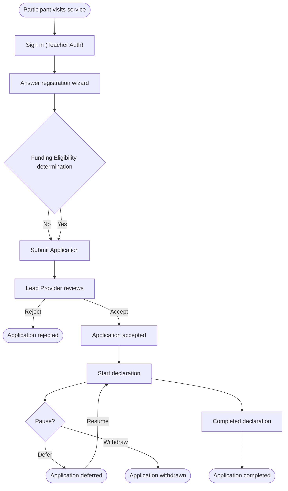

# Registration — Overview

The registration domain lets a participant apply for funded CPD training. It
turns a signed-in teacher into an `Application`, links them to a Lead Provider,
and records the rules that govern whether their chosen `Course` is currently
fundable.

## Who registers

Three kinds of teachers can register:

| Teacher type          | Authentication | Identity check                   |
|-----------------------|----------------|----------------------------------|
| Qualified teacher     | Teacher Auth   | UK TRN                           |
| FE teacher            | Teacher Auth   | Field experience, may lack a TRN |
| International teacher | Teacher Auth   | No UK TRN                        |

Each `User` has a `one_login_id`, a `provider`, and a `notify_user_for_future_reg`
flag — see `app/models/user.rb`.

## Journey at a glance



Stages above the dotted line below happen inside the registration domain;
declarations, deferral and withdrawal are owned by application management.

| Stage                     | Domain                  |
|---------------------------|-------------------------|
| Sign in → wizard → submit | Registration (this doc) |
| LP accept / reject        | Application management  |
| Declarations              | Application management  |
| Defer / withdraw          | Application management  |

## Core concepts

### Application

The central model (`app/models/application.rb`). Created on submission, advanced
through defined `STATUS_TRANSITIONS` as the LP and participant act.

### Course / CourseCohort

- **`Course`** — a funded training programme. Each course has its own funding
  eligibility and set of lead providers.
- **`CourseCohort`** — the cornerstone join: a `Course` available in a specific
  `Cohort` with a specific `Schedule` and LP. Always navigate courses via
  `CourseCohort` — it is what makes a course *available now*.
- **`Schedule`** — when training runs and which declarations an LP may submit.

### LeadProvider

A third party that delivers training (`app/models/lead_provider.rb`). Connected
to a `CourseCohort` and, once an application is accepted, to the `Application`.

### FundingEligibility

A service object (`app/services/funding_eligibility.rb`) with a tiny public
interface:

```ruby
FundingEligibility.call(user:, course_cohort:)
  # => { funded?: true|false, funding_eligibility_status_code: "..." }
```

It decides whether a user can register for a given `CourseCohort`. The wizard
calls it before allowing submission. See [`funding.md`](../funding.md)
for the rules and status codes, and the forthcoming
`application-submission.md` for how the wizard uses it.

## Where the code lives

| Concern             | Path                                                       |
|---------------------|------------------------------------------------------------|
| Models              | `app/models/`                                              |
| Wizard step objects | `app/forms/`                                               |
| Registration routes | `config/routes.rb` (`/registration/:step`, `applications`) |
| Funding rules       | `app/services/funding_eligibility.rb`                      |

## Related docs
- [`data_model.md`](../data_model.md) — entity relationships.
- [`funding.md`](../funding.md) — funding eligibility rules and codes.
- [`authentication.md`](authentication.md) — sign-in and sessions.
- [`application-submission.md`](application-submission.md) — wizard, forms, and how
  `FundingEligibility` is invoked.
- [`change-of-provider.md`](change-of-provider.md) — change-of-provider flow.
